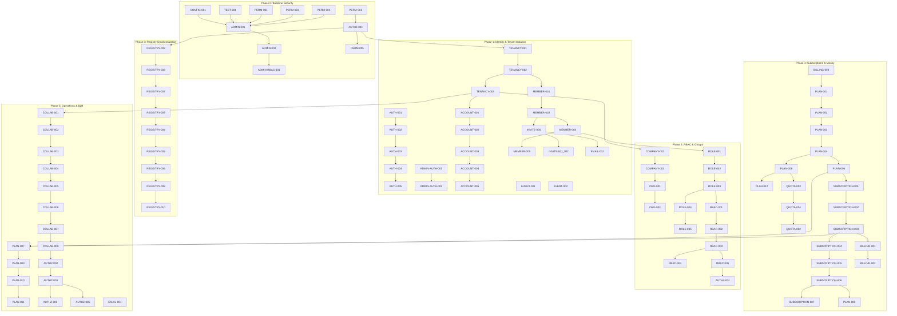

# Planning rules
1. **Compilable and Runnable Batches**: Every implementation batch must keep the codebase compiling and passing existing JUnit tests.
2. **Foundations First**: DB schemas and migration scripts must be developed before coding services.
3. **Core API Stability**: Backend endpoints and contracts (DTOs) must be stable before starting frontend development.
4. **Prerequisites Verification**: Do not begin a batch unless all prerequisite TOFIX IDs are fully implemented/verified.
5. **No Placeholders**: Mock classes must use explicit, configurable behavior rather than empty logic.

---

# Phase overview
- **Phase 0: Baseline protection and critical security** (Hardens testing, configuration, and security guard execution).
- **Phase 1: Account, ownership, membership, authentication and tenant isolation** (Establishes strict tenant boundaries, removes invitations, and implements basic membership/credentials).
- **Phase 2: Company, Groups, roles, assignments and permission overrides** (Builds the organization hierarchy, RBAC scoping, and exceptions).
- **Phase 3: Registry and Permissionizer integration** (Resolves startup syncing, dynamic catalogs, and action-level grant checks).
- **Phase 4: Plans, AddOns, quotas, Money and subscriptions** (Introduces Money columns, price-books, subscriptions, and quota package models).
- **Phase 5: Operational flows: previews, scheduled/bulk jobs, lifecycle, audit, communications and B2B** (Implements plan revisions, B2B collaboration, auditing, and mail escape).
- **Phase 6: Stable APIs, DTOs and read models** (Cleans boundaries, maps via MapStruct, and paginates responses).
- **Phase 7: Remove and rewrite the admin frontend** (Rebuilds the admin panel to consume the clean REST APIs).
- **Phase 8: End-to-end verification and documentation cleanup** (Validates migrations, B2B links, and purges references).

---

# Dependency graph

---

# Phase 0: Baseline protection and critical security

### Batch 0.1: Recommended First Batch

**Execution status — 2026-07-16**

- `ADMIN-001` is complete; `ADMIN-002` collision handling was safely resolved in the same bootstrap change.
- The destructive/default-secret portion of `CONFIG-001` is complete. Versioned database migrations remain open, so the full finding is not closed.
- `PERM-003` and `PERM-004` were confirmed and fixed with focused standalone tests.
- `PERM-001` was confirmed. HiveApp's reliance on package interception was removed in Batch 0.2; the generic library limitation remains deferred.
- `TEST-001` remains ongoing. Current verified baseline: 213 HiveApp backend tests and 6 Permissionizer tests, all green.

#### [IMPLEMENT] CONFIG-001 — The only application configuration is destructive development configuration
- **Prerequisites**: None.
- **Unlocks**: ADMIN-001.
- **Order Rationale**: Separates configuration profiles immediately to ensure production migrations do not execute with `ddl-auto: create-drop`.
- **Affected Backend Areas**: `application.yaml`, `application-prod.yaml`, `application-dev.yaml`.
- **Database Migration**: No.
- **Acceptance Criteria**: Running with production profile disables dev tools and uses safe database validation levels.
- **Tests**: Configuration profile loader tests.
- **Future UI Flow**: None.
- **Execution Status**: Profile separation, external production secrets/URLs, PostgreSQL configuration, and safe `ddl-auto` behavior are implemented. Versioned schema migrations remain open.

#### [VERIFY FIRST] TEST-001 — Green tests preserve important unsafe behavior and omit critical negative cases
- **Prerequisites**: None.
- **Unlocks**: ADMIN-001.
- **Order Rationale**: Baseline test verification. The latest run passes all 213 tests (`2026-07-16`) while focused negative cases continue to be added. Remediation: Add test assertions for the remaining missing negative cases.
- **Affected Backend Areas**: Entire Integration Test Suite.
- **Database Migration**: No.
- **Acceptance Criteria**: Report on Loose Assertions is completed; new negative test cases are integrated.
- **Tests**: Integration security checks.
- **Future UI Flow**: None.
- **Execution Status**: In progress. Configuration/admin-bootstrap negative tests and standalone Permissionizer characterization tests were added; the broader audit remains open.

#### [VERIFY FIRST] PERM-001 — Package-level guarded nodes may not be intercepted
- **Prerequisites**: None.
- **Unlocks**: None.
- **Order Rationale**: Standalone AOP package scan check. Verification: Add focused integration test targeting a package-level guard to verify if unannotated classes inherit the guard. Remediation: If failed, adjust Spring AOP advisor pattern matching.
- **Affected Backend Areas**: AspectJ AOP Proxy rules.
- **Database Migration**: No.
- **Acceptance Criteria**: Interceptors execute on methods within guarded packages.
- **Tests**: Focused AOP test.
- **Future UI Flow**: None.
- **Execution Status**: Confirmed. The resolver recognizes the package guard, but the current annotation-only Spring pointcut does not intercept the unannotated method. Remediation is carried into Batch 0.2 after a guarded-package boundary audit.

#### [VERIFY FIRST] PERM-003 — Overloaded methods share the processor's element key
- **Prerequisites**: None.
- **Unlocks**: None.
- **Order Rationale**: Validation of processor key generation. Verification: Add test check with overloaded controller signatures. Remediation: If key clashes, update generator parser to append arguments parameters.
- **Affected Backend Areas**: Annotation processor.
- **Database Migration**: No.
- **Acceptance Criteria**: Overloaded methods generate unique processor keys.
- **Tests**: Compilation tests.
- **Future UI Flow**: None.
- **Execution Status**: Completed. Processor keys include erased parameter signatures, with a compilation test covering overloads.

#### [VERIFY FIRST] PERM-004 — Reflection and collection failures are silently swallowed
- **Prerequisites**: None.
- **Unlocks**: None.
- **Order Rationale**: Verification of reflection handlers. Verification: Trigger custom class loader exceptions. Remediation: If swallowed, configure PermissionCollector to crash context on exceptions.
- **Affected Backend Areas**: PermissionCollector class.
- **Database Migration**: No.
- **Acceptance Criteria**: Scans throwing reflection exceptions propagate and halt startup.
- **Tests**: Reflection exception tests.
- **Future UI Flow**: None.
- **Execution Status**: Completed. Indexed-root and reflection failures now throw a dedicated collection exception, with focused fail-closed tests.

#### [IMPLEMENT] ADMIN-001 — Unconditional startup seeder creates and logs a known SuperAdmin password
- **Prerequisites**: CONFIG-001.
- **Unlocks**: ADMIN-002.
- **Order Rationale**: Secures default password seeding before configuring admin flows.
- **Affected Backend Areas**: `AdminSeeder.java`.
- **Database Migration**: No.
- **Acceptance Criteria**: Seeding in production gets passwords from safe variables and skips logs.
- **Tests**: Seeding environment checks.
- **Future UI Flow**: None.
- **Execution Status**: Completed. Bootstrap is opt-in, credentials are externally configured and validated, passwords are never logged, and production-disabled/collision behavior is tested.

---

### Batch 0.2: Security Guard Activation

**Execution status — 2026-07-16:** Completed. The broad `com.hiveapp.platform` root is structural-only, all 12 permission-bearing service classes explicitly enable guarding, infrastructure remains outside the automatic boundary, startup alignment is fatal, and focused plus full-suite verification is green. Generic package-only interception remains a deferred Permissionizer library limitation rather than a HiveApp dependency.

#### [IMPLEMENT] PERM-002 — HiveApp bypasses startup guard-alignment verification
- **Prerequisites**: None.
- **Unlocks**: AUTHZ-001.
- **Order Rationale**: Activates fatal boot checks on mismatched keys after the Batch 0.1 collector/processor fixes; package-interception activation remains gated by the carried-forward boundary audit.
- **Affected Backend Areas**: Guard verification execution.
- **Database Migration**: No.
- **Acceptance Criteria**: Initialization aborts when guarded definitions exist without a registered interceptor/agent; a registered Spring interceptor permits startup.
- **Tests**: Boot verification checks.
- **Future UI Flow**: None.
- **Execution Status**: Completed. Verification exceptions propagate, reset/reconfiguration preserves installed interception, and standalone tests cover failure and success paths.

#### [IMPLEMENT] AUTHZ-001 — HiveApp explicitly disables Permissionizer guard verification
- **Prerequisites**: PERM-002.
- **Unlocks**: TENANCY-001, REGISTRY-002.
- **Order Rationale**: Enables fatal startup alignment and explicit service-level interception without automatically proxying every platform bean.
- **Affected Backend Areas**: `SecurityConfig.java`, `application.yaml`.
- **Database Migration**: No.
- **Acceptance Criteria**: Permission-bearing services are explicitly intercepted, infrastructure does not inherit synthetic permissions, and unauthorized requests are denied.
- **Tests**: Integration tests checking access blocks.
- **Future UI Flow**: None.
- **Execution Status**: Completed. `skipVerification()` is removed, interceptor registration is ordered before initialization, boundary tests pass, and the full 213-test backend suite is green.

---

### Batch 0.3: Admin Seeding & Security Constraints

**Execution status — 2026-07-16:** Completed. The earlier bootstrap work safely resolved `ADMIN-002`; centralized admin mutation authorization now protects SuperAdmin targets and applies the acting administrator's permission ceiling consistently across role and permission mutations. Focused verification and the complete 222-test backend suite are green.

#### [IMPLEMENT] ADMIN-002 — Admin seeding stops when the user exists, even if the admin record does not
- **Prerequisites**: ADMIN-001.
- **Unlocks**: ADMIN-RBAC-001.
- **Order Rationale**: Prevents ambiguous bootstrap identity state before delegated administration is enabled.
- **Affected Backend Areas**: `AdminSeeder.java`.
- **Database Migration**: No.
- **Acceptance Criteria**: Bootstrap verifies the explicit AdminUser record and never silently promotes an existing normal user.
- **Tests**: Seeder unit tests.
- **Future UI Flow**: None.
- **Execution Status**: Completed in Batch 0.1. An existing normal user causes startup to refuse unsafe implicit promotion; an existing AdminUser is recognized safely.

#### [IMPLEMENT] ADMIN-RBAC-001 — Non-SuperAdmin protection is incomplete for destructive admin actions
- **Prerequisites**: ADMIN-002.
- **Unlocks**: None.
- **Order Rationale**: Establishes the target and delegation boundaries before more admin control-plane features are built.
- **Affected Backend Areas**: `AdminMutationAuthorizer.java`, `AdminUserServiceImpl.java`, `AdminRoleServiceImpl.java`.
- **Database Migration**: No.
- **Acceptance Criteria**: A non-SuperAdmin cannot modify a SuperAdmin or manage roles/permissions outside their own permission ceiling; SuperAdmins can manage other administrators; self-deactivation remains blocked.
- **Tests**: Central authorizer unit tests and admin control-plane integration tests covering both denial and permitted paths.
- **Future UI Flow**: Admin Portal management.
- **Execution Status**: Completed. Target protection and permission-ceiling enforcement now cover admin activation, role assignment/removal, role metadata/activation, and permission grant/revocation. Full backend suite: 222 tests green.

---

### Batch 0.4: Policy Order Verification

**Execution status — 2026-07-16:** Completed. Seven focused tests lock the configured Admin → B2B → Plan → User Role → Spring-authority chain, including every grant/deny short-circuit boundary. The complete 229-test backend suite is green. `AUTHZ-002` remains a separate later fix; this batch documents and preserves its current B2B precedence instead of changing behavior implicitly.

#### [LOCK WITH TESTS] PERM-005 — Policy order is security-significant
- **Prerequisites**: AUTHZ-001.
- **Unlocks**: None.
- **Order Rationale**: The current policy execution chain (Admin → B2B → Plan → User Role → Spring authorities) is intentional. Lock the order and document the consequence for AUTHZ-002 before changing B2B actor authorization later.
- **Affected Backend Areas**: `SecurityConfig.permissionsLoader()`, `PermissionGuard` policy evaluation.
- **Database Migration**: No.
- **Acceptance Criteria**: Exact chain precedence and every early grant/deny boundary are asserted; the fallback cannot override a domain denial.
- **Tests**: `PermissionPolicyOrderTest` using the actual `SecurityConfig` registration path.
- **Future UI Flow**: None.
- **Execution Status**: Completed. Seven focused tests and the full 229-test backend suite pass.

---

# Phase 1: Account, ownership, membership, authentication and tenant isolation

### Batch 1.1: Tenancy Boundaries & Isolation

**Execution status — 2026-07-16:** Completed for the current unpublished, in-memory development stage. Account-scoped repository lookups, active membership context selection, ownership mapping, generated-schema foreign-key metadata, entity persistence callbacks, non-disclosing 404 isolation behavior, and the full 241-test backend suite are green. Versioned production migrations remain future deployment hardening under `CONFIG-001`, not a Batch 1.1 blocker.

#### [IMPLEMENT] TENANCY-001 — Establish `Account` as the canonical tenant boundary
- **Prerequisites**: AUTHZ-001.
- **Unlocks**: TENANCY-002.
- **Order Rationale**: Sets the core tenant filters on database queries before validating relationships.
- **Affected Backend Areas**: Tenant-owned JPA repositories, client services, `SecurityContextService.java`.
- **Database Migration**: No.
- **Acceptance Criteria**: Queries enforce Account ID parameters.
- **Tests**: Multi-tenant isolation checks.
- **Future UI Flow**: Tenant navigation.
- **Execution Status**: Completed. Account is the canonical context ID and tenant-owned IDs are loaded through account/participant-scoped queries.

#### [IMPLEMENT] TENANCY-002 — `Account.ownerId` is an unverified raw UUID relationship
- **Prerequisites**: TENANCY-001.
- **Unlocks**: TENANCY-003, MEMBER-001.
- **Order Rationale**: Ensures the owner ID maps to a real entity before checking tenant-wide parents.
- **Affected Backend Areas**: `Account.java`, `AccountRepository.java`, provisioning/member creation.
- **Database Migration**: Yes (add foreign key).
- **Acceptance Criteria**: Account owner points to a User; owner Member matches it; one active membership per user is enforced in current application flows and generated development schemas contain the owner foreign key.
- **Tests**: Ownership mapping, owner-member callback, duplicate active-membership flows.
- **Future UI Flow**: None.
- **Execution Status**: Completed for the current in-memory stage. Persistent-production concurrency constraints move with the future CONFIG-001 migration baseline.

#### [VERIFY FIRST] TENANCY-003 — Cross-account relationship invariants are not visible in the entity model
- **Prerequisites**: TENANCY-002.
- **Unlocks**: ACCOUNT-001, COMPANY-001, COLLAB-001.
- **Order Rationale**: Entity cross-account verification confirmed persistence-level gaps; callbacks now provide defense beyond normal service paths.
- **Affected Backend Areas**: Tenant aggregate entities, `TenantInvariant.java`, scoped repositories.
- **Database Migration**: No.
- **Acceptance Criteria**: Mismatched tenant hierarchies raise validation errors.
- **Tests**: Cross-account mismatch tests.
- **Future UI Flow**: None.
- **Execution Status**: Completed. Persistence callbacks cover all relationships listed in the finding, and request-level isolation tests pass.

---

### Batch 1.2: Identity & Authentication

**Execution status — 2026-07-16:** Completed for the current unpublished, single-process, in-memory development stage. Canonical email identity, database-race translation, audience/use-bound access and refresh tokens, single-use rotation, logout revocation, admin refresh/logout, active workspace context checks, safe malformed-ID handling, and validated admin DTOs are implemented. Ten focused tests and the full 251-test backend suite pass. Refresh-session persistence/coordination across application instances remains future deployment hardening; restart currently invalidates all sessions safely.

#### [VERIFY FIRST] AUTH-001 — Email identity is not canonicalized
- **Prerequisites**: None.
- **Unlocks**: AUTH-002.
- **Order Rationale**: Email validation check. Verification: Check if casing differences create duplicates. Remediation: Enforce lower-casing on read/write in repository.
- **Affected Backend Areas**: `UserServiceImpl.java`, `UserRepository.java`.
- **Database Migration**: No for the current disposable in-memory database. Normalize existing rows and add the production index only when a persistent deployment baseline exists.
- **Acceptance Criteria**: Email fields are saved in lower-case.
- **Tests**: Registration unit tests.
- **Future UI Flow**: Signup / Login.
- **Execution Status**: Completed. One canonicalizer covers writes and lookups, with a persistence callback as the final write boundary and integration coverage for mixed-case registration/login.

#### [IMPLEMENT] AUTH-002 — Refresh-token type and revocation behavior are not visible at the service boundary
- **Prerequisites**: AUTH-001.
- **Unlocks**: AUTH-003.
- **Order Rationale**: Secures refresh token scope before resolving member security principal.
- **Affected Backend Areas**: Token Service, Security Filters.
- **Database Migration**: No for the current single-process in-memory stage. A shared persistent refresh-session store is required before multi-instance production.
- **Acceptance Criteria**: Active token validation checks match service layer definitions.
- **Tests**: Refresh token validation tests.
- **Future UI Flow**: Logout / session expiry.
- **Execution Status**: Completed for the current stage. Refresh sessions are audience-bound, single-use, rotated, revocable, and cleaned after expiry; restart invalidates all sessions.

#### [IMPLEMENT] AUTH-003 — Client authentication is user-based while authorization is membership/workspace-based
- **Prerequisites**: AUTH-002.
- **Unlocks**: AUTH-004.
- **Order Rationale**: Scopes security principal to the active member inside the workspace.
- **Affected Backend Areas**: `JwtAuthenticationFilter.java`, `SecurityContextHolder`.
- **Database Migration**: No.
- **Acceptance Criteria**: Context principal resolves to workspace member roles.
- **Tests**: Authentication context tests.
- **Future UI Flow**: Dashboard loading.
- **Execution Status**: Completed. The user principal resolves one active membership transactionally, and direct/B2B context rejects inactive client or provider Accounts before authorization.

#### [VERIFY FIRST] AUTH-004 — Registration uniqueness check is race-prone unless database errors are translated
- **Prerequisites**: AUTH-003.
- **Unlocks**: AUTH-005.
- **Order Rationale**: Registration concurrency check. Verification: Test concurrent signup requests with identical email. Remediation: Add try-catch translating database unique constraint errors to structured validation exceptions.
- **Affected Backend Areas**: `UserServiceImpl.java`.
- **Database Migration**: No.
- **Acceptance Criteria**: Mismatched parallel registrations throw clear exception mappings.
- **Tests**: Registration concurrency tests.
- **Future UI Flow**: Registration page.
- **Execution Status**: Completed. `saveAndFlush()` makes the database constraint authoritative and translates a losing unique-email race before workspace provisioning.

#### [IMPLEMENT] AUTH-005 — User-details lookup leaks invalid UUID parsing behavior
- **Prerequisites**: AUTH-004.
- **Unlocks**: None.
- **Order Rationale**: Resolves payload validation crashes on malformed queries.
- **Affected Backend Areas**: Controllers.
- **Database Migration**: No.
- **Acceptance Criteria**: Malformed and unknown authentication principal IDs use the same non-disclosing authentication failure path.
- **Tests**: URL parser check tests.
- **Future UI Flow**: User detail lookup.
- **Execution Status**: Completed. Client and admin UUID parsing is defensive and covered by focused repository-noninteraction tests.

#### [IMPLEMENT] ADMIN-AUTH-001 — Admin refresh tokens have no matching admin refresh flow
- **Prerequisites**: None.
- **Unlocks**: ADMIN-AUTH-002.
- **Order Rationale**: Implements token renewal mechanics for administrators.
- **Affected Backend Areas**: Admin Token controller.
- **Database Migration**: No.
- **Acceptance Criteria**: Active admin sessions are renewable via refresh tokens.
- **Tests**: Refresh token integration tests.
- **Future UI Flow**: Admin Portal dashboard refresh.
- **Execution Status**: Completed. Admin refresh preserves ADMIN audience, rotates once, rejects client/reused tokens, and supports explicit logout revocation.

#### [IMPLEMENT] ADMIN-AUTH-002 — Admin login duplicates authentication logic and skips DTO validation
- **Prerequisites**: ADMIN-AUTH-001.
- **Unlocks**: None.
- **Order Rationale**: Standardizes admin controllers validation payload.
- **Affected Backend Areas**: `AdminAuthController.java`.
- **Database Migration**: No.
- **Acceptance Criteria**: Admin endpoint matches normal login schema validations.
- **Tests**: Authentication validation tests.
- **Future UI Flow**: Admin Portal login.
- **Execution Status**: Completed. The controller uses `@Valid`, delegates to an admin authentication service, and shares canonical credential verification with client login.

---

### Batch 1.3: Provisioning & Slug Lifecycle

**Execution status — 2026-07-16:** Completed for the current unpublished, in-memory stage. Registration now requires and snapshots an active FREE plan atomically; internal provisioning retries return an existing complete workspace without duplicate rows; initial slugs are uniquely bound to User IDs without check-then-insert; account suspension blocks access and revokes all member CLIENT refresh sessions while preserving business records; and API-facing account reads return DTOs. Eight focused tests and the full 259-test backend suite pass. No Flyway or idempotency-log infrastructure was added.

#### [IMPLEMENT] ACCOUNT-001 — Registration can succeed with no subscription
- **Prerequisites**: TENANCY-003.
- **Unlocks**: ACCOUNT-002.
- **Order Rationale**: Mandatory subscription allocation during account provisioning.
- **Affected Backend Areas**: `AccountProvisioningService.java`.
- **Database Migration**: No.
- **Acceptance Criteria**: Onboarding fails if FREE plan assignment fails.
- **Tests**: Provisioning tests.
- **Future UI Flow**: Onboarding checkouts.
- **Execution Status**: Completed. Missing/inactive FREE configuration aborts and rolls back registration; every successful registration has one usable snapshotted entitlement.

#### [IMPLEMENT] ACCOUNT-002 — Workspace deactivation consequences are not implemented in the account service
- **Prerequisites**: ACCOUNT-001.
- **Unlocks**: ACCOUNT-003.
- **Order Rationale**: Cuts access for suspended tenants.
- **Affected Backend Areas**: Tenant interceptors.
- **Database Migration**: No.
- **Acceptance Criteria**: Inactive account endpoints throw `403 Account Suspended`.
- **Tests**: Account deactivation checks.
- **Future UI Flow**: Workspace lock screen.
- **Execution Status**: Completed for the current stage. Security context denies inactive Accounts, deactivation revokes all member CLIENT refresh sessions, and related business records remain preserved for future explicit reactivation.

#### [VERIFY FIRST] ACCOUNT-003 — Workspace slug creation is check-then-insert and race-prone
- **Prerequisites**: ACCOUNT-002.
- **Unlocks**: ACCOUNT-004.
- **Order Rationale**: Slug duplicate check. Verification: Check slug creation under concurrent registration. Remediation: Add unique database index on `accounts(slug)`.
- **Affected Backend Areas**: `Account.java`, `AccountRepository.java`.
- **Database Migration**: No for the current generated in-memory schema; the existing unique column remains authoritative. A production migration baseline is future deployment work.
- **Acceptance Criteria**: Different Users cannot calculate the same initial slug, even when email prefixes match.
- **Tests**: Slug concurrency tests.
- **Future UI Flow**: Account creation form.
- **Execution Status**: Completed. Slugs combine a bounded readable prefix with the complete User UUID; the race-prone existence loop was removed.

#### [VERIFY FIRST] ACCOUNT-004 — Workspace provisioning is not explicitly idempotent
- **Prerequisites**: ACCOUNT-003.
- **Unlocks**: ACCOUNT-005.
- **Order Rationale**: Idempotency check. Verification: Submit identical registration payload twice. Remediation: Add an idempotency key table checking submissions.
- **Affected Backend Areas**: `AccountProvisioningService.java`.
- **Database Migration**: No. Registration duplicates remain conflicts; the internal transactionally atomic provisioning operation returns an existing complete workspace on retry.
- **Acceptance Criteria**: Repeating internal provisioning creates no duplicate Account, owner Member, or usable Subscription and returns the existing setup identifiers.
- **Tests**: Idempotent provisioning tests.
- **Future UI Flow**: Onboarding wizard.
- **Execution Status**: Completed by explicit decision. No idempotency table is needed for this internal synchronous operation; incomplete preexisting aggregates fail for deliberate repair.

#### [IMPLEMENT] ACCOUNT-005 — Account service contract still exposes a persistence entity
- **Prerequisites**: ACCOUNT-004.
- **Unlocks**: None.
- **Order Rationale**: Clean encapsulation.
- **Affected Backend Areas**: `AccountService.java`.
- **Database Migration**: No.
- **Acceptance Criteria**: Operations exchange DTO schemas.
- **Tests**: Interface unit tests.
- **Future UI Flow**: Account settings.
- **Execution Status**: Completed. API-facing account reads return `AccountDto` from the service boundary, and the unused duplicate interface was removed.

---

### Batch 1.4: Workspace Membership & Quotas

**Execution status — 2026-07-16:** Completed for the current unpublished, generated-schema stage. Workspace owners are protected from delegated deactivation; membership and scoped role assignments are duplicate-safe; inactive roles cannot be assigned; deactivation revokes CLIENT refresh sessions while active-token context rejects the suspended member; active member/company quotas use database counts under an Account write lock; and all seven verified join/grant relationships have database uniqueness. Focused tests and the full 271-test backend suite pass. Activation-material cleanup, reactivation impact checks, audit/reason capture, and production migrations remain assigned to their later lifecycle/deployment work rather than this batch.

#### [IMPLEMENT] MEMBER-001 — Authorized members can deactivate the workspace owner
- **Prerequisites**: TENANCY-002.
- **Unlocks**: MEMBER-002.
- **Order Rationale**: Protects owner lockout bounds before structuring membership constraint checks.
- **Affected Backend Areas**: `MemberServiceImpl.java`.
- **Database Migration**: No.
- **Acceptance Criteria**: Lockout requests target owner throw 403.
- **Tests**: Owner lockout block integration tests.
- **Future UI Flow**: Team configurations settings.
- **Execution Status**: Completed. Self-deactivation remains forbidden, and any different actor targeting the workspace owner receives 403 with an explicit ownership-transfer requirement.

#### [IMPLEMENT] MEMBER-002 — Direct member addition allows duplicate memberships
- **Prerequisites**: MEMBER-001.
- **Unlocks**: MEMBER-003, INVITE-000.
- **Order Rationale**: Restricts multi-tenant membership duplication.
- **Affected Backend Areas**: `members` table.
- **Database Migration**: No for the current generated in-memory schema; the entity constraint is authoritative until the production migration baseline exists.
- **Acceptance Criteria**: Workspace addition fails on existing user.
- **Tests**: Concurrency membership addition tests.
- **Future UI Flow**: Team addition panel.
- **Execution Status**: Completed. A friendly same-workspace pre-check, database uniqueness, flush-time conflict translation, and concurrent same-user requests produce exactly one membership.

#### [IMPLEMENT] MEMBER-003 — Member role assignment allows duplicates and inactive roles
- **Prerequisites**: MEMBER-002.
- **Unlocks**: MEMBER-005, ROLE-001.
- **Order Rationale**: Ensures role status alignment.
- **Affected Backend Areas**: `MemberRoleRepository.java`.
- **Database Migration**: No.
- **Acceptance Criteria**: Adding duplicate or deactivated assignments throws validation errors.
- **Tests**: Assignment checks.
- **Future UI Flow**: Team role assignments.
- **Execution Status**: Completed. Assignment rejects inactive roles and an existing account/company-scoped grant; a derived non-null scope key makes account-wide uniqueness database-safe despite nullable `company_id`.

#### [IMPLEMENT] MEMBER-005 — Member deactivation does not implement the decided offboarding lifecycle
- **Prerequisites**: MEMBER-003.
- **Unlocks**: None.
- **Order Rationale**: Session revocation blocks deactivated logins.
- **Affected Backend Areas**: `MemberServiceImpl.java`, token refresh filters.
- **Database Migration**: No.
- **Acceptance Criteria**: Active JWT sessions are immediately invalidated on deactivation.
- **Tests**: Token revocation checks.
- **Future UI Flow**: Team manager dashboard.
- **Execution Status**: Completed for the available lifecycle. Suspension preserves the Member and access configuration, removes it from runtime context/quota, and revokes every current CLIENT refresh session. Activation credential cleanup and reactivation validation follow the direct-creation lifecycle in Batch 1.5 and later operational/audit batches.

#### [IMPLEMENT] QUOTA-001 — Member/company quota checks are inefficient and race-prone
- **Prerequisites**: MEMBER-002.
- **Unlocks**: None.
- **Order Rationale**: Optimizes membership counts.
- **Affected Backend Areas**: `MemberServiceImpl.java`.
- **Database Migration**: No.
- **Acceptance Criteria**: Queries use optimized database counts.
- **Tests**: Load limit checks.
- **Future UI Flow**: Team member addition.
- **Execution Status**: Completed. Active-only database counts replace row loading, and an Account pessimistic lock serializes member/company creation across the quota check and insert. Exact-boundary concurrency tests pass.

#### [VERIFY FIRST] DATA-001 — Join/grant tables may allow duplicate relationships
- **Prerequisites**: MEMBER-003.
- **Unlocks**: None.
- **Order Rationale**: Join table constraint check. Verification: Check if duplicate `member_roles` or `role_permissions` can be saved. Remediation: Add unique database constraints on join tables.
- **Affected Backend Areas**: Database schemas.
- **Database Migration**: No for the current generated in-memory schema; versioned equivalents belong to the future production migration baseline.
- **Acceptance Criteria**: Database rejects duplicate mapping inserts.
- **Tests**: Constraint integrity tests.
- **Future UI Flow**: None.
- **Execution Status**: Completed. Verification confirmed the gap. Generated schemas now reject duplicates for admin user roles, admin role permissions, client role permissions, null-safe member-role scopes, member overrides, collaboration permissions, and plan features; AdminUser-to-User uniqueness is explicit.

---

### Batch 1.5: Direct Creation Replacing Invitations

**Execution status — 2026-07-16:** Completed for the current unpublished, generated-schema stage. The invitation subsystem and redeemable invitation routes are gone. Account actors now create a User and Member atomically with quota, tenant, initial-role, plan-entitlement, and actor-delegation checks. Email members use hashed one-time activation/reset links; members without email use one-time-visible temporary passwords that force a restricted password-change session. Manager regeneration/reset/unlock, username/email/Account-code-plus-employee-number login, attempt locking, session revocation, safe post-commit email delivery, origin validation, and escaped deadline-aware templates are implemented. Focused lifecycle/role/template tests and the clean full 265-test backend suite pass with zero failures/errors; centralized audit remains assigned to `AUDIT-001`, delivery tracking/retry remains in `EMAIL-001`, and production schema migration begins only when a deployment baseline exists.

#### [IMPLEMENT] INVITE-000 — Remove the invitation subsystem and replace it with direct member creation
- **Prerequisites**: MEMBER-002.
- **Unlocks**: INVITE-001_007, EMAIL-002.
- **Order Rationale**: Completely removes the legacy invitation entities and adds direct creation endpoints. Carry safe template HTML escaping, validated origin URLs, and accurate deadlines (from EMAIL-002) into the replacement activation/reset emails.
- **Affected Backend Areas**: All invitation files, controllers, services.
- **Database Migration**: No for the current generated disposable schema. The invitation model has been deleted; a production retirement migration is only needed if a future deployment baseline ever contains invitation rows.
- **Acceptance Criteria**: Invitation controller/services are deleted. Direct creation and the complete decided initial-access lifecycle are exposed.
- **Tests**: Removed invitation tests; direct creation, temporary/email activation, replay, lock/unlock, regeneration, reset, employee login, and session-revocation tests added.
- **Future UI Flow**: Add Member screen.
- **Execution Status**: Completed. Direct creation is transactional and Account-scoped; all credential material is hashed or one-time-visible, ordinary access is blocked until activation completes, and management actions are Permissionizer-protected on the member surface.

#### [REMOVE AS OBSOLETE] INVITE-001 — Invitation acceptance bypasses member quota enforcement
- **Prerequisites**: INVITE-000.
- **Unlocks**: None.
- **Order Rationale**: Subsystem is removed.
- **Affected Backend Areas**: Invitations.
- **Database Migration**: No.
- **Acceptance Criteria**: Removed.
- **Tests**: Delete corresponding tests.
- **Future UI Flow**: None.
- **Execution Status**: Removed with the invitation subsystem; direct creation uses the quota-aware Account-locked member admission path.

#### [REMOVE AS OBSOLETE] INVITE-002 — Invitation token acts as a seven-day login credential for existing users
- **Prerequisites**: INVITE-000.
- **Unlocks**: None.
- **Order Rationale**: Subsystem is removed.
- **Affected Backend Areas**: Invitations.
- **Database Migration**: No.
- **Acceptance Criteria**: Removed.
- **Tests**: Delete corresponding tests.
- **Future UI Flow**: None.
- **Execution Status**: Removed. No invitation token can authenticate an existing User; replacement credential tokens are purpose-bound, expiring, hashed, and one-time.

#### [REMOVE AS OBSOLETE] INVITE-003 — Invitation token is stored in plaintext
- **Prerequisites**: INVITE-000.
- **Unlocks**: None.
- **Order Rationale**: Subsystem is removed.
- **Affected Backend Areas**: Invitations.
- **Database Migration**: No.
- **Acceptance Criteria**: Removed.
- **Tests**: Delete corresponding tests.
- **Future UI Flow**: None.
- **Execution Status**: Removed. Replacement activation/reset tokens are stored only as SHA-256 hashes.

#### [REMOVE AS OBSOLETE] INVITE-004 — Stored invitation role/scope is not safely revalidated on acceptance
- **Prerequisites**: INVITE-000.
- **Unlocks**: None.
- **Order Rationale**: Subsystem is removed.
- **Affected Backend Areas**: Invitations.
- **Database Migration**: No.
- **Acceptance Criteria**: Removed.
- **Tests**: Delete corresponding tests.
- **Future UI Flow**: None.
- **Execution Status**: Removed. Initial roles on direct creation are revalidated transactionally against active tenant/scope/role state, plan entitlement, and actor ceiling.

#### [REMOVE AS OBSOLETE] INVITE-005 — Invitation email normalization and duplicate protection are incomplete
- **Prerequisites**: INVITE-000.
- **Unlocks**: None.
- **Order Rationale**: Subsystem is removed.
- **Affected Backend Areas**: Invitations.
- **Database Migration**: No.
- **Acceptance Criteria**: Removed.
- **Tests**: Delete corresponding tests.
- **Future UI Flow**: None.
- **Execution Status**: Removed. Replacement identity creation canonicalizes optional email and enforces database-backed username/email/Account employee-number uniqueness.

#### [REMOVE AS OBSOLETE] INVITE-006 — Expiration maintenance scans other accounts and mutates inside a read-only flow
- **Prerequisites**: INVITE-000.
- **Unlocks**: None.
- **Order Rationale**: Subsystem is removed.
- **Affected Backend Areas**: Invitations.
- **Database Migration**: No.
- **Acceptance Criteria**: Removed.
- **Tests**: Delete corresponding tests.
- **Future UI Flow**: None.
- **Execution Status**: Removed. No invitation-expiration scan or read-only mutation path remains.

#### [REMOVE AS OBSOLETE] INVITE-007 — Email delivery and database commit are not coordinated
- **Prerequisites**: INVITE-000.
- **Unlocks**: None.
- **Order Rationale**: Subsystem is removed.
- **Affected Backend Areas**: Invitations.
- **Database Migration**: No.
- **Acceptance Criteria**: Removed.
- **Tests**: Delete corresponding tests.
- **Future UI Flow**: None.
- **Execution Status**: Removed. Replacement email dispatch occurs after commit; failure preserves recoverable pending access for explicit regeneration.

#### [REMOVE AS OBSOLETE] EMAIL-002 — Invitation HTML embeds unescaped user/configuration values and hard-codes expiry text
- **Prerequisites**: INVITE-000.
- **Unlocks**: None.
- **Order Rationale**: Replaced by safe escaping, URL validation, and dynamic expiry deadlines inside the new user activation templates under direct creation (`INVITE-000`).
- **Affected Backend Areas**: Credential activation/reset email and activation configuration.
- **Database Migration**: No.
- **Acceptance Criteria**: Replacement templates escape dynamic HTML values, validate origin configuration, and render the actual expiry deadline.
- **Tests**: Focused credential-template escaping/deadline test.
- **Future UI Flow**: None.
- **Execution Status**: Completed by replacement. The old invitation template is deleted and its safety requirements are enforced in activation/reset email.

---

### Batch 1.6: Legacy Event Cleanup

**Execution status — 2026-07-16:** Completed. The unused registration event, Account event, comment-only listener, and orphaned shared event marker are deleted. Registration remains one explicit synchronous transaction through `WorkspaceProvisioningService`; current credential email and subscription listeners remain intact because they have active publishers and concrete after-commit behavior. The clean full backend suite passes all 265 tests with zero failures/errors.

#### [REMOVE AS OBSOLETE] EVENT-001 — `UserRegisteredEvent` is unused dead architecture
- **Prerequisites**: None.
- **Unlocks**: None.
- **Order Rationale**: Cleans legacy boilerplate.
- **Affected Backend Areas**: Events.
- **Database Migration**: No.
- **Acceptance Criteria**: File deleted.
- **Tests**: Clean compilation.
- **Future UI Flow**: None.
- **Execution Status**: Removed together with the now-unused `DomainEvent` marker. Registration continues to provision synchronously with no duplicate event path.

#### [REMOVE AS OBSOLETE] EVENT-002 — `Account` event artifacts are unused leftovers
- **Prerequisites**: None.
- **Unlocks**: None.
- **Order Rationale**: Cleans legacy boilerplate.
- **Affected Backend Areas**: Events.
- **Database Migration**: No.
- **Acceptance Criteria**: Files deleted.
- **Tests**: Clean compilation.
- **Future UI Flow**: None.
- **Execution Status**: Removed. `AccountCreatedEvent` and the comment-only `UserRegistrationEventListener` are deleted; the already-removed duplicate `AccountService` remains absent.

---

# Phase 2: Company, Groups, roles, assignments and permission overrides

### Batch 2.1: Company Lifecycle & Safe Metadata Edits

**Execution status — 2026-07-16:** Completed for the current platform shell. Ordinary deactivation is reversible but immediately cuts off direct and B2B operation; explicit Permissionizer-protected reactivation atomically rechecks Account state, active-Company quota, and preserved grant entitlements. Company identity commands/read models now cover the decided fields with normalization, same-tenant tax warnings, cross-tenant privacy, and an extensible country-dependent-record guard. Permanent Company purge remains a distinct deferred Phase 5 operational workflow, and centralized actor-aware auditing remains under `AUDIT-001`.

#### [IMPLEMENT] COMPANY-001 — Company deactivation has no defined dependent-data behavior
- **Prerequisites**: TENANCY-003.
- **Unlocks**: COMPANY-002.
- **Order Rationale**: Restricts access on deactivated workspace scopes.
- **Affected Backend Areas**: `CompanyServiceImpl.java`.
- **Database Migration**: No.
- **Acceptance Criteria**: Inactive Company context and new grants are blocked; preserved data is reversible; reactivation is separately authorized and atomically validates Account state, quota, and saved entitlements.
- **Tests**: Direct/B2B inactive-context, preserved-grant restoration, reused-quota rejection, inactive-grant prevention, and entitlement-conflict tests.
- **Future UI Flow**: Company configurations page.
- **Execution Status**: Implemented for reversible lifecycle. `SecurityContextService` cuts off inactive scope, grant paths refuse new inactive-Company delegation, and `platform.company.reactivate` runs under Account/Company locks with quota and saved-permission validation. Permanent owner-only purge is explicitly deferred to the operational-lifecycle phase rather than coupled to ordinary `company.delete`.

#### [IMPLEMENT] COMPANY-002 — Company identity editing does not implement the decided field-sensitive contract
- **Prerequisites**: COMPANY-001.
- **Unlocks**: ORG-001.
- **Order Rationale**: Implements safe edits validation rules.
- **Affected Backend Areas**: `CompanyServiceImpl.java`.
- **Database Migration**: No.
- **Acceptance Criteria**: Required identity fields and all decided optional metadata are coherent across create/update/read; tax duplicates warn only inside the Account; country-dependent domains can block ordinary jurisdiction edits.
- **Tests**: Validation, normalization, full metadata, partial update, duplicate warning, cross-tenant privacy, and country-dependency guard tests.
- **Future UI Flow**: Company settings form.
- **Execution Status**: Implemented for the current shell. The existing Company update permission remains the single authorization action while service validation is field-sensitive. Central before/after actor auditing remains under `AUDIT-001` and does not justify a Company-only audit subsystem.

---

### Batch 2.2: Organizational Hierarchy Model

**Execution status — 2026-07-16:** Completed for the current platform shell. The Department-specific draft is replaced by a generic Company-owned Group tree, explicit multi-placement memberships with per-placement positions, safe lifecycle and hierarchy commands, and member-free Platform/Account/Company structure templates with previewed all-or-nothing instantiation. Organization actions are individually Permissionizer-protected, while Group structure and placement remain deliberately absent from effective-permission evaluation. Generated H2 schema mappings were updated directly; versioned migration history remains deferred until the application enters a persistent production-schema stage.

#### [IMPLEMENT] ORG-001 — Department entity cannot support the decided generic Group model
- **Prerequisites**: COMPANY-002.
- **Unlocks**: ORG-002.
- **Order Rationale**: Implements nested groups model structure.
- **Affected Backend Areas**: Organization entities/repositories, Company initialization, organization service/controller/DTOs, registry feature, and blocker error contract.
- **Database Migration**: Generated schema updated from entity mappings; no versioned migration during the current disposable in-memory stage by project decision.
- **Acceptance Criteria**: Generic multi-root hierarchy, explicit memberships/positions, normalized sibling uniqueness, cycle and cross-Company protection, safe reorder/archive/restore/empty-only deletion, and independent member-free structure templates are available through stable APIs.
- **Tests**: Entity invariants plus HTTP hierarchy, reorder, archive/restore, cycle, cross-Company, membership, blocker, template conflict/atomicity/copy/delete, and tenant-isolation coverage.
- **Future UI Flow**: Organization hierarchy manager.
- **Execution Status**: Implemented. Company creation adds a deletable ordinary `Departments` root; Group operations preserve explicit placements and return actionable deletion blockers; templates support Platform/Account/Company ownership boundaries and all-or-nothing independent structure copies. Platform template authoring stays reserved for a platform-admin surface.

#### [IMPLEMENT] ORG-002 — Organization Groups must stay outside automatic authorization
- **Prerequisites**: ORG-001.
- **Unlocks**: None.
- **Order Rationale**: Decouples group movements from security clearances.
- **Affected Backend Areas**: `OrganizationServiceImpl`, `OrganizationFeature`, Permissionizer boundary tests, and effective-permission integration coverage. `UserRolePolicy` remains unchanged because it has no Group dependency.
- **Database Migration**: No.
- **Acceptance Criteria**: Security checks evaluate permissions independently of group placement.
- **Tests**: Permission guard registration, B2B target-Company scoping, and effective-permission equality across membership, position, rename, and reparent operations.
- **Future UI Flow**: Organization hierarchy manager.
- **Execution Status**: Implemented. Organization commands require explicit `platform.organization.*` actions, but no Group field or operation participates in role/override evaluation or grants operational access.

---

### Batch 2.3: Custom & System Role Constraints

**Execution status — 2026-07-17:** Completed for the current platform shell. Custom roles now have explicit inactive/active/archived lifecycle, system roles are tenant-read-only, used roles cannot be hard-deleted, shared-role changes require fresh impact confirmation, and Duplicate supports staged rollout/adoption. Permissionizer generation verified every role action key, including intentional distinct `read` and `view` actions. Generated H2 schema mappings were updated directly; versioned migration history remains deferred until persistent production-schema work begins. Actor delegation ceilings and central mutation audit remain in their planned owners, `RBAC-003` and `AUDIT-001`.

#### [IMPLEMENT] ROLE-001 — Deleting a role does not deliberately handle member assignments
- **Prerequisites**: MEMBER-003.
- **Unlocks**: ROLE-002.
- **Order Rationale**: Blocks deleting roles currently assigned to members.
- **Affected Backend Areas**: `RoleServiceImpl.java`.
- **Database Migration**: No.
- **Acceptance Criteria**: Deleting active role returns validation warnings.
- **Tests**: Role deletion check tests.
- **Future UI Flow**: Roles settings manager.
- **Execution Status**: Implemented. Only never-assigned custom roles without current references can be hard-deleted; a persistent first-assignment marker keeps used roles in deactivate/archive lifecycle even after assignments are removed.

#### [IMPLEMENT] ROLE-002 — System-role permissions can still be modified
- **Prerequisites**: ROLE-001.
- **Unlocks**: ROLE-003.
- **Order Rationale**: Locks platform templates.
- **Affected Backend Areas**: `RoleServiceImpl.java`.
- **Database Migration**: No.
- **Acceptance Criteria**: Modifying roles marked `isSystemRole = true` returns 403.
- **Tests**: System roles integrity checks.
- **Future UI Flow**: Roles dashboard.
- **Execution Status**: Implemented. Tenant metadata, permission, lifecycle, and deletion mutations all reject system roles; Duplicate creates an independent inactive custom adoption copy.

#### [IMPLEMENT] ROLE-003 — Role activation state is incomplete and internally inconsistent
- **Prerequisites**: ROLE-002.
- **Unlocks**: ROLE-004, RBAC-001.
- **Order Rationale**: Adds role lifecycles (ACTIVE, INACTIVE, ARCHIVED).
- **Affected Backend Areas**: `Role.java`.
- **Database Migration**: Generated schema updated from entity mappings; no versioned migration during the current disposable in-memory stage by project decision.
- **Acceptance Criteria**: Role states transition according to enum rules.
- **Tests**: State transition tests.
- **Future UI Flow**: Role lifecycle toggles.
- **Execution Status**: Implemented. `ACTIVE`, `INACTIVE`, and terminal `ARCHIVED` are exposed in the API; assignment/runtime evaluation ignores non-active roles, and activation revalidates current scope, grantability, and entitlement.

#### [VERIFY FIRST] ROLE-004 — Role permission keys may not match the declared feature contract
- **Prerequisites**: ROLE-003.
- **Unlocks**: ROLE-005.
- **Order Rationale**: Permission validation check. Verification: Check if invalid keys can be mapped to roles. Remediation: Add validator rejecting keys not declared by feature annotations.
- **Affected Backend Areas**: `RoleServiceImpl.java`.
- **Database Migration**: No.
- **Acceptance Criteria**: Invalid key mappings reject with `ResourceNotFoundException`.
- **Tests**: Key validation tests.
- **Future UI Flow**: Permission picker.
- **Execution Status**: Verified with no defect. All annotated role keys are emitted in Permissionizer's generated catalog; `read` and `view` intentionally protect detail and list actions, and unknown grant keys return 404.

#### [IMPLEMENT] ROLE-005 — Shared custom-role edits have no impact workflow
- **Prerequisites**: ROLE-004.
- **Unlocks**: None.
- **Order Rationale**: Warns admins on custom role mutations.
- **Affected Backend Areas**: `RoleServiceImpl.java`.
- **Database Migration**: No.
- **Acceptance Criteria**: Editing role alerts downstream subscriber impact count.
- **Tests**: Save role warning tests.
- **Future UI Flow**: Custom roles save dialog.
- **Execution Status**: Implemented for the impact workflow. Preview exposes assignment/member/scope and permission deltas; assigned-role mutations require matching role version plus assignment count, and Duplicate is the staged-rollout path. Delegation ceiling and central auditing remain under `RBAC-003` and `AUDIT-001`.

---

### Batch 2.4: Clean RBAC Scoping & Evaluation Ceiling
#### [IMPLEMENT] RBAC-001 — Company scope is represented twice for role assignment
- **Prerequisites**: ROLE-003.
- **Unlocks**: RBAC-002.
- **Order Rationale**: Cleans duplicate scope columns in database.
- **Affected Backend Areas**: `MemberRole.java`, `Role.java`.
- **Database Migration**: Yes (consolidate company scope mappings).
- **Acceptance Criteria**: Role assignments declare company boundaries uniquely.
- **Tests**: Database schema mappings check.
- **Future UI Flow**: None.

#### [IMPLEMENT] RBAC-002 — Inactive client roles still grant permissions
- **Prerequisites**: RBAC-001.
- **Unlocks**: RBAC-003.
- **Order Rationale**: Runtime verification of role active state.
- **Affected Backend Areas**: `UserRolePolicy.java`.
- **Database Migration**: No.
- **Acceptance Criteria**: Deactivated roles are excluded from permission resolution.
- **Tests**: Active role runtime checks.
- **Future UI Flow**: Access logs.

#### [IMPLEMENT] RBAC-003 — Client role assignment and direct grants have no actor permission ceiling
- **Prerequisites**: RBAC-002.
- **Unlocks**: RBAC-004, RBAC-006.
- **Order Rationale**: Backend validation ceiling check.
- **Affected Backend Areas**: `RoleServiceImpl.java`.
- **Database Migration**: No.
- **Acceptance Criteria**: User cannot grant permission keys they do not hold.
- **Tests**: Assignment ceiling tests.
- **Future UI Flow**: Admin role edit panel.

#### [IMPLEMENT] RBAC-004 — Removing a member role ignores company scope
- **Prerequisites**: RBAC-003.
- **Unlocks**: None.
- **Order Rationale**: Scopes assignments removal safely.
- **Affected Backend Areas**: `MemberServiceImpl.java`.
- **Database Migration**: No.
- **Acceptance Criteria**: Removing role assignment respects target company boundaries.
- **Tests**: Scoped removal tests.
- **Future UI Flow**: Role assignment tables.

---

### Batch 2.5: Scoped Exceptions & Overrides
#### [IMPLEMENT] RBAC-006 — Direct member overrides cannot support the decided exception lifecycle
- **Prerequisites**: RBAC-003.
- **Unlocks**: AUTHZ-004.
- **Order Rationale**: Exception override details.
- **Affected Backend Areas**: `MemberPermissionOverride.java`.
- **Database Migration**: Yes (add reason, expiry columns).
- **Acceptance Criteria**: Overrides support description reasons and expiration dates.
- **Tests**: Overrides expiration tests.
- **Future UI Flow**: User exceptions settings.

#### [IMPLEMENT] AUTHZ-004 — Account-wide member overrides do not apply inside company context
- **Prerequisites**: RBAC-006.
- **Unlocks**: None.
- **Order Rationale**: Cascades global overrides to child entities.
- **Affected Backend Areas**: `UserRolePolicy.java`.
- **Database Migration**: No.
- **Acceptance Criteria**: Account-wide overrides cascade to sub-company operations.
- **Tests**: Scoped cascade validation tests.
- **Future UI Flow**: None.

---

# Phase 3: Registry and Permissionizer integration

### Deferred registry lifecycle work
#### [DEFERRED] REGISTRY-001 — Removed code definitions and annotations remain as live database rows
- **Prerequisites**: None.
- **Unlocks**: None.
- **Order Rationale**: Product decision assumes deployed feature and permission codes remain stable. Do not build alias, replacement, or automated retirement machinery until a real removal/rename requirement appears.
- **Affected Backend Areas**: Registry synchronization and persisted plan/role/grant references.
- **Database Migration**: No active migration in this plan.
- **Acceptance Criteria**: The deferral is explicit; codes are treated as stable developer contracts and are never silently reused.
- **Tests**: None until the deferred lifecycle is activated.
- **Future UI Flow**: None.

---

### Batch 3.1: Startup Seeding Repair & Inspectability
#### [IMPLEMENT] REGISTRY-002 — Stale permission actions still pass role-grant validation
- **Prerequisites**: AUTHZ-001.
- **Unlocks**: REGISTRY-003.
- **Order Rationale**: Checks role grants against code definitions (excludes deferred REGISTRY-001).
- **Affected Backend Areas**: `PermissionGrantValidator.java`.
- **Database Migration**: No.
- **Acceptance Criteria**: Mismatched codes reject role updates.
- **Tests**: Action validation integration tests.
- **Future UI Flow**: None.

#### [IMPLEMENT] REGISTRY-003 — A partial or empty Permissionizer collection is accepted as successful seeding
- **Prerequisites**: REGISTRY-002.
- **Unlocks**: REGISTRY-007.
- **Order Rationale**: Crash boot on incomplete scans.
- **Affected Backend Areas**: `FeatureSeeder.java`.
- **Database Migration**: No.
- **Acceptance Criteria**: Empty scanned keys cause context exit.
- **Tests**: Verification checks.
- **Future UI Flow**: None.

#### [IMPLEMENT] REGISTRY-007 — Existing feature rows are not fully repaired from their code definition
- **Prerequisites**: REGISTRY-003.
- **Unlocks**: REGISTRY-009.
- **Order Rationale**: Syncs database columns with code annotations.
- **Affected Backend Areas**: `FeatureSeeder.java`.
- **Database Migration**: No.
- **Acceptance Criteria**: Database metadata is overwritten by code annotations.
- **Tests**: Sync repair tests.
- **Future UI Flow**: None.

#### [IMPLEMENT] REGISTRY-009 — Startup synchronization is split, non-atomic across registry layers, and not inspectable
- **Prerequisites**: REGISTRY-007.
- **Unlocks**: REGISTRY-004.
- **Order Rationale**: Wraps synchronize routines into single transaction.
- **Affected Backend Areas**: `FeatureSeeder.java`, `PermissionSeeder.java`.
- **Database Migration**: No.
- **Acceptance Criteria**: Sync executes transactionally and writes a sync log row.
- **Tests**: Concurrency synchronization locks checks.
- **Future UI Flow**: System status logs.

---

### Batch 3.2: Dynamic Catalog Visibility & Audience Selection
#### [IMPLEMENT] REGISTRY-004 — Current feature activation cannot represent the four decided operational controls
- **Prerequisites**: REGISTRY-009.
- **Unlocks**: REGISTRY-005.
- **Order Rationale**: State indicators for catalogs.
- **Affected Backend Areas**: `Feature.java`.
- **Database Migration**: Yes (add visibility state columns).
- **Acceptance Criteria**: Features support visibility states.
- **Tests**: Visibility transition checks.
- **Future UI Flow**: Catalog Admin visibility switches.

#### [IMPLEMENT] REGISTRY-005 — The two public catalog implementations disagree and one mutates JPA entities
- **Prerequisites**: REGISTRY-004.
- **Unlocks**: REGISTRY-006.
- **Order Rationale**: Standardizes catalog fetch routines.
- **Affected Backend Areas**: Catalog Services.
- **Database Migration**: No.
- **Acceptance Criteria**: Disagreeing catalog implementation is removed; uses read DTOs.
- **Tests**: Catalog queries return consistent models.
- **Future UI Flow**: Pricing page catalogs.

#### [IMPLEMENT] REGISTRY-006 — Permission-picker construction scales as permission-by-permission entitlement checks
- **Prerequisites**: REGISTRY-005.
- **Unlocks**: REGISTRY-008.
- **Order Rationale**: Database optimization for pickers.
- **Affected Backend Areas**: `PermissionGrantValidator.java`.
- **Database Migration**: No.
- **Acceptance Criteria**: Permissions are queried using bulk joins.
- **Tests**: Load testing verification.
- **Future UI Flow**: Admin role assignment pickers.

#### [IMPLEMENT] REGISTRY-008 — Client-role grantability is feature-wide, including destructive and commercial actions
- **Prerequisites**: REGISTRY-006.
- **Unlocks**: REGISTRY-010.
- **Order Rationale**: Checks code grant limits before mappings.
- **Affected Backend Areas**: `PermissionGrantValidator.java`.
- **Database Migration**: No.
- **Acceptance Criteria**: Granting non-role-grantable keys throws security exceptions.
- **Tests**: Validation integration tests.
- **Future UI Flow**: Admin role edit form.

#### [IMPLEMENT] REGISTRY-010 — Catalog and permission-picker contracts are neither uniformly audience-specific nor versioned
- **Prerequisites**: REGISTRY-008.
- **Unlocks**: None.
- **Order Rationale**: Decouples API catalog contracts.
- **Affected Backend Areas**: Catalog controllers.
- **Database Migration**: No.
- **Acceptance Criteria**: Picker API contract uses DTO mappings.
- **Tests**: API contract tests.
- **Future UI Flow**: Role picker list.

---

# Phase 4: Plans, AddOns, quotas, Money and subscriptions

### Batch 4.1: Money Type and Price-Book Foundations
#### [IMPLEMENT] BILLING-003 — HiveApp has price calculations but no decided Money, price-book, invoice, or payment ledger
- **Prerequisites**: None.
- **Unlocks**: PLAN-001.
- **Order Rationale**: Installs the core money structures before mapping database tables.
- **Affected Backend Areas**: Domain entities.
- **Database Migration**: Yes (add explicit currency column).
- **Acceptance Criteria**: Prices are saved with explicit currencies (e.g. `USD`).
- **Tests**: Money value object tests.
- **Future UI Flow**: Billing history lists.

---

### Batch 4.2: Plan Persistence & Atomic Seeders
#### [VERIFY FIRST] PLAN-001 — Plan persistence constraints are weak at the entity level
- **Prerequisites**: BILLING-003.
- **Unlocks**: PLAN-002.
- **Order Rationale**: Database level unique constraint verification. Verification: Check if duplicate plan codes can be saved. Remediation: Add unique database index on `plans(code)`.
- **Affected Backend Areas**: `Plan.java`.
- **Database Migration**: Yes (unique code constraint).
- **Acceptance Criteria**: Duplicate plan codes raise database errors.
- **Tests**: JPA integration tests.
- **Future UI Flow**: Plans builder.

#### [IMPLEMENT] PLAN-002 — FREE/default plan availability is not protected
- **Prerequisites**: PLAN-001.
- **Unlocks**: PLAN-003.
- **Order Rationale**: Blocks default plan deletes.
- **Affected Backend Areas**: `PlanAdminServiceImpl.java`.
- **Database Migration**: No.
- **Acceptance Criteria**: Deleting default FREE plan throws `BusinessException`.
- **Tests**: Default plan deletion unit tests.
- **Future UI Flow**: Admin plans console.

#### [IMPLEMENT] PLAN-003 — Seeded plan composition diverges between fresh and existing installations
- **Prerequisites**: PLAN-002.
- **Unlocks**: PLAN-004.
- **Order Rationale**: Atomic plan seeder setup.
- **Affected Backend Areas**: `PlanSeeder.java`.
- **Database Migration**: No.
- **Acceptance Criteria**: Seed operation leaves database matches identical.
- **Tests**: Seeder checks.
- **Future UI Flow**: None.

#### [IMPLEMENT] PLAN-004 — Plan-feature uniqueness is enforced only by a race-prone pre-check
- **Prerequisites**: PLAN-003.
- **Unlocks**: PLAN-006, PLAN-008.
- **Order Rationale**: Restricts duplications in features map.
- **Affected Backend Areas**: `PlanFeature.java`.
- **Database Migration**: Yes (unique index on `plan_features(plan_id, feature_id)`).
- **Acceptance Criteria**: Duplicate plan feature mappings fail database constraint checks.
- **Tests**: Concurrency mapping tests.
- **Future UI Flow**: Catalog assignments setting page.

---

### Batch 4.3: Plan Lifecycle & AddOn Models
#### [IMPLEMENT] PLAN-006 — Boolean plan state cannot implement the decided lifecycle
- **Prerequisites**: PLAN-004.
- **Unlocks**: SUBSCRIPTION-001, PLAN-007.
- **Order Rationale**: Adds lifecycles (DRAFT, ACTIVE, ARCHIVED).
- **Affected Backend Areas**: `Plan.java`.
- **Database Migration**: Yes (add lifecycle state column).
- **Acceptance Criteria**: State field matches enum machine rules.
- **Tests**: State transition tests.
- **Future UI Flow**: Plan status dropdown.

#### [IMPLEMENT] PLAN-008 — PlanFeature commercial meaning and subscriber-removal boundaries are implicit
- **Prerequisites**: PLAN-004.
- **Unlocks**: PLAN-012, QUOTA-003.
- **Order Rationale**: Structured JSON packages mappings.
- **Affected Backend Areas**: `PlanFeature.java`.
- **Database Migration**: Yes (schema updates for features).
- **Acceptance Criteria**: Configuration objects support distinct packages.
- **Tests**: JSON mapping unit tests.
- **Future UI Flow**: Plan features edit form.

#### [IMPLEMENT] PLAN-012 — Current per-feature add-on fields cannot represent the agreed commercial AddOn model
- **Prerequisites**: PLAN-008.
- **Unlocks**: None.
- **Order Rationale**: Implements explicit AddOn records instead of null-inferred prices.
- **Affected Backend Areas**: `AddOn.java` (new entity).
- **Database Migration**: Yes (create `add_ons` table).
- **Acceptance Criteria**: Add-on plans are purchasable separately.
- **Tests**: Add-on purchase integration tests.
- **Future UI Flow**: Marketplace add-on catalog.

---

### Batch 4.4: Quota Packages & Resource Cost Resolution
#### [IMPLEMENT] QUOTA-003 — Quota conflict matching loses the owning feature
- **Prerequisites**: PLAN-008.
- **Unlocks**: QUOTA-004.
- **Order Rationale**: Dynamic compound key.
- **Affected Backend Areas**: `QuotaEnforcer.java`.
- **Database Migration**: No.
- **Acceptance Criteria**: Quota checks resolve conflict mappings using feature code.
- **Tests**: Enforcement unit tests.
- **Future UI Flow**: None.

#### [IMPLEMENT] QUOTA-004 — Current arbitrary overrides cannot represent the decided quota-package model
- **Prerequisites**: QUOTA-003.
- **Unlocks**: QUOTA-002.
- **Order Rationale**: Maps discrete increments.
- **Affected Backend Areas**: `QuotaOverride.java`.
- **Database Migration**: No.
- **Acceptance Criteria**: Overrides map to discrete package increments.
- **Tests**: Quota math tests.
- **Future UI Flow**: Subscription custom quotas editor.

#### [IMPLEMENT] QUOTA-002 — Client quota overrides can request unlimited capacity for free
- **Prerequisites**: QUOTA-004.
- **Unlocks**: None.
- **Order Rationale**: Recalculates cost prior to changes.
- **Affected Backend Areas**: `SubscriptionServiceImpl.java`.
- **Database Migration**: No.
- **Acceptance Criteria**: Adding overrides recalculates subscription costs.
- **Tests**: Quota price calculation tests.
- **Future UI Flow**: Customer billing overrides page.

---

### Batch 4.5: Immutable snapshots & Subscription Transitions
#### [VERIFY FIRST] SUBSCRIPTION-001 — Subscription lifecycle terminology is inconsistent
- **Prerequisites**: PLAN-006.
- **Unlocks**: SUBSCRIPTION-002.
- **Order Rationale**: Verification of enum naming consistency. Verification: Check database mapping files for conflicting terminology. Remediation: Enforce standard naming status values.
- **Affected Backend Areas**: `SubscriptionStatus.java`.
- **Database Migration**: No.
- **Acceptance Criteria**: Status values match canonical terms.
- **Tests**: Alignment check.
- **Future UI Flow**: None.

#### [VERIFY FIRST] SUBSCRIPTION-002 — Entitlement and override JSON is stored as untyped strings
- **Prerequisites**: SUBSCRIPTION-001.
- **Unlocks**: SUBSCRIPTION-003.
- **Order Rationale**: JSON mapping verification. Verification: Check if mapping errors trigger silent crashes on load. Remediation: Write JPA AttributeConverters translating column to typed Java models.
- **Affected Backend Areas**: `Subscription.java`.
- **Database Migration**: Yes (JSON columns).
- **Acceptance Criteria**: JSON columns parse safely to Java attributes.
- **Tests**: Converter unit tests.
- **Future UI Flow**: Customer subscriptions view.

#### [IMPLEMENT] SUBSCRIPTION-003 — Subscription periods and lifecycle transitions are not implemented
- **Prerequisites**: SUBSCRIPTION-002.
- **Unlocks**: SUBSCRIPTION-004, BILLING-001, PLAN-007.
- **Order Rationale**: Core period scheduler.
- **Affected Backend Areas**: `SubscriptionServiceImpl.java`, background scheduler.
- **Database Migration**: Yes (periods tables).
- **Acceptance Criteria**: Scheduled task updates active subscriptions at period end.
- **Tests**: Integration scheduler tests.
- **Future UI Flow**: None.

#### [IMPLEMENT] SUBSCRIPTION-004 — Trial subscriptions are authorized but invisible to client subscription flows
- **Prerequisites**: SUBSCRIPTION-003.
- **Unlocks**: SUBSCRIPTION-005.
- **Order Rationale**: Exposes trial duration.
- **Affected Backend Areas**: `SubscriptionServiceImpl.java`.
- **Database Migration**: No.
- **Acceptance Criteria**: Trialing accounts display trial bounds.
- **Tests**: Trial access integration tests.
- **Future UI Flow**: Subscription Billing status dashboard.

#### [IMPLEMENT] SUBSCRIPTION-005 — Admin overrides can grant out-of-plan features with no defined price
- **Prerequisites**: SUBSCRIPTION-004.
- **Unlocks**: SUBSCRIPTION-006.
- **Order Rationale**: Recalculates cost on custom feature grants.
- **Affected Backend Areas**: `SubscriptionServiceImpl.java`.
- **Database Migration**: No.
- **Acceptance Criteria**: Adding out-of-plan features charges priced defaults.
- **Tests**: Dynamic pricing integration tests.
- **Future UI Flow**: Customer overrides setting form.

#### [IMPLEMENT] SUBSCRIPTION-006 — Legacy subscriptions without snapshots receive optional add-ons automatically
- **Prerequisites**: SUBSCRIPTION-005.
- **Unlocks**: SUBSCRIPTION-007, PLAN-005.
- **Order Rationale**: Snapshots are mandatory before evaluating downgrade steps.
- **Affected Backend Areas**: `SubscriptionServiceImpl.java`.
- **Database Migration**: No.
- **Acceptance Criteria**: Legacy entries receive dynamic repairs.
- **Tests**: Migration snapshot repair tests.
- **Future UI Flow**: None.

#### [IMPLEMENT] SUBSCRIPTION-007 — Downgrade safety is centralized, incomplete, and fails open for new modules
- **Prerequisites**: SUBSCRIPTION-006.
- **Unlocks**: None.
- **Order Rationale**: Validates limits prior to downgrading.
- **Affected Backend Areas**: Downgrade validator classes.
- **Database Migration**: No.
- **Acceptance Criteria**: Downgrading fails if current usage exceeds target limits.
- **Tests**: Downgrade rejection tests.
- **Future UI Flow**: Plan change checkout wizard.

#### [IMPLEMENT] PLAN-005 — Purchased subscription terms are not a complete historical snapshot
- **Prerequisites**: SUBSCRIPTION-006.
- **Unlocks**: None.
- **Order Rationale**: Guarantees immutable terms history preservation.
- **Affected Backend Areas**: `SubscriptionServiceImpl.java`.
- **Database Migration**: No.
- **Acceptance Criteria**: Snapshots store exact plan terms at checkout time.
- **Tests**: Price mutation tests.
- **Future UI Flow**: Customer invoice histories.

---

### Batch 4.6: Checkout Operations & Gateway Mocks
#### [IMPLEMENT] BILLING-001 — Client self-service activates paid plans without payment or approval
- **Prerequisites**: SUBSCRIPTION-003.
- **Unlocks**: BILLING-002.
- **Order Rationale**: Installs payment gateway validations.
- **Affected Backend Areas**: Checkout services.
- **Database Migration**: Yes (payment ledger schema).
- **Acceptance Criteria**: Changes stay pending until payment confirmation.
- **Tests**: Payment checkout tests.
- **Future UI Flow**: Upgrades checkouts page.

#### [IMPLEMENT] BILLING-002 — The only payment gateway bean always reports fake success
- **Prerequisites**: BILLING-001.
- **Unlocks**: None.
- **Order Rationale**: Replace raw mocks with structured simulator settings.
- **Affected Backend Areas**: Mock Payment provider configurations.
- **Database Migration**: No.
- **Acceptance Criteria**: Simulated payments return configurable outcomes.
- **Tests**: Mock gateway unit tests.
- **Future UI Flow**: Payment test panels.

---

# Phase 5: Operational flows: previews, scheduled/bulk jobs, lifecycle, audit, communications and B2B

### Batch 5.1: Plan Lineages, Revisions & Deletion Previews
#### [IMPLEMENT] PLAN-007 — Active plan edits have no revision or subscriber-effect workflow
- **Prerequisites**: PLAN-006, SUBSCRIPTION-003.
- **Unlocks**: PLAN-009.
- **Order Rationale**: Implements draft-revision edits to active plans.
- **Affected Backend Areas**: `PlanAdminServiceImpl.java`.
- **Database Migration**: Yes (lineage linking columns).
- **Acceptance Criteria**: Edits to active plans branch into drafts.
- **Tests**: Plan draft revision branching tests.
- **Future UI Flow**: Plan editing dashboard.

#### [IMPLEMENT] PLAN-009 — Plan deletion lacks the decided draft-only impact workflow
- **Prerequisites**: PLAN-007.
- **Unlocks**: PLAN-010.
- **Order Rationale**: Checks usage prior to deletes.
- **Affected Backend Areas**: `PlanAdminServiceImpl.java`.
- **Database Migration**: No.
- **Acceptance Criteria**: Deleting active templates returns count warnings.
- **Tests**: Delete custom role integration tests.
- **Future UI Flow**: Plan deletion validation modal.

#### [IMPLEMENT] PLAN-010 — Plan duplication has no durable revision identity or code-reservation lifecycle
- **Prerequisites**: PLAN-009.
- **Unlocks**: PLAN-011.
- **Order Rationale**: Builds lineage tracks.
- **Affected Backend Areas**: `PlanAdminServiceImpl.java`.
- **Database Migration**: Yes (parent plan code tracking).
- **Acceptance Criteria**: Duplicates inherit history chains.
- **Tests**: Lineage validation tests.
- **Future UI Flow**: Plan cloning wizard.

#### [IMPLEMENT] PLAN-011 — Admin subscriber management is a collection of single-record endpoints, not the decided operational flow
- **Prerequisites**: PLAN-010.
- **Unlocks**: None.
- **Order Rationale**: Exposes batch actions and paginated metrics to admins.
- **Affected Backend Areas**: Plan admin controllers.
- **Database Migration**: No.
- **Acceptance Criteria**: Subscriber lists are paginated and searchable.
- **Tests**: Pagination endpoint integration tests.
- **Future UI Flow**: Admin plan subscribers list.

---

### Batch 5.2: B2B Lifecycle & Discovery Operations
#### [IMPLEMENT] COLLAB-001 — Duplicate collaborations are allowed
- **Prerequisites**: TENANCY-003.
- **Unlocks**: COLLAB-002.
- **Order Rationale**: Constraints for B2B.
- **Affected Backend Areas**: `Collaboration.java`.
- **Database Migration**: Yes (unique index on `collaborations(client_id, provider_id, company_id)`).
- **Acceptance Criteria**: Duplicate relationships fail DB saves.
- **Tests**: Concurrency collaboration tests.
- **Future UI Flow**: Collaboration request card.

#### [IMPLEMENT] COLLAB-002 — B2B delegation lacks an actor permission ceiling
- **Prerequisites**: COLLAB-001.
- **Unlocks**: COLLAB-003.
- **Order Rationale**: Delegation checks.
- **Affected Backend Areas**: `CollaborationServiceImpl.java`.
- **Database Migration**: No.
- **Acceptance Criteria**: Delegator cannot assign permissions they do not hold.
- **Tests**: Ceiling validation checks.
- **Future UI Flow**: Delegation pickers.

#### [IMPLEMENT] COLLAB-003 — Collaboration operations do not revalidate active account/company state
- **Prerequisites**: COLLAB-002.
- **Unlocks**: COLLAB-004.
- **Order Rationale**: Active rechecks.
- **Affected Backend Areas**: `CollaborationServiceImpl.java`.
- **Database Migration**: No.
- **Acceptance Criteria**: Mapped records verify status flags.
- **Tests**: Isolation tests.
- **Future UI Flow**: Connection grids.

#### [IMPLEMENT] COLLAB-004 — `SUSPENDED` status has no management flow
- **Prerequisites**: COLLAB-003.
- **Unlocks**: COLLAB-005.
- **Order Rationale**: Lifecycle suspension transitions.
- **Affected Backend Areas**: `CollaborationServiceImpl.java`.
- **Database Migration**: No.
- **Acceptance Criteria**: Suspend endpoint disables active access.
- **Tests**: State check tests.
- **Future UI Flow**: Collaboration management toggles.

#### [IMPLEMENT] COLLAB-005 — Concurrent lifecycle actions can overwrite each other
- **Prerequisites**: COLLAB-004.
- **Unlocks**: COLLAB-006.
- **Order Rationale**: Locking transitions.
- **Affected Backend Areas**: `Collaboration.java`.
- **Database Migration**: Yes (add `@Version` column).
- **Acceptance Criteria**: Mismatched transitions throw `ObjectOptimisticLockingFailureException`.
- **Tests**: Concurrency locking tests.
- **Future UI Flow**: Connection buttons.

#### [IMPLEMENT] COLLAB-006 — UI cannot read the collaboration's currently granted permissions
- **Prerequisites**: COLLAB-005.
- **Unlocks**: COLLAB-007.
- **Order Rationale**: Access inspection APIs.
- **Affected Backend Areas**: Collaboration controllers.
- **Database Migration**: No.
- **Acceptance Criteria**: Connection detail endpoint lists grants.
- **Tests**: API contract integration tests.
- **Future UI Flow**: Collaboration details inspect panel.

#### [IMPLEMENT] COLLAB-007 — Collaboration service exposes persistence entities
- **Prerequisites**: COLLAB-006.
- **Unlocks**: COLLAB-008.
- **Order Rationale**: Decouple service boundaries.
- **Affected Backend Areas**: `CollaborationService.java`.
- **Database Migration**: No.
- **Acceptance Criteria**: Services exchange B2BDTOs.
- **Tests**: Compilation checks.
- **Future UI Flow**: None.

#### [IMPLEMENT] COLLAB-008 — B2B discovery and lifecycle APIs cannot implement the decided management flow
- **Prerequisites**: COLLAB-007.
- **Unlocks**: AUTHZ-002.
- **Order Rationale**: Implements share-code verification instead of raw UUID lookups.
- **Affected Backend Areas**: Collaboration controllers.
- **Database Migration**: Yes (add company share codes column).
- **Acceptance Criteria**: Requests require valid share code matching.
- **Tests**: Share code verification tests.
- **Future UI Flow**: Collaboration connector form.

---

### Batch 5.3: B2B Operator Scoping & Context Routing
#### [IMPLEMENT] AUTHZ-002 — Any active member of a B2B client account can use all delegated collaboration permissions
- **Prerequisites**: COLLAB-008.
- **Unlocks**: AUTHZ-003.
- **Order Rationale**: Blocks client members from accessing provider data unless they hold client-side B2B operator roles.
- **Affected Backend Areas**: `B2bCollaborationPolicy.java`.
- **Database Migration**: No.
- **Acceptance Criteria**: Runtime checks verify client worker role status.
- **Tests**: B2B operator role integration tests.
- **Future UI Flow**: B2B operator settings panel.

#### [IMPLEMENT] AUTHZ-003 — Existing B2B grants are not revalidated against current code delegation rules
- **Prerequisites**: AUTHZ-002.
- **Unlocks**: AUTHZ-005, AUTHZ-006.
- **Order Rationale**: Re-filters runtime B2B permissions dynamically against active code definition annotations.
- **Affected Backend Areas**: `B2bCollaborationPolicy.java`.
- **Database Migration**: No.
- **Acceptance Criteria**: Removed permissions disappear dynamically from B2B access lists.
- **Tests**: Dynamic delegation tests.
- **Future UI Flow**: None.

#### [IMPLEMENT] AUTHZ-005 — Tenant and B2B context headers are absent from CORS configuration
- **Prerequisites**: AUTHZ-003.
- **Unlocks**: None.
- **Order Rationale**: Adds custom context headers to CORS config.
- **Affected Backend Areas**: `WebMvcConfigurer` CORS settings.
- **Database Migration**: No.
- **Acceptance Criteria**: HTTP headers (e.g. `X-Tenant-Id`) are accepted in options requests.
- **Tests**: CORS validation tests.
- **Future UI Flow**: Cross-workspace frontend requests.

#### [DESIGN FIRST] AUTHZ-006 — Shell authorization cannot target one managed entity or subgroup
- **Prerequisites**: AUTHZ-003.
- **Unlocks**: None.
- **Order Rationale**: Target-aware exceptions design decision. Choose the smallest explicit target model during implementation before deploying context parameters.
- **Affected Backend Areas**: `HiveAppContextHolder`, policy evaluation engines.
- **Database Migration**: No.
- **Acceptance Criteria**: Target-management model selected; context parameters resolved in check gates.
- **Tests**: Target validation tests.
- **Future UI Flow**: Sub-company data lists.

---

### Batch 5.4: Transactional Security & Financial Auditing
#### [VERIFY FIRST] AUDIT-001 — Security and billing changes lack a reviewed actor-aware audit model
- **Prerequisites**: None.
- **Unlocks**: None.
- **Order Rationale**: Audit trail verify. Verification: Check which mutations skip actor-logging. Remediation: Enforce audit recording mapping actors.
- **Affected Backend Areas**: Mutation controllers, audit service.
- **Database Migration**: Yes (audit logs schema).
- **Acceptance Criteria**: State mutations write record entries mapping active actor.
- **Tests**: Audit logging integration tests.
- **Future UI Flow**: Compliance audit reports.

---

### Batch 5.5: Unified Monolith Time Handling
#### [VERIFY FIRST] TIME-001 — Business timestamps mix `Instant` and `LocalDateTime`
- **Prerequisites**: None.
- **Unlocks**: None.
- **Order Rationale**: Time formats check. Verification: Locate entities declaring LocalDateTime properties. Remediation: Convert all datetime properties to Instant.
- **Affected Backend Areas**: Domain entities.
- **Database Migration**: Yes (alter timestamp columns type).
- **Acceptance Criteria**: Datetime properties represent UTC Instants.
- **Tests**: Timezone mapping unit tests.
- **Future UI Flow**: Date labels.

---

### Batch 5.6: Safe SMTP
#### [IMPLEMENT] EMAIL-001 — Missing SMTP silently becomes token logging and apparent delivery success
- **Prerequisites**: None.
- **Unlocks**: None.
- **Order Rationale**: Safe SMTP failures handling.
- **Affected Backend Areas**: Email Sender provider.
- **Database Migration**: No.
- **Acceptance Criteria**: Unsent mail returns failure metrics to caller.
- **Tests**: SMTP exception simulation tests.
- **Future UI Flow**: Email delivery status dialogs.

---

# Phase 6: Stable APIs, DTOs and read models

### Batch 6.1: DTO Validation & Pagination
#### [VERIFY FIRST] DTO-001 — Request validation is inconsistent at important write boundaries
- **Prerequisites**: None.
- **Unlocks**: DTO-002.
- **Order Rationale**: API validation verification. Verification: Check which API endpoints accept raw input. Remediation: Standardize validation annotations on DTO schemas.
- **Affected Backend Areas**: Request bodies.
- **Database Migration**: No.
- **Acceptance Criteria**: Invalid payloads reject with structured validation arrays.
- **Tests**: Validation annotation checks.
- **Future UI Flow**: Form validations.

#### [VERIFY FIRST] DTO-002 — Several response DTOs cannot represent important entity state
- **Prerequisites**: DTO-001.
- **Unlocks**: DTO-003.
- **Order Rationale**: API response verification. Verification: Locate response fields mapping entities directly. Remediation: Align DTO attributes to match entity states.
- **Affected Backend Areas**: Response bodies.
- **Database Migration**: No.
- **Acceptance Criteria**: Response fields display status states.
- **Tests**: Mapping unit tests.
- **Future UI Flow**: Settings status panels.

#### [VERIFY FIRST] DTO-003 — Multiple overlapping registry/catalog DTO families need explicit boundaries
- **Prerequisites**: DTO-002.
- **Unlocks**: DTO-004, AUTHZ-DTO-001, MAPPER-001, ADMIN-DATA-001, ADMIN-DATA-002, MEMBER-004.
- **Order Rationale**: Catalog family namespace verification. Verification: Map overlaps in catalog DTOs. Remediation: Split into platform-admin vs client workspaces sets.
- **Affected Backend Areas**: DTO directories.
- **Database Migration**: No.
- **Acceptance Criteria**: Clean namespaces.
- **Tests**: Compilation checks.
- **Future UI Flow**: Settings pages.

#### [VERIFY FIRST] DTO-004 — Client plan catalog quota model contains duplicated fields
- **Prerequisites**: DTO-003.
- **Unlocks**: None.
- **Order Rationale**: Quota DTO payload validation. Verification: Find redundant fields in quota models. Remediation: Streamline models.
- **Affected Backend Areas**: `QuotaLimitDto.java`.
- **Database Migration**: No.
- **Acceptance Criteria**: Duplicate fields removed from payload.
- **Tests**: JSON schema validation.
- **Future UI Flow**: Pricing page catalogs.

#### [IMPLEMENT] AUTHZ-DTO-001 — Effective client permission response has no explicit company context
- **Prerequisites**: DTO-003.
- **Unlocks**: None.
- **Order Rationale**: Groups permissions inside companies.
- **Affected Backend Areas**: Permission responses.
- **Database Migration**: No.
- **Acceptance Criteria**: Permission lists map company contexts.
- **Tests**: Mapping tests.
- **Future UI Flow**: Sidebar menus.

#### [IMPLEMENT] MEMBER-004 — Member DTO cannot support the implemented management flows cleanly
- **Prerequisites**: DTO-003.
- **Unlocks**: None.
- **Order Rationale**: Aligns member lists to display active status and scopes.
- **Affected Backend Areas**: `MemberDto.java`.
- **Database Migration**: No.
- **Acceptance Criteria**: Member responses display active role arrays.
- **Tests**: Mapping tests.
- **Future UI Flow**: Team settings list.

#### [IMPLEMENT] ADMIN-DATA-001 — Admin list endpoints perform query-per-row mapping
- **Prerequisites**: DTO-003.
- **Unlocks**: None.
- **Order Rationale**: Prevents N+1 queries in admin views.
- **Affected Backend Areas**: Admin controllers.
- **Database Migration**: No.
- **Acceptance Criteria**: Admin query loads relationships in single join query.
- **Tests**: Hibernate query count checks.
- **Future UI Flow**: Admin Portal lists.

#### [VERIFY FIRST] ADMIN-DATA-002 — Admin users and roles are returned without pagination
- **Prerequisites**: DTO-003.
- **Unlocks**: None.
- **Order Rationale**: Admin pagination verification. Verification: Check list query performance with high admin count. Remediation: Add pagination query parameters.
- **Affected Backend Areas**: Admin controllers.
- **Database Migration**: No.
- **Acceptance Criteria**: Requests accept page/size parameters.
- **Tests**: Pagination unit tests.
- **Future UI Flow**: Admin user lists.

---

### Batch 6.2: Lazy-Safe API DTO Mapping
#### [VERIFY FIRST] MAPPER-001 — Mappers traverse lazy relationships
- **Prerequisites**: DTO-003.
- **Unlocks**: MAPPER-002.
- **Order Rationale**: Hibernate lazy mapping check. Verification: Assert if mapper calls trigger LazyInitializationExceptions. Remediation: Exclude uninitialized lazy properties from auto-mappings.
- **Affected Backend Areas**: Mappers.
- **Database Migration**: No.
- **Acceptance Criteria**: Mappers do not check uninitialized Hibernate properties.
- **Tests**: Lazy serialization checks.
- **Future UI Flow**: API JSON serialization.

#### [VERIFY FIRST] MAPPER-002 — Most API mapping appears to be manual and distributed
- **Prerequisites**: MAPPER-001.
- **Unlocks**: None.
- **Order Rationale**: Mapping normalization check. Verification: Locate manual property loops. Remediation: Standardize mappings using MapStruct interfaces.
- **Affected Backend Areas**: Core mappers.
- **Database Migration**: No.
- **Acceptance Criteria**: Manual mapping boilerplates are deleted.
- **Tests**: MapStruct compilation.
- **Future UI Flow**: None.

---

### Batch 6.3: Boundary Segregation
#### [VERIFY FIRST] SERVICE-001 — Identity service exposes its JPA entity as a cross-domain contract
- **Prerequisites**: None.
- **Unlocks**: SERVICE-002.
- **Order Rationale**: Identity encapsulation check. Verification: Check if identity service leaks User entity. Remediation: Restructure interface using UserDTO contract.
- **Affected Backend Areas**: `IdentityService.java`.
- **Database Migration**: No.
- **Acceptance Criteria**: Interfaces hide `User` entity records.
- **Tests**: Compilation checks.
- **Future UI Flow**: Login screen.

#### [IMPLEMENT] SERVICE-002 — Platform admin service contracts expose persistence entities
- **Prerequisites**: SERVICE-001.
- **Unlocks**: SERVICE-003.
- **Order Rationale**: Isolates admin services.
- **Affected Backend Areas**: Admin services.
- **Database Migration**: No.
- **Acceptance Criteria**: Interfaces exchange AdminDTOs.
- **Tests**: Compilation checks.
- **Future UI Flow**: Admin Dashboard.

#### [IMPLEMENT] SERVICE-003 — Company and member API services also expose persistence entities
- **Prerequisites**: SERVICE-002.
- **Unlocks**: None.
- **Order Rationale**: Isolates workspaces services.
- **Affected Backend Areas**: Workspace services.
- **Database Migration**: No.
- **Acceptance Criteria**: Services return DTOs.
- **Tests**: Compilation checks.
- **Future UI Flow**: Team portal pages.

---

### Batch 6.4: Monolithic Cross-Domain Modular Contracts
#### [DESIGN FIRST] MODULES-001 — Cross-domain data exchange inside the monolith has no confirmed contract yet
- **Prerequisites**: None.
- **Unlocks**: MODULES-002.
- **Order Rationale**: Internal monolith contract decision. Review service/package dependencies first before prescribing ArchUnit or restructuring.
- **Affected Backend Areas**: Domain module packages.
- **Database Migration**: No.
- **Acceptance Criteria**: Cross-package communication rules selected; boundaries documented.
- **Tests**: None.
- **Future UI Flow**: None.

#### [VERIFY FIRST] MODULES-002 — Company domain ownership is structurally unclear
- **Prerequisites**: MODULES-001.
- **Unlocks**: None.
- **Order Rationale**: Package location verification. Verification: Review company service dependencies. Remediation: Re-align company module mapping boundaries.
- **Affected Backend Areas**: Company domain packages.
- **Database Migration**: No.
- **Acceptance Criteria**: decide whether Company belongs to accounts, company module, or shared organizational kernel.
- **Tests**: Package checks.
- **Future UI Flow**: None.

---

### Batch 6.5: Normalized REST Errors
#### [IMPLEMENT] API-ERROR-001 — Error responses lack stable machine-readable business codes
- **Prerequisites**: None.
- **Unlocks**: None.
- **Order Rationale**: Standardizes exception representation.
- **Affected Backend Areas**: `GlobalExceptionHandler.java`.
- **Database Migration**: No.
- **Acceptance Criteria**: Exception payload structure outputs code strings (e.g. `MEMBER_LIMIT_EXCEEDED`).
- **Tests**: Error controller checks.
- **Future UI Flow**: Client error banners.

---

# Phase 7: Remove and rewrite the admin frontend
- **Prerequisites**: All Phase 6 API work completed.
- **Action**: IMPLEMENT.
- **Description**: Rebuild the Admin Frontend using clean, versioned DTO catalogs and paginated subscriber queries. Delete legacy views.

---

# Phase 8: End-to-end verification and documentation cleanup
- **Prerequisites**: All Phase 7 work completed.
- **Action**: IMPLEMENT.
- **Description**: Verification of migrations, B2B connections, and deletion of obsolete docs.

---

# Deferred work
- **REGISTRY-001 — Removed code definitions and annotations remain as live database rows**
  - **Prerequisites**: AUTHZ-001.
  - **Unlocks**: None.
  - **Order Rationale**: Deferred by product decision. Treat deployed codes as stable developer contracts and revisit only when actual rename requirements appear.
- All advanced target-aware management rules (deferred per `MANAGEMENT-FLOW-001` and `AUTHZ-006` agreements).
- Emergency runtime catalog shutdowns and new-sale suspensions (`REGISTRY-FLOW-002` / `REGISTRY-004` aspects).

---

# Verification-first issues
- `TEST-001`: Negative-test coverage audit of current JUnit integration tests.
- `PERM-001`: Verification of package-level AOP advisor target matching.
- `PERM-003`: Verification of overloaded methods key resolution.
- `PERM-004`: Verification of PermissionCollector exception propagation.
- `TENANCY-003`: Verification of cross-account parent-child boundary leakage.
- `DATA-001`: Verification of join table mapping duplicates.
- `ROLE-004`: Verification of role permission key matching.
- `PLAN-001`: Verification of plan code database constraints.
- `SUBSCRIPTION-001`: Verification of subscription status nomenclature conflicts.
- `SUBSCRIPTION-002`: Verification of JSON column conversion crashes.
- `AUDIT-001`: Verification of mutation audit trail gaps.
- `TIME-001`: Verification of mixed local vs UTC datetime usage.
- `DTO-001`: Verification of API payload validation coverage.
- `DTO-002`: Verification of API response state mapping gaps.
- `DTO-003`: Verification of overlapping catalog DTO namespaces.
- `DTO-004`: Verification of redundant fields in quota models.
- `ADMIN-DATA-002`: Verification of large admin lists performance bounds.
- `MAPPER-001`: Verification of Hibernate lazy mapping serialization traversals.
- `MAPPER-002`: Verification of manual mapping boilerplate occurrences.
- `SERVICE-001`: Verification of identity service entity leakage.
- `MODULES-002`: Verification of company domain packages location.

---

# Obsolete/removal work
- `INVITE-001` through `INVITE-007`: Removed and replaced by completed `INVITE-000` (Direct Member Creation).
- `EMAIL-002`: Removed invitation template; safety requirements completed in activation/reset emails under `INVITE-000`.
- `EVENT-001`: Completed removal of the legacy registration event and orphaned marker.
- `EVENT-002`: Completed removal of legacy Account event/listener artifacts.

---

# Complete TOFIX coverage matrix
| TOFIX ID | Title | Current status | Action | Phase | Batch | Prerequisites | Acceptance evidence |
| :--- | :--- | :--- | :--- | :--- | :--- | :--- | :--- |
| **TENANCY-001** | Establish Account boundary | PARTIAL | IMPLEMENT | Phase 1 | Batch 1.1 | AUTHZ-001 | Context ID scoping |
| **TENANCY-002** | Account owner id relationship | PARTIAL | IMPLEMENT | Phase 1 | Batch 1.1 | TENANCY-001 | User relationship and active-member guard |
| **RBAC-001** | Company scope represented twice | PARTIAL | IMPLEMENT | Phase 2 | Batch 2.4 | ROLE-003 | Consolidated columns |
| **RBAC-002** | Inactive roles grant permissions | PARTIAL | IMPLEMENT | Phase 2 | Batch 2.4 | RBAC-001 | Ignored in evaluation |
| **RBAC-003** | Ceiling for assignments | PARTIAL | IMPLEMENT | Phase 2 | Batch 2.4 | RBAC-002 | Actor ceiling enforced |
| **RBAC-004** | Role removal ignores scope | PARTIAL | IMPLEMENT | Phase 2 | Batch 2.4 | RBAC-003 | Scope checked |
| **DATA-001** | Duplicate relationships | IMPLEMENTED | VERIFY FIRST | Phase 1 | Batch 1.4 | MEMBER-003 | Seven generated-schema unique constraints and duplicate-insert tests |
| **TENANCY-003** | Mismatched parent accounts | PARTIAL | VERIFY FIRST | Phase 1 | Batch 1.1 | TENANCY-002 | `@PrePersist` validator |
| **ORG-001** | Support generic Group model | IMPLEMENTED | IMPLEMENT | Phase 2 | Batch 2.2 | COMPANY-002 | Generic hierarchy, memberships, lifecycle, templates, and verified APIs |
| **ORG-002** | Groups stay outside authz | IMPLEMENTED | IMPLEMENT | Phase 2 | Batch 2.2 | ORG-001 | Permissionized operations with unchanged effective permissions |
| **AUTHZ-006** | Context evaluation checks | MISSING | DESIGN FIRST | Phase 5 | Batch 5.3 | AUTHZ-003 | Design document |
| **RBAC-006** | Exception override lifecycle | PARTIAL | IMPLEMENT | Phase 2 | Batch 2.5 | RBAC-003 | Expire column |
| **SUBSCRIPTION-001**| Terminological alignment | PARTIAL | VERIFY FIRST | Phase 4 | Batch 4.5 | PLAN-006 | Enums corrected |
| **SUBSCRIPTION-002**| JSON strings | PARTIAL | VERIFY FIRST | Phase 4 | Batch 4.5 | SUBSCRIPTION-001 | Converter classes |
| **PLAN-001** | Database constraints | PARTIAL | VERIFY FIRST | Phase 4 | Batch 4.2 | BILLING-003 | Unique code |
| **PLAN-006** | Lifecycle states | PARTIAL | IMPLEMENT | Phase 4 | Batch 4.3 | PLAN-004 | State column |
| **PLAN-007** | Branching revisions | PARTIAL | IMPLEMENT | Phase 5 | Batch 5.1 | PLAN-006, SUBSCRIPTION-003 | Draft generation |
| **BILLING-001** | Checkouts activation | PARTIAL | IMPLEMENT | Phase 4 | Batch 4.6 | SUBSCRIPTION-003 | Payment validation |
| **BILLING-003** | Money prices ledger | PARTIAL | IMPLEMENT | Phase 4 | Batch 4.1 | None | Money type index |
| **QUOTA-002** | Custom overrides limit | CONTRADICTED | IMPLEMENT | Phase 4 | Batch 4.4 | QUOTA-004 | Cost calculation |
| **SUBSCRIPTION-003**| Periods scheduler | PARTIAL | IMPLEMENT | Phase 4 | Batch 4.5 | SUBSCRIPTION-002 | Cron execution |
| **SUBSCRIPTION-004**| Trial visibility | PARTIAL | IMPLEMENT | Phase 4 | Batch 4.5 | SUBSCRIPTION-003 | Trial display |
| **SUBSCRIPTION-005**| Overrides pricing | PARTIAL | IMPLEMENT | Phase 4 | Batch 4.5 | SUBSCRIPTION-004 | Recalculated cost |
| **SUBSCRIPTION-006**| Dynamic repairs | PARTIAL | IMPLEMENT | Phase 4 | Batch 4.5 | SUBSCRIPTION-005 | Snapshot seeder |
| **SUBSCRIPTION-007**| Downgrade safety checks | MISSING | IMPLEMENT | Phase 4 | Batch 4.5 | SUBSCRIPTION-006 | Rejections |
| **QUOTA-004** | Discrete packages | CONTRADICTED | IMPLEMENT | Phase 4 | Batch 4.4 | QUOTA-003 | Packages map |
| **QUOTA-003** | Compound key | CONTRADICTED | IMPLEMENT | Phase 4 | Batch 4.4 | PLAN-008 | Collision fixed |
| **PLAN-002** | Default plan protection | PARTIAL | IMPLEMENT | Phase 4 | Batch 4.2 | PLAN-001 | Deletion block |
| **PLAN-003** | Atomic plan seeding | PARTIAL | IMPLEMENT | Phase 4 | Batch 4.2 | PLAN-002 | Transactional boot |
| **PLAN-004** | Unique assignments | PARTIAL | IMPLEMENT | Phase 4 | Batch 4.2 | PLAN-003 | Db unique index |
| **PLAN-008** | PlanFeature schema | PARTIAL | IMPLEMENT | Phase 4 | Batch 4.3 | PLAN-004 | Quota config JSON |
| **PLAN-009** | Deletion preview | PARTIAL | IMPLEMENT | Phase 5 | Batch 5.1 | PLAN-007 | Deletion warnings |
| **PLAN-010** | Cloning Wizard | PARTIAL | IMPLEMENT | Phase 5 | Batch 5.1 | PLAN-009 | Copy lineages |
| **PLAN-011** | Subscriber management | PARTIAL | IMPLEMENT | Phase 5 | Batch 5.1 | PLAN-010 | Pagination |
| **PLAN-012** | Explicit AddOn | PARTIAL | IMPLEMENT | Phase 4 | Batch 4.3 | PLAN-008 | Add_ons table |
| **PLAN-005** | Immutable snapshots | CONTRADICTED | IMPLEMENT | Phase 4 | Batch 4.5 | SUBSCRIPTION-006 | snapshot values |
| **TIME-001** | Unified Timestamps | PARTIAL | VERIFY FIRST | Phase 5 | Batch 5.5 | None | Instants type |
| **MODULES-001** | Modular Interfaces | PARTIAL | DESIGN FIRST | Phase 6 | Batch 6.4 | None | Boundary check |
| **MODULES-002** | Company domain owner | PARTIAL | VERIFY FIRST | Phase 6 | Batch 6.4 | MODULES-001 | Package check |
| **AUDIT-001** | Audit logs | PARTIAL | VERIFY FIRST | Phase 5 | Batch 5.4 | None | Audit logs validation |
| **DTO-001** | Request validation | PARTIAL | VERIFY FIRST | Phase 6 | Batch 6.1 | None | MethodArgumentNotValid |
| **DTO-002** | Align response | PARTIAL | VERIFY FIRST | Phase 6 | Batch 6.1 | DTO-001 | Mapped properties |
| **AUTHZ-DTO-001**| Contextual DTO | PARTIAL | IMPLEMENT | Phase 6 | Batch 6.1 | DTO-003 | Scope context |
| **DTO-003** | DTO boundaries | PARTIAL | VERIFY FIRST | Phase 6 | Batch 6.1 | DTO-002 | Namespace mappings |
| **DTO-004** | Client DTO clean | PARTIAL | VERIFY FIRST | Phase 6 | Batch 6.1 | DTO-003 | Clean structure |
| **MAPPER-001** | Prevent Lazy-Init | PARTIAL | VERIFY FIRST | Phase 6 | Batch 6.2 | DTO-003 | Excluded properties |
| **MAPPER-002** | MapStruct mappers | PARTIAL | VERIFY FIRST | Phase 6 | Batch 6.2 | MAPPER-001 | MapStruct interfaces |
| **SERVICE-001** | Expose DTOs | PARTIAL | VERIFY FIRST | Phase 6 | Batch 6.3 | None | UserDTO return |
| **SERVICE-002** | Expose DTOs | PARTIAL | IMPLEMENT | Phase 6 | Batch 6.3 | SERVICE-001 | AdminDTO return |
| **SERVICE-003** | Expose DTOs | PARTIAL | IMPLEMENT | Phase 6 | Batch 6.3 | SERVICE-002 | MemberDTO return |
| **AUTH-001** | Email Canonicalized | IMPLEMENTED | VERIFY FIRST | Phase 1 | Batch 1.2 | None | Mixed-case registration/login test |
| **AUTH-002** | Invalidate sessions | IMPLEMENTED | IMPLEMENT | Phase 1 | Batch 1.2 | AUTH-001 | Rotation, reuse, logout, purpose and audience tests |
| **AUTH-003** | Align Security Context | IMPLEMENTED | IMPLEMENT | Phase 1 | Batch 1.2 | AUTH-002 | Active membership/account context test |
| **AUTH-004** | Db error translation | IMPLEMENTED | VERIFY FIRST | Phase 1 | Batch 1.2 | Unique-constraint translation unit test |
| **AUTH-005** | Malformed UUID check | IMPLEMENTED | IMPLEMENT | Phase 1 | Batch 1.2 | Safe client/admin principal parsing tests |
| **EVENT-001** | Dead Event | IMPLEMENTED | REMOVE AS OBSOLETE | Phase 1 | Batch 1.6 | None | Registration event and orphaned marker deleted |
| **ACCOUNT-001** | Require Subscription | IMPLEMENTED | IMPLEMENT | Phase 1 | Batch 1.3 | TENANCY-003 | Atomic FREE snapshot and rollback tests |
| **ACCOUNT-002** | Account check filters | IMPLEMENTED | IMPLEMENT | Phase 1 | Batch 1.3 | ACCOUNT-001 | Suspension denial and refresh revocation tests |
| **ACCOUNT-003** | Slug constraints | IMPLEMENTED | VERIFY FIRST | Phase 1 | Batch 1.3 | ACCOUNT-002 | User-bound slug collision tests |
| **ACCOUNT-004** | Idempotency token | IMPLEMENTED | VERIFY FIRST | Phase 1 | Batch 1.3 | ACCOUNT-003 | Internal provisioning retry test |
| **ACCOUNT-005** | DTO in interface | IMPLEMENTED | IMPLEMENT | Phase 1 | Batch 1.3 | ACCOUNT-004 | DTO service response integration test |
| **QUOTA-001** | Fast count | IMPLEMENTED | IMPLEMENT | Phase 1 | Batch 1.4 | MEMBER-002 | Active database counts and exact-boundary concurrency tests |
| **COMPANY-001** | Access blocking | IMPLEMENTED | IMPLEMENT | Phase 2 | Batch 2.1 | TENANCY-003 | Inactive context/B2B cutoff and locked reactivation tests |
| **COMPANY-002** | Safe edits | IMPLEMENTED | IMPLEMENT | Phase 2 | Batch 2.1 | COMPANY-001 | Metadata, privacy, validation and country-guard tests |
| **MEMBER-001** | Owner lockout block | IMPLEMENTED | IMPLEMENT | Phase 1 | Batch 1.4 | TENANCY-002 | Owner-target and self-target deactivation rejection |
| **MEMBER-002** | Unique memberships | IMPLEMENTED | IMPLEMENT | Phase 1 | Batch 1.4 | MEMBER-001 | Generated-schema unique constraint and concurrent conflict translation |
| **MEMBER-003** | Active role check | IMPLEMENTED | IMPLEMENT | Phase 1 | Batch 1.4 | MEMBER-002 | Inactive and duplicate scoped assignment rejection |
| **MEMBER-004** | Member DTO clean | PARTIAL | IMPLEMENT | Phase 6 | Batch 6.1 | DTO-003 | Align fields |
| **MEMBER-005** | Token revocation | IMPLEMENTED | IMPLEMENT | Phase 1 | Batch 1.4 | MEMBER-003 | Access-context denial and CLIENT refresh-session revocation |
| **EVENT-002** | Dead Event | IMPLEMENTED | REMOVE AS OBSOLETE | Phase 1 | Batch 1.6 | None | Account event/listener artifacts deleted |
| **ROLE-001** | Role check delete | IMPLEMENTED | IMPLEMENT | Phase 2 | Batch 2.3 | MEMBER-003 | Never-assigned-only hard delete and retained used-role history |
| **ROLE-002** | System roles locks | IMPLEMENTED | IMPLEMENT | Phase 2 | Batch 2.3 | ROLE-001 | 403 across every tenant mutation; independent adoption copy |
| **ROLE-003** | Lifecycle enums | IMPLEMENTED | IMPLEMENT | Phase 2 | Batch 2.3 | ROLE-002 | State machine, assignment/runtime cutoff, activation revalidation |
| **ROLE-004** | Key matching validation | VERIFIED — NO DEFECT | VERIFY FIRST | Phase 2 | Batch 2.3 | ROLE-003 | Generated Permissionizer catalog and unknown-key 404 tests |
| **ROLE-005** | Edit Warnings | IMPLEMENTED | IMPLEMENT | Phase 2 | Batch 2.3 | ROLE-004 | Versioned impact preview/confirmation and Duplicate workflow |
| **INVITE-000** | Replace invites | IMPLEMENTED | IMPLEMENT | Phase 1 | Batch 1.5 | MEMBER-002 | Atomic direct creation and credential lifecycle tests |
| **INVITE-001** | Obsolete invite | IMPLEMENTED | REMOVE AS OBSOLETE | Phase 1 | Batch 1.5 | INVITE-000 | Quota bypass removed |
| **INVITE-002** | Obsolete invite | IMPLEMENTED | REMOVE AS OBSOLETE | Phase 1 | Batch 1.5 | INVITE-000 | Magic-login path removed |
| **INVITE-003** | Obsolete invite | IMPLEMENTED | REMOVE AS OBSOLETE | Phase 1 | Batch 1.5 | INVITE-000 | Plaintext invitation token removed |
| **INVITE-004** | Obsolete invite | IMPLEMENTED | REMOVE AS OBSOLETE | Phase 1 | Batch 1.5 | INVITE-000 | Initial roles revalidated on creation |
| **INVITE-005** | Obsolete invite | IMPLEMENTED | REMOVE AS OBSOLETE | Phase 1 | Batch 1.5 | INVITE-000 | Canonical identity and unique identifiers |
| **INVITE-006** | Obsolete invite | IMPLEMENTED | REMOVE AS OBSOLETE | Phase 1 | Batch 1.5 | INVITE-000 | Expiration mutation path removed |
| **INVITE-007** | Obsolete invite | IMPLEMENTED | REMOVE AS OBSOLETE | Phase 1 | Batch 1.5 | INVITE-000 | Post-commit credential email |
| **COLLAB-001** | Collaboration unique | PARTIAL | IMPLEMENT | Phase 5 | Batch 5.2 | TENANCY-003 | Unique Index |
| **COLLAB-002** | Actor ceiling | PARTIAL | IMPLEMENT | Phase 5 | Batch 5.2 | COLLAB-001 | Ceiling validation |
| **COLLAB-003** | Revalidate active | PARTIAL | IMPLEMENT | Phase 5 | Batch 5.2 | COLLAB-002 | Context checks |
| **COLLAB-004** | Suspend methods | PARTIAL | IMPLEMENT | Phase 5 | Batch 5.2 | COLLAB-003 | Active state cuts |
| **COLLAB-005** | Optimistic lock | PARTIAL | IMPLEMENT | Phase 5 | Batch 5.2 | COLLAB-004 | `@Version` checks |
| **COLLAB-006** | Detail endpoint | PARTIAL | IMPLEMENT | Phase 5 | Batch 5.2 | COLLAB-005 | API lists grants |
| **COLLAB-007** | Clean services | PARTIAL | IMPLEMENT | Phase 5 | Batch 5.2 | COLLAB-006 | DTO usage |
| **COLLAB-008** | Connection codes | PARTIAL | IMPLEMENT | Phase 5 | Batch 5.2 | COLLAB-007 | Share code verified |
| **ADMIN-001** | Safe seeding logging | PARTIAL | IMPLEMENT | Phase 0 | Batch 0.1 | CONFIG-001 | Secure env password |
| **ADMIN-002** | User existing seed | PARTIAL | IMPLEMENT | Phase 0 | Batch 0.3 | ADMIN-001 | Context matches |
| **ADMIN-AUTH-001**| Token refresh | IMPLEMENTED | IMPLEMENT | Phase 1 | Batch 1.2 | None | ADMIN rotation, audience and reuse tests |
| **ADMIN-AUTH-002**| DTO validate admin | IMPLEMENTED | IMPLEMENT | Phase 1 | Batch 1.2 | ADMIN-AUTH-001 | Validated thin controller test |
| **ADMIN-RBAC-001**| SuperAdmin checks | PARTIAL | IMPLEMENT | Phase 0 | Batch 0.3 | ADMIN-002 | Access denied blocks |
| **ADMIN-DATA-001**| Query join | PARTIAL | IMPLEMENT | Phase 6 | Batch 6.1 | DTO-003 | Bulk load mapping |
| **ADMIN-DATA-002**| Page parameters | PARTIAL | VERIFY FIRST | Phase 6 | Batch 6.1 | DTO-003 | Paginated metrics |
| **BILLING-002** | Simulated payments | PARTIAL | IMPLEMENT | Phase 4 | Batch 4.6 | BILLING-001 | Configurable returns |
| **EMAIL-001** | Mail error report | PARTIAL | IMPLEMENT | Phase 5 | Batch 5.6 | None | Exception propagate |
| **EMAIL-002** | Escape templates | IMPLEMENTED | REMOVE AS OBSOLETE | Phase 1 | Batch 1.5 | INVITE-000 | Escaped, validated, deadline-aware activation emails |
| **API-ERROR-001**| Error codes payload | PARTIAL | IMPLEMENT | Phase 6 | Batch 6.5 | None | Code mapping returned |
| **CONFIG-001** | Profile configs | PARTIAL | IMPLEMENT | Phase 0 | Batch 0.1 | None | Destructive dev only |
| **AUTHZ-001** | Explicit service guards | PARTIAL | IMPLEMENT | Phase 0 | Batch 0.2 | PERM-002 | Guarded services enforced |
| **AUTHZ-002** | B2B operator check | PARTIAL | IMPLEMENT | Phase 5 | Batch 5.3 | COLLAB-008 | Client worker verified |
| **AUTHZ-003** | Dynamic validation | PARTIAL | IMPLEMENT | Phase 5 | Batch 5.3 | AUTHZ-002 | Keys filter checks |
| **AUTHZ-005** | CORS headers | PARTIAL | IMPLEMENT | Phase 5 | Batch 5.3 | AUTHZ-003 | Header verification |
| **REGISTRY-001** | Deleted keys clean | PARTIAL | DEFERRED | Phase 3 | None | AUTHZ-001 | Revisit on requirement |
| **REGISTRY-002** | Stale actions block | PARTIAL | IMPLEMENT | Phase 3 | Batch 3.1 | AUTHZ-001 | Grant check matches |
| **REGISTRY-003** | Corrupt discovery crash| PARTIAL | IMPLEMENT | Phase 3 | Batch 3.1 | REGISTRY-002 | Startup validation exit |
| **REGISTRY-004** | Visibility enums | PARTIAL | IMPLEMENT | Phase 3 | Batch 3.2 | REGISTRY-009 | State column mapping |
| **REGISTRY-005** | Clean catalog services | PARTIAL | IMPLEMENT | Phase 3 | Batch 3.2 | REGISTRY-004 | Disagreeing API removed |
| **REGISTRY-006** | Bulk picker query | PARTIAL | IMPLEMENT | Phase 3 | Batch 3.2 | REGISTRY-005 | Bulk query execution |
| **REGISTRY-007** | Repair metadata | PARTIAL | IMPLEMENT | Phase 3 | Batch 3.1 | REGISTRY-003 | Sync updates columns |
| **REGISTRY-008** | destructive block | PARTIAL | IMPLEMENT | Phase 3 | Batch 3.2 | REGISTRY-006 | Action level validator |
| **REGISTRY-009** | Seeding transaction | PARTIAL | IMPLEMENT | Phase 3 | Batch 3.1 | REGISTRY-007 | Startup lock logs |
| **REGISTRY-010** | Picker DTO | PARTIAL | IMPLEMENT | Phase 3 | Batch 3.2 | REGISTRY-008 | Decoupled payload |
| **PERM-001** | AspectJ matching | PARTIAL | VERIFY FIRST | Phase 0 | Batch 0.1 | None | Target node proxy |
| **PERM-002** | Startup guard checks | PARTIAL | IMPLEMENT | Phase 0 | Batch 0.2 | None | Alignment check |
| **PERM-003** | Element key uniqueness| PARTIAL | VERIFY FIRST | Phase 0 | Batch 0.1 | None | Signature compiler key |
| **PERM-004** | Swallowed reflection | PARTIAL | VERIFY FIRST | Phase 0 | Batch 0.1 | None | Exception throws |
| **PERM-005** | Precedence chain | PARTIAL | LOCK WITH TESTS | Phase 0 | Batch 0.4 | AUTHZ-001 | Precedence evaluation |
| **TEST-001** | Negative test audit | PARTIAL | VERIFY FIRST | Phase 0 | Batch 0.1 | None | Verified negative coverage |
| **AUTHZ-004** | Cascade overrides | PARTIAL | IMPLEMENT | Phase 2 | Batch 2.5 | RBAC-006 | Dynamic context check |

---

# Risks and migration ordering
- **High-Risk Schema Conversions**: Adding unique constraints on `members(account_id, user_id)` (`MEMBER-002`) and `collaborations` (`COLLAB-001`) may fail if duplicate data exists.
  - *Mitigation*: Run pre-migration clean scripts in Flyway to delete or merge duplicates.
- **Transactional Seeding Deadlocks**: Synchronization database locking on multi-node startup (`REGISTRY-009`) may deadlock.
  - *Mitigation*: Configure short timeouts and lock acquisition retry behaviors.
- **In-Place Subscription Mutations**: Converting money columns to support explicit currencies (`BILLING-003`) changes all price calculations.
  - *Mitigation*: This migration must run first in the billing phase before plan lifecycle validation.

---

# Definition of done per batch
1. **Compilation**: Code compiles with zero warnings or errors.
2. **Local Tests**: `mvn test` completes with 100% success rate.
3. **Database Consistency**: During the unpublished in-memory stage, the generated H2 schema and persistence invariants pass. Flyway/PostgreSQL migration verification begins only when the production database baseline is introduced.
4. **Security Integrity**: Dynamic permissionizer validations protect all newly deployed endpoints.

---

# Recommended first implementation batch
- **Batch 0.1 (Baseline Security & Verification)**
  - Encompasses `CONFIG-001` (configuration profiles setup), `TEST-001` (negative tests coverage audit), `PERM-001`, `PERM-003`, `PERM-004` (verification steps for standalone Permissionizer aspect behavior), and `ADMIN-001` (securing SuperAdmin startup logging and credentials).
  - This establishes safe configuration, a test baseline, and focused verification of the user-owned Permissionizer behavior before any conditional Permissionizer changes.

---

# Questions/blockers requiring user confirmation
1. **B2B Invitation Expiry Timeframe (COLLAB-008)**: Should B2B collaboration share codes carry a default, configurable expiration window similar to the original user invitation workflow (e.g. 7 days)?
