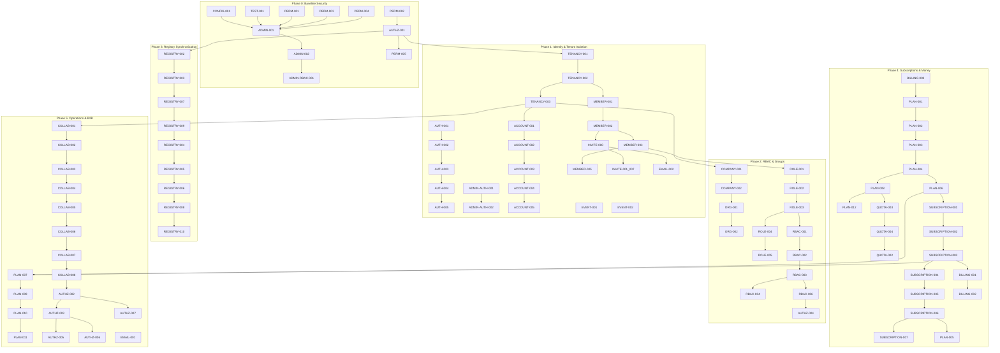

# Planning rules
1. **Compilable and Runnable Batches**: Every implementation batch must keep the codebase compiling and passing existing JUnit tests.
2. **Foundations First**: DB schemas and migration scripts must be developed before coding services.
3. **Core API Stability**: Backend endpoints and contracts (DTOs) must be stable before starting frontend development.
4. **Prerequisites Verification**: Do not begin a batch unless all prerequisite TOFIX IDs are fully implemented/verified.
5. **No Placeholders**: Mock classes must use explicit, configurable behavior rather than empty logic.

---

# Phase overview
- **Phase 0: Baseline protection and critical security** (Hardens testing, configuration, and security guard execution).
- **Phase 1: Account, ownership, membership, authentication and tenant isolation** (Establishes strict tenant boundaries, removes invitations, and implements basic membership/credentials).
- **Phase 2: Company, Groups, roles, assignments and permission overrides** (Builds the organization hierarchy, RBAC scoping, and exceptions).
- **Phase 3: Registry and Permissionizer integration** (Resolves startup syncing, dynamic catalogs, and action-level grant checks).
- **Phase 4: Plans, AddOns, quotas, Money and subscriptions** (Introduces Money columns, price-books, subscriptions, and quota package models).
- **Phase 5: Operational flows: previews, scheduled/bulk jobs, lifecycle, audit, communications and B2B** (Implements plan revisions, B2B collaboration, auditing, and mail escape).
- **Phase 6: Stable APIs, DTOs and read models** (Cleans boundaries, maps via MapStruct, and paginates responses).
- **Phase 7: Remove and rewrite the admin frontend** (Rebuilds the admin panel to consume the clean REST APIs).
- **Phase 8: End-to-end verification and documentation cleanup** (Validates migrations, B2B links, and purges references).

---

# Dependency graph

```mermaid
flowchart TD
    subgraph Phase 0: Baseline Security
        CONFIG-001 & TEST-001 --> ADMIN-001
        PERM-001 & PERM-003 & PERM-004 --> ADMIN-001
        ADMIN-001 --> ADMIN-002
        ADMIN-002 --> ADMIN-RBAC-001
        PERM-002 --> AUTHZ-001
        AUTHZ-001 --> PERM-005
    end

    subgraph Phase 1: Identity & Tenant Isolation
        AUTHZ-001 --> TENANCY-001
        TENANCY-001 --> TENANCY-002
        TENANCY-002 --> TENANCY-003
        AUTH-001 --> AUTH-002
        AUTH-002 --> AUTH-003
        AUTH-003 --> AUTH-004
        AUTH-004 --> AUTH-005
        ADMIN-AUTH-001 --> ADMIN-AUTH-002
        TENANCY-003 --> ACCOUNT-001
        ACCOUNT-001 --> ACCOUNT-002
        ACCOUNT-002 --> ACCOUNT-003
        ACCOUNT-003 --> ACCOUNT-004
        ACCOUNT-004 --> ACCOUNT-005
        TENANCY-002 --> MEMBER-001
        MEMBER-001 --> MEMBER-002
        MEMBER-002 --> MEMBER-003
        MEMBER-003 --> MEMBER-005
        MEMBER-002 --> INVITE-000
        INVITE-000 --> INVITE-001_007
        INVITE-000 --> EMAIL-002
        EVENT-001
        EVENT-002
    end

    subgraph Phase 2: RBAC & Groups
        TENANCY-003 --> COMPANY-001
        COMPANY-001 --> COMPANY-002
        COMPANY-002 --> ORG-001
        ORG-001 --> ORG-002
        MEMBER-003 --> ROLE-001
        ROLE-001 --> ROLE-002
        ROLE-002 --> ROLE-003
        ROLE-003 --> ROLE-004
        ROLE-004 --> ROLE-005
        ROLE-003 --> RBAC-001
        RBAC-001 --> RBAC-002
        RBAC-002 --> RBAC-003
        RBAC-003 --> RBAC-004
        RBAC-003 --> RBAC-006
        RBAC-006 --> AUTHZ-004
    end

    subgraph Phase 3: Registry Synchronization
        AUTHZ-001 --> REGISTRY-002
        REGISTRY-002 --> REGISTRY-003
        REGISTRY-003 --> REGISTRY-007
        REGISTRY-007 --> REGISTRY-009
        REGISTRY-009 --> REGISTRY-004
        REGISTRY-004 --> REGISTRY-005
        REGISTRY-005 --> REGISTRY-006
        REGISTRY-006 --> REGISTRY-008
        REGISTRY-008 --> REGISTRY-010
    end

    subgraph Phase 4: Subscriptions & Money
        BILLING-003 --> PLAN-001
        PLAN-001 --> PLAN-002
        PLAN-002 --> PLAN-003
        PLAN-003 --> PLAN-004
        PLAN-004 --> PLAN-006
        PLAN-004 --> PLAN-008
        PLAN-008 --> PLAN-012
        PLAN-008 --> QUOTA-003
        QUOTA-003 --> QUOTA-004
        QUOTA-004 --> QUOTA-002
        PLAN-006 --> SUBSCRIPTION-001
        SUBSCRIPTION-001 --> SUBSCRIPTION-002
        SUBSCRIPTION-002 --> SUBSCRIPTION-003
        SUBSCRIPTION-003 --> SUBSCRIPTION-004
        SUBSCRIPTION-004 --> SUBSCRIPTION-005
        SUBSCRIPTION-005 --> SUBSCRIPTION-006
        SUBSCRIPTION-006 --> SUBSCRIPTION-007
        SUBSCRIPTION-006 --> PLAN-005
        SUBSCRIPTION-003 --> BILLING-001
        BILLING-001 --> BILLING-002
    end

    subgraph Phase 5: Operations & B2B
        PLAN-006 & SUBSCRIPTION-003 --> PLAN-007
        PLAN-007 --> PLAN-009
        PLAN-009 --> PLAN-010
        PLAN-010 --> PLAN-011
        TENANCY-003 --> COLLAB-001
        COLLAB-001 --> COLLAB-002
        COLLAB-002 --> COLLAB-003
        COLLAB-003 --> COLLAB-004
        COLLAB-004 --> COLLAB-005
        COLLAB-005 --> COLLAB-006
        COLLAB-006 --> COLLAB-007
        COLLAB-007 --> COLLAB-008
        COLLAB-008 --> AUTHZ-002
        AUTHZ-002 --> AUTHZ-003
        AUTHZ-002 --> AUTHZ-007
        AUTHZ-003 --> AUTHZ-005
        AUTHZ-003 --> AUTHZ-006
        EMAIL-001
    end
```

---

# Phase 0: Baseline protection and critical security

### Batch 0.1: Recommended First Batch

**Execution status — 2026-07-16**

- `ADMIN-001` is complete; `ADMIN-002` collision handling was safely resolved in the same bootstrap change.
- The destructive/default-secret portion of `CONFIG-001` is complete. Versioned database migrations remain open, so the full finding is not closed.
- `PERM-003` and `PERM-004` were confirmed and fixed with focused standalone tests.
- `PERM-001` was confirmed. HiveApp's reliance on package interception was removed in Batch 0.2; the generic library limitation remains deferred.
- `TEST-001` remains ongoing. Current verified baseline: 213 HiveApp backend tests and 6 Permissionizer tests, all green.

#### [IMPLEMENT] CONFIG-001 — The only application configuration is destructive development configuration
- **Prerequisites**: None.
- **Unlocks**: ADMIN-001.
- **Order Rationale**: Separates configuration profiles immediately to ensure production migrations do not execute with `ddl-auto: create-drop`.
- **Affected Backend Areas**: `application.yaml`, `application-prod.yaml`, `application-dev.yaml`.
- **Database Migration**: No.
- **Acceptance Criteria**: Running with production profile disables dev tools and uses safe database validation levels.
- **Tests**: Configuration profile loader tests.
- **Future UI Flow**: None.
- **Execution Status**: Profile separation, external production secrets/URLs, PostgreSQL configuration, and safe `ddl-auto` behavior are implemented. Versioned schema migrations remain open.

#### [VERIFY FIRST] TEST-001 — Green tests preserve important unsafe behavior and omit critical negative cases
- **Prerequisites**: None.
- **Unlocks**: ADMIN-001.
- **Order Rationale**: Baseline test verification. The latest run passes all 213 tests (`2026-07-16`) while focused negative cases continue to be added. Remediation: Add test assertions for the remaining missing negative cases.
- **Affected Backend Areas**: Entire Integration Test Suite.
- **Database Migration**: No.
- **Acceptance Criteria**: Report on Loose Assertions is completed; new negative test cases are integrated.
- **Tests**: Integration security checks.
- **Future UI Flow**: None.
- **Execution Status**: In progress. Configuration/admin-bootstrap negative tests and standalone Permissionizer characterization tests were added; the broader audit remains open.

#### [VERIFY FIRST] PERM-001 — Package-level guarded nodes may not be intercepted
- **Prerequisites**: None.
- **Unlocks**: None.
- **Order Rationale**: Standalone AOP package scan check. Verification: Add focused integration test targeting a package-level guard to verify if unannotated classes inherit the guard. Remediation: If failed, adjust Spring AOP advisor pattern matching.
- **Affected Backend Areas**: AspectJ AOP Proxy rules.
- **Database Migration**: No.
- **Acceptance Criteria**: Interceptors execute on methods within guarded packages.
- **Tests**: Focused AOP test.
- **Future UI Flow**: None.
- **Execution Status**: Confirmed. The resolver recognizes the package guard, but the current annotation-only Spring pointcut does not intercept the unannotated method. Remediation is carried into Batch 0.2 after a guarded-package boundary audit.

#### [VERIFY FIRST] PERM-003 — Overloaded methods share the processor's element key
- **Prerequisites**: None.
- **Unlocks**: None.
- **Order Rationale**: Validation of processor key generation. Verification: Add test check with overloaded controller signatures. Remediation: If key clashes, update generator parser to append arguments parameters.
- **Affected Backend Areas**: Annotation processor.
- **Database Migration**: No.
- **Acceptance Criteria**: Overloaded methods generate unique processor keys.
- **Tests**: Compilation tests.
- **Future UI Flow**: None.
- **Execution Status**: Completed. Processor keys include erased parameter signatures, with a compilation test covering overloads.

#### [VERIFY FIRST] PERM-004 — Reflection and collection failures are silently swallowed
- **Prerequisites**: None.
- **Unlocks**: None.
- **Order Rationale**: Verification of reflection handlers. Verification: Trigger custom class loader exceptions. Remediation: If swallowed, configure PermissionCollector to crash context on exceptions.
- **Affected Backend Areas**: PermissionCollector class.
- **Database Migration**: No.
- **Acceptance Criteria**: Scans throwing reflection exceptions propagate and halt startup.
- **Tests**: Reflection exception tests.
- **Future UI Flow**: None.
- **Execution Status**: Completed. Indexed-root and reflection failures now throw a dedicated collection exception, with focused fail-closed tests.

#### [IMPLEMENT] ADMIN-001 — Unconditional startup seeder creates and logs a known SuperAdmin password
- **Prerequisites**: CONFIG-001.
- **Unlocks**: ADMIN-002.
- **Order Rationale**: Secures default password seeding before configuring admin flows.
- **Affected Backend Areas**: `AdminSeeder.java`.
- **Database Migration**: No.
- **Acceptance Criteria**: Seeding in production gets passwords from safe variables and skips logs.
- **Tests**: Seeding environment checks.
- **Future UI Flow**: None.
- **Execution Status**: Completed. Bootstrap is opt-in, credentials are externally configured and validated, passwords are never logged, and production-disabled/collision behavior is tested.

---

### Batch 0.2: Security Guard Activation

**Execution status — 2026-07-16:** Completed. The broad `com.hiveapp.platform` root is structural-only, all 12 permission-bearing service classes explicitly enable guarding, infrastructure remains outside the automatic boundary, startup alignment is fatal, and focused plus full-suite verification is green. Generic package-only interception remains a deferred Permissionizer library limitation rather than a HiveApp dependency.

#### [IMPLEMENT] PERM-002 — HiveApp bypasses startup guard-alignment verification
- **Prerequisites**: None.
- **Unlocks**: AUTHZ-001.
- **Order Rationale**: Activates fatal boot checks on mismatched keys after the Batch 0.1 collector/processor fixes; package-interception activation remains gated by the carried-forward boundary audit.
- **Affected Backend Areas**: Guard verification execution.
- **Database Migration**: No.
- **Acceptance Criteria**: Initialization aborts when guarded definitions exist without a registered interceptor/agent; a registered Spring interceptor permits startup.
- **Tests**: Boot verification checks.
- **Future UI Flow**: None.
- **Execution Status**: Completed. Verification exceptions propagate, reset/reconfiguration preserves installed interception, and standalone tests cover failure and success paths.

#### [IMPLEMENT] AUTHZ-001 — HiveApp explicitly disables Permissionizer guard verification
- **Prerequisites**: PERM-002.
- **Unlocks**: TENANCY-001, REGISTRY-002.
- **Order Rationale**: Enables fatal startup alignment and explicit service-level interception without automatically proxying every platform bean.
- **Affected Backend Areas**: `SecurityConfig.java`, `application.yaml`.
- **Database Migration**: No.
- **Acceptance Criteria**: Permission-bearing services are explicitly intercepted, infrastructure does not inherit synthetic permissions, and unauthorized requests are denied.
- **Tests**: Integration tests checking access blocks.
- **Future UI Flow**: None.
- **Execution Status**: Completed. `skipVerification()` is removed, interceptor registration is ordered before initialization, boundary tests pass, and the full 213-test backend suite is green.

---

### Batch 0.3: Admin Seeding & Security Constraints

**Execution status — 2026-07-16:** Completed. The earlier bootstrap work safely resolved `ADMIN-002`; centralized admin mutation authorization now protects SuperAdmin targets and applies the acting administrator's permission ceiling consistently across role and permission mutations. Focused verification and the complete 222-test backend suite are green.

#### [IMPLEMENT] ADMIN-002 — Admin seeding stops when the user exists, even if the admin record does not
- **Prerequisites**: ADMIN-001.
- **Unlocks**: ADMIN-RBAC-001.
- **Order Rationale**: Prevents ambiguous bootstrap identity state before delegated administration is enabled.
- **Affected Backend Areas**: `AdminSeeder.java`.
- **Database Migration**: No.
- **Acceptance Criteria**: Bootstrap verifies the explicit AdminUser record and never silently promotes an existing normal user.
- **Tests**: Seeder unit tests.
- **Future UI Flow**: None.
- **Execution Status**: Completed in Batch 0.1. An existing normal user causes startup to refuse unsafe implicit promotion; an existing AdminUser is recognized safely.

#### [IMPLEMENT] ADMIN-RBAC-001 — Non-SuperAdmin protection is incomplete for destructive admin actions
- **Prerequisites**: ADMIN-002.
- **Unlocks**: None.
- **Order Rationale**: Establishes the target and delegation boundaries before more admin control-plane features are built.
- **Affected Backend Areas**: `AdminMutationAuthorizer.java`, `AdminUserServiceImpl.java`, `AdminRoleServiceImpl.java`.
- **Database Migration**: No.
- **Acceptance Criteria**: A non-SuperAdmin cannot modify a SuperAdmin or manage roles/permissions outside their own permission ceiling; SuperAdmins can manage other administrators; self-deactivation remains blocked.
- **Tests**: Central authorizer unit tests and admin control-plane integration tests covering both denial and permitted paths.
- **Future UI Flow**: Admin Portal management.
- **Execution Status**: Completed. Target protection and permission-ceiling enforcement now cover admin activation, role assignment/removal, role metadata/activation, and permission grant/revocation. Full backend suite: 222 tests green.

---

### Batch 0.4: Policy Order Verification

**Execution status — 2026-07-16:** Completed. Seven focused tests lock the configured Admin → B2B → Plan → User Role → Spring-authority chain, including every grant/deny short-circuit boundary. The complete 229-test backend suite is green. `AUTHZ-002` remains a separate later fix; this batch documents and preserves its current B2B precedence instead of changing behavior implicitly.

#### [LOCK WITH TESTS] PERM-005 — Policy order is security-significant
- **Prerequisites**: AUTHZ-001.
- **Unlocks**: None.
- **Order Rationale**: The current policy execution chain (Admin → B2B → Plan → User Role → Spring authorities) is intentional. Lock the order and document the consequence for AUTHZ-002 before changing B2B actor authorization later.
- **Affected Backend Areas**: `SecurityConfig.permissionsLoader()`, `PermissionGuard` policy evaluation.
- **Database Migration**: No.
- **Acceptance Criteria**: Exact chain precedence and every early grant/deny boundary are asserted; the fallback cannot override a domain denial.
- **Tests**: `PermissionPolicyOrderTest` using the actual `SecurityConfig` registration path.
- **Future UI Flow**: None.
- **Execution Status**: Completed. Seven focused tests and the full 229-test backend suite pass.

---

# Phase 1: Account, ownership, membership, authentication and tenant isolation

### Batch 1.1: Tenancy Boundaries & Isolation

**Execution status — 2026-07-16:** Completed for the current unpublished, in-memory development stage. Account-scoped repository lookups, active membership context selection, ownership mapping, generated-schema foreign-key metadata, entity persistence callbacks, non-disclosing 404 isolation behavior, and the full 241-test backend suite are green. Versioned production migrations remain future deployment hardening under `CONFIG-001`, not a Batch 1.1 blocker.

#### [IMPLEMENT] TENANCY-001 — Establish `Account` as the canonical tenant boundary
- **Prerequisites**: AUTHZ-001.
- **Unlocks**: TENANCY-002.
- **Order Rationale**: Sets the core tenant filters on database queries before validating relationships.
- **Affected Backend Areas**: Tenant-owned JPA repositories, client services, `SecurityContextService.java`.
- **Database Migration**: No.
- **Acceptance Criteria**: Queries enforce Account ID parameters.
- **Tests**: Multi-tenant isolation checks.
- **Future UI Flow**: Tenant navigation.
- **Execution Status**: Completed. Account is the canonical context ID and tenant-owned IDs are loaded through account/participant-scoped queries.

#### [IMPLEMENT] TENANCY-002 — `Account.ownerId` is an unverified raw UUID relationship
- **Prerequisites**: TENANCY-001.
- **Unlocks**: TENANCY-003, MEMBER-001.
- **Order Rationale**: Ensures the owner ID maps to a real entity before checking tenant-wide parents.
- **Affected Backend Areas**: `Account.java`, `AccountRepository.java`, provisioning/member creation.
- **Database Migration**: Yes (add foreign key).
- **Acceptance Criteria**: Account owner points to a User; owner Member matches it; one active membership per user is enforced in current application flows and generated development schemas contain the owner foreign key.
- **Tests**: Ownership mapping, owner-member callback, duplicate active-membership flows.
- **Future UI Flow**: None.
- **Execution Status**: Completed for the current in-memory stage. Persistent-production concurrency constraints move with the future CONFIG-001 migration baseline.

#### [VERIFY FIRST] TENANCY-003 — Cross-account relationship invariants are not visible in the entity model
- **Prerequisites**: TENANCY-002.
- **Unlocks**: ACCOUNT-001, COMPANY-001, COLLAB-001.
- **Order Rationale**: Entity cross-account verification confirmed persistence-level gaps; callbacks now provide defense beyond normal service paths.
- **Affected Backend Areas**: Tenant aggregate entities, `TenantInvariant.java`, scoped repositories.
- **Database Migration**: No.
- **Acceptance Criteria**: Mismatched tenant hierarchies raise validation errors.
- **Tests**: Cross-account mismatch tests.
- **Future UI Flow**: None.
- **Execution Status**: Completed. Persistence callbacks cover all relationships listed in the finding, and request-level isolation tests pass.

---

### Batch 1.2: Identity & Authentication

**Execution status — 2026-07-16:** Completed for the current unpublished, single-process, in-memory development stage. Canonical email identity, database-race translation, audience/use-bound access and refresh tokens, single-use rotation, logout revocation, admin refresh/logout, active workspace context checks, safe malformed-ID handling, and validated admin DTOs are implemented. Ten focused tests and the full 251-test backend suite pass. Refresh-session persistence/coordination across application instances remains future deployment hardening; restart currently invalidates all sessions safely.

#### [VERIFY FIRST] AUTH-001 — Email identity is not canonicalized
- **Prerequisites**: None.
- **Unlocks**: AUTH-002.
- **Order Rationale**: Email validation check. Verification: Check if casing differences create duplicates. Remediation: Enforce lower-casing on read/write in repository.
- **Affected Backend Areas**: `UserServiceImpl.java`, `UserRepository.java`.
- **Database Migration**: No for the current disposable in-memory database. Normalize existing rows and add the production index only when a persistent deployment baseline exists.
- **Acceptance Criteria**: Email fields are saved in lower-case.
- **Tests**: Registration unit tests.
- **Future UI Flow**: Signup / Login.
- **Execution Status**: Completed. One canonicalizer covers writes and lookups, with a persistence callback as the final write boundary and integration coverage for mixed-case registration/login.

#### [IMPLEMENT] AUTH-002 — Refresh-token type and revocation behavior are not visible at the service boundary
- **Prerequisites**: AUTH-001.
- **Unlocks**: AUTH-003.
- **Order Rationale**: Secures refresh token scope before resolving member security principal.
- **Affected Backend Areas**: Token Service, Security Filters.
- **Database Migration**: No for the current single-process in-memory stage. A shared persistent refresh-session store is required before multi-instance production.
- **Acceptance Criteria**: Active token validation checks match service layer definitions.
- **Tests**: Refresh token validation tests.
- **Future UI Flow**: Logout / session expiry.
- **Execution Status**: Completed for the current stage. Refresh sessions are audience-bound, single-use, rotated, revocable, and cleaned after expiry; restart invalidates all sessions.

#### [IMPLEMENT] AUTH-003 — Client authentication is user-based while authorization is membership/workspace-based
- **Prerequisites**: AUTH-002.
- **Unlocks**: AUTH-004.
- **Order Rationale**: Scopes security principal to the active member inside the workspace.
- **Affected Backend Areas**: `JwtAuthenticationFilter.java`, `SecurityContextHolder`.
- **Database Migration**: No.
- **Acceptance Criteria**: Context principal resolves to workspace member roles.
- **Tests**: Authentication context tests.
- **Future UI Flow**: Dashboard loading.
- **Execution Status**: Completed. The user principal resolves one active membership transactionally, and direct/B2B context rejects inactive client or provider Accounts before authorization.

#### [VERIFY FIRST] AUTH-004 — Registration uniqueness check is race-prone unless database errors are translated
- **Prerequisites**: AUTH-003.
- **Unlocks**: AUTH-005.
- **Order Rationale**: Registration concurrency check. Verification: Test concurrent signup requests with identical email. Remediation: Add try-catch translating database unique constraint errors to structured validation exceptions.
- **Affected Backend Areas**: `UserServiceImpl.java`.
- **Database Migration**: No.
- **Acceptance Criteria**: Mismatched parallel registrations throw clear exception mappings.
- **Tests**: Registration concurrency tests.
- **Future UI Flow**: Registration page.
- **Execution Status**: Completed. `saveAndFlush()` makes the database constraint authoritative and translates a losing unique-email race before workspace provisioning.

#### [IMPLEMENT] AUTH-005 — User-details lookup leaks invalid UUID parsing behavior
- **Prerequisites**: AUTH-004.
- **Unlocks**: None.
- **Order Rationale**: Resolves payload validation crashes on malformed queries.
- **Affected Backend Areas**: Controllers.
- **Database Migration**: No.
- **Acceptance Criteria**: Malformed and unknown authentication principal IDs use the same non-disclosing authentication failure path.
- **Tests**: URL parser check tests.
- **Future UI Flow**: User detail lookup.
- **Execution Status**: Completed. Client and admin UUID parsing is defensive and covered by focused repository-noninteraction tests.

#### [IMPLEMENT] ADMIN-AUTH-001 — Admin refresh tokens have no matching admin refresh flow
- **Prerequisites**: None.
- **Unlocks**: ADMIN-AUTH-002.
- **Order Rationale**: Implements token renewal mechanics for administrators.
- **Affected Backend Areas**: Admin Token controller.
- **Database Migration**: No.
- **Acceptance Criteria**: Active admin sessions are renewable via refresh tokens.
- **Tests**: Refresh token integration tests.
- **Future UI Flow**: Admin Portal dashboard refresh.
- **Execution Status**: Completed. Admin refresh preserves ADMIN audience, rotates once, rejects client/reused tokens, and supports explicit logout revocation.

#### [IMPLEMENT] ADMIN-AUTH-002 — Admin login duplicates authentication logic and skips DTO validation
- **Prerequisites**: ADMIN-AUTH-001.
- **Unlocks**: None.
- **Order Rationale**: Standardizes admin controllers validation payload.
- **Affected Backend Areas**: `AdminAuthController.java`.
- **Database Migration**: No.
- **Acceptance Criteria**: Admin endpoint matches normal login schema validations.
- **Tests**: Authentication validation tests.
- **Future UI Flow**: Admin Portal login.
- **Execution Status**: Completed. The controller uses `@Valid`, delegates to an admin authentication service, and shares canonical credential verification with client login.

---

### Batch 1.3: Provisioning & Slug Lifecycle

**Execution status — 2026-07-16:** Completed for the current unpublished, in-memory stage. Registration now requires and snapshots an active FREE plan atomically; internal provisioning retries return an existing complete workspace without duplicate rows; initial slugs are uniquely bound to User IDs without check-then-insert; account suspension blocks access and revokes all member CLIENT refresh sessions while preserving business records; and API-facing account reads return DTOs. Eight focused tests and the full 259-test backend suite pass. No Flyway or idempotency-log infrastructure was added.

#### [IMPLEMENT] ACCOUNT-001 — Registration can succeed with no subscription
- **Prerequisites**: TENANCY-003.
- **Unlocks**: ACCOUNT-002.
- **Order Rationale**: Mandatory subscription allocation during account provisioning.
- **Affected Backend Areas**: `AccountProvisioningService.java`.
- **Database Migration**: No.
- **Acceptance Criteria**: Onboarding fails if FREE plan assignment fails.
- **Tests**: Provisioning tests.
- **Future UI Flow**: Onboarding checkouts.
- **Execution Status**: Completed. Missing/inactive FREE configuration aborts and rolls back registration; every successful registration has one usable snapshotted entitlement.

#### [IMPLEMENT] ACCOUNT-002 — Workspace deactivation consequences are not implemented in the account service
- **Prerequisites**: ACCOUNT-001.
- **Unlocks**: ACCOUNT-003.
- **Order Rationale**: Cuts access for suspended tenants.
- **Affected Backend Areas**: Tenant interceptors.
- **Database Migration**: No.
- **Acceptance Criteria**: Inactive account endpoints throw `403 Account Suspended`.
- **Tests**: Account deactivation checks.
- **Future UI Flow**: Workspace lock screen.
- **Execution Status**: Completed for the current stage. Security context denies inactive Accounts, deactivation revokes all member CLIENT refresh sessions, and related business records remain preserved for future explicit reactivation.

#### [VERIFY FIRST] ACCOUNT-003 — Workspace slug creation is check-then-insert and race-prone
- **Prerequisites**: ACCOUNT-002.
- **Unlocks**: ACCOUNT-004.
- **Order Rationale**: Slug duplicate check. Verification: Check slug creation under concurrent registration. Remediation: Add unique database index on `accounts(slug)`.
- **Affected Backend Areas**: `Account.java`, `AccountRepository.java`.
- **Database Migration**: No for the current generated in-memory schema; the existing unique column remains authoritative. A production migration baseline is future deployment work.
- **Acceptance Criteria**: Different Users cannot calculate the same initial slug, even when email prefixes match.
- **Tests**: Slug concurrency tests.
- **Future UI Flow**: Account creation form.
- **Execution Status**: Completed. Slugs combine a bounded readable prefix with the complete User UUID; the race-prone existence loop was removed.

#### [VERIFY FIRST] ACCOUNT-004 — Workspace provisioning is not explicitly idempotent
- **Prerequisites**: ACCOUNT-003.
- **Unlocks**: ACCOUNT-005.
- **Order Rationale**: Idempotency check. Verification: Submit identical registration payload twice. Remediation: Add an idempotency key table checking submissions.
- **Affected Backend Areas**: `AccountProvisioningService.java`.
- **Database Migration**: No. Registration duplicates remain conflicts; the internal transactionally atomic provisioning operation returns an existing complete workspace on retry.
- **Acceptance Criteria**: Repeating internal provisioning creates no duplicate Account, owner Member, or usable Subscription and returns the existing setup identifiers.
- **Tests**: Idempotent provisioning tests.
- **Future UI Flow**: Onboarding wizard.
- **Execution Status**: Completed by explicit decision. No idempotency table is needed for this internal synchronous operation; incomplete preexisting aggregates fail for deliberate repair.

#### [IMPLEMENT] ACCOUNT-005 — Account service contract still exposes a persistence entity
- **Prerequisites**: ACCOUNT-004.
- **Unlocks**: None.
- **Order Rationale**: Clean encapsulation.
- **Affected Backend Areas**: `AccountService.java`.
- **Database Migration**: No.
- **Acceptance Criteria**: Operations exchange DTO schemas.
- **Tests**: Interface unit tests.
- **Future UI Flow**: Account settings.
- **Execution Status**: Completed. API-facing account reads return `AccountDto` from the service boundary, and the unused duplicate interface was removed.

---

### Batch 1.4: Workspace Membership & Quotas

**Execution status — 2026-07-16:** Completed for the current unpublished, generated-schema stage. Workspace owners are protected from delegated deactivation; membership and scoped role assignments are duplicate-safe; inactive roles cannot be assigned; deactivation revokes CLIENT refresh sessions while active-token context rejects the suspended member; active member/company quotas use database counts under an Account write lock; and all seven verified join/grant relationships have database uniqueness. Focused tests and the full 271-test backend suite pass. Activation-material cleanup, reactivation impact checks, audit/reason capture, and production migrations remain assigned to their later lifecycle/deployment work rather than this batch.

#### [IMPLEMENT] MEMBER-001 — Authorized members can deactivate the workspace owner
- **Prerequisites**: TENANCY-002.
- **Unlocks**: MEMBER-002.
- **Order Rationale**: Protects owner lockout bounds before structuring membership constraint checks.
- **Affected Backend Areas**: `MemberServiceImpl.java`.
- **Database Migration**: No.
- **Acceptance Criteria**: Lockout requests target owner throw 403.
- **Tests**: Owner lockout block integration tests.
- **Future UI Flow**: Team configurations settings.
- **Execution Status**: Completed. Self-deactivation remains forbidden, and any different actor targeting the workspace owner receives 403 with an explicit ownership-transfer requirement.

#### [IMPLEMENT] MEMBER-002 — Direct member addition allows duplicate memberships
- **Prerequisites**: MEMBER-001.
- **Unlocks**: MEMBER-003, INVITE-000.
- **Order Rationale**: Restricts multi-tenant membership duplication.
- **Affected Backend Areas**: `members` table.
- **Database Migration**: No for the current generated in-memory schema; the entity constraint is authoritative until the production migration baseline exists.
- **Acceptance Criteria**: Workspace addition fails on existing user.
- **Tests**: Concurrency membership addition tests.
- **Future UI Flow**: Team addition panel.
- **Execution Status**: Completed. A friendly same-workspace pre-check, database uniqueness, flush-time conflict translation, and concurrent same-user requests produce exactly one membership.

#### [IMPLEMENT] MEMBER-003 — Member role assignment allows duplicates and inactive roles
- **Prerequisites**: MEMBER-002.
- **Unlocks**: MEMBER-005, ROLE-001.
- **Order Rationale**: Ensures role status alignment.
- **Affected Backend Areas**: `MemberRoleRepository.java`.
- **Database Migration**: No.
- **Acceptance Criteria**: Adding duplicate or deactivated assignments throws validation errors.
- **Tests**: Assignment checks.
- **Future UI Flow**: Team role assignments.
- **Execution Status**: Completed. Assignment rejects inactive roles and an existing account/company-scoped grant; a derived non-null scope key makes account-wide uniqueness database-safe despite nullable `company_id`.

#### [IMPLEMENT] MEMBER-005 — Member deactivation does not implement the decided offboarding lifecycle
- **Prerequisites**: MEMBER-003.
- **Unlocks**: None.
- **Order Rationale**: Session revocation blocks deactivated logins.
- **Affected Backend Areas**: `MemberServiceImpl.java`, token refresh filters.
- **Database Migration**: No.
- **Acceptance Criteria**: Active JWT sessions are immediately invalidated on deactivation.
- **Tests**: Token revocation checks.
- **Future UI Flow**: Team manager dashboard.
- **Execution Status**: Completed for the available lifecycle. Suspension preserves the Member and access configuration, removes it from runtime context/quota, and revokes every current CLIENT refresh session. Activation credential cleanup and reactivation validation follow the direct-creation lifecycle in Batch 1.5 and later operational/audit batches.

#### [IMPLEMENT] QUOTA-001 — Member/company quota checks are inefficient and race-prone
- **Prerequisites**: MEMBER-002.
- **Unlocks**: None.
- **Order Rationale**: Optimizes membership counts.
- **Affected Backend Areas**: `MemberServiceImpl.java`.
- **Database Migration**: No.
- **Acceptance Criteria**: Queries use optimized database counts.
- **Tests**: Load limit checks.
- **Future UI Flow**: Team member addition.
- **Execution Status**: Completed. Active-only database counts replace row loading, and an Account pessimistic lock serializes member/company creation across the quota check and insert. Exact-boundary concurrency tests pass.

#### [VERIFY FIRST] DATA-001 — Join/grant tables may allow duplicate relationships
- **Prerequisites**: MEMBER-003.
- **Unlocks**: None.
- **Order Rationale**: Join table constraint check. Verification: Check if duplicate `member_roles` or `role_permissions` can be saved. Remediation: Add unique database constraints on join tables.
- **Affected Backend Areas**: Database schemas.
- **Database Migration**: No for the current generated in-memory schema; versioned equivalents belong to the future production migration baseline.
- **Acceptance Criteria**: Database rejects duplicate mapping inserts.
- **Tests**: Constraint integrity tests.
- **Future UI Flow**: None.
- **Execution Status**: Completed. Verification confirmed the gap. Generated schemas now reject duplicates for admin user roles, admin role permissions, client role permissions, null-safe member-role scopes, member overrides, collaboration permissions, and plan features; AdminUser-to-User uniqueness is explicit.

---

### Batch 1.5: Direct Creation Replacing Invitations

**Execution status — 2026-07-16:** Completed for the current unpublished, generated-schema stage. The invitation subsystem and redeemable invitation routes are gone. Account actors now create a User and Member atomically with quota, tenant, initial-role, plan-entitlement, and actor-delegation checks. Email members use hashed one-time activation/reset links; members without email use one-time-visible temporary passwords that force a restricted password-change session. Manager regeneration/reset/unlock, username/email/Account-code-plus-employee-number login, attempt locking, session revocation, safe post-commit email delivery, origin validation, and escaped deadline-aware templates are implemented. Focused lifecycle/role/template tests and the clean full 265-test backend suite pass with zero failures/errors; centralized audit remains assigned to `AUDIT-001`, delivery tracking/retry remains in `EMAIL-001`, and production schema migration begins only when a deployment baseline exists.

#### [IMPLEMENT] INVITE-000 — Remove the invitation subsystem and replace it with direct member creation
- **Prerequisites**: MEMBER-002.
- **Unlocks**: INVITE-001_007, EMAIL-002.
- **Order Rationale**: Completely removes the legacy invitation entities and adds direct creation endpoints. Carry safe template HTML escaping, validated origin URLs, and accurate deadlines (from EMAIL-002) into the replacement activation/reset emails.
- **Affected Backend Areas**: All invitation files, controllers, services.
- **Database Migration**: No for the current generated disposable schema. The invitation model has been deleted; a production retirement migration is only needed if a future deployment baseline ever contains invitation rows.
- **Acceptance Criteria**: Invitation controller/services are deleted. Direct creation and the complete decided initial-access lifecycle are exposed.
- **Tests**: Removed invitation tests; direct creation, temporary/email activation, replay, lock/unlock, regeneration, reset, employee login, and session-revocation tests added.
- **Future UI Flow**: Add Member screen.
- **Execution Status**: Completed. Direct creation is transactional and Account-scoped; all credential material is hashed or one-time-visible, ordinary access is blocked until activation completes, and management actions are Permissionizer-protected on the member surface.

#### [REMOVE AS OBSOLETE] INVITE-001 — Invitation acceptance bypasses member quota enforcement
- **Prerequisites**: INVITE-000.
- **Unlocks**: None.
- **Order Rationale**: Subsystem is removed.
- **Affected Backend Areas**: Invitations.
- **Database Migration**: No.
- **Acceptance Criteria**: Removed.
- **Tests**: Delete corresponding tests.
- **Future UI Flow**: None.
- **Execution Status**: Removed with the invitation subsystem; direct creation uses the quota-aware Account-locked member admission path.

#### [REMOVE AS OBSOLETE] INVITE-002 — Invitation token acts as a seven-day login credential for existing users
- **Prerequisites**: INVITE-000.
- **Unlocks**: None.
- **Order Rationale**: Subsystem is removed.
- **Affected Backend Areas**: Invitations.
- **Database Migration**: No.
- **Acceptance Criteria**: Removed.
- **Tests**: Delete corresponding tests.
- **Future UI Flow**: None.
- **Execution Status**: Removed. No invitation token can authenticate an existing User; replacement credential tokens are purpose-bound, expiring, hashed, and one-time.

#### [REMOVE AS OBSOLETE] INVITE-003 — Invitation token is stored in plaintext
- **Prerequisites**: INVITE-000.
- **Unlocks**: None.
- **Order Rationale**: Subsystem is removed.
- **Affected Backend Areas**: Invitations.
- **Database Migration**: No.
- **Acceptance Criteria**: Removed.
- **Tests**: Delete corresponding tests.
- **Future UI Flow**: None.
- **Execution Status**: Removed. Replacement activation/reset tokens are stored only as SHA-256 hashes.

#### [REMOVE AS OBSOLETE] INVITE-004 — Stored invitation role/scope is not safely revalidated on acceptance
- **Prerequisites**: INVITE-000.
- **Unlocks**: None.
- **Order Rationale**: Subsystem is removed.
- **Affected Backend Areas**: Invitations.
- **Database Migration**: No.
- **Acceptance Criteria**: Removed.
- **Tests**: Delete corresponding tests.
- **Future UI Flow**: None.
- **Execution Status**: Removed. Initial roles on direct creation are revalidated transactionally against active tenant/scope/role state, plan entitlement, and actor ceiling.

#### [REMOVE AS OBSOLETE] INVITE-005 — Invitation email normalization and duplicate protection are incomplete
- **Prerequisites**: INVITE-000.
- **Unlocks**: None.
- **Order Rationale**: Subsystem is removed.
- **Affected Backend Areas**: Invitations.
- **Database Migration**: No.
- **Acceptance Criteria**: Removed.
- **Tests**: Delete corresponding tests.
- **Future UI Flow**: None.
- **Execution Status**: Removed. Replacement identity creation canonicalizes optional email and enforces database-backed username/email/Account employee-number uniqueness.

#### [REMOVE AS OBSOLETE] INVITE-006 — Expiration maintenance scans other accounts and mutates inside a read-only flow
- **Prerequisites**: INVITE-000.
- **Unlocks**: None.
- **Order Rationale**: Subsystem is removed.
- **Affected Backend Areas**: Invitations.
- **Database Migration**: No.
- **Acceptance Criteria**: Removed.
- **Tests**: Delete corresponding tests.
- **Future UI Flow**: None.
- **Execution Status**: Removed. No invitation-expiration scan or read-only mutation path remains.

#### [REMOVE AS OBSOLETE] INVITE-007 — Email delivery and database commit are not coordinated
- **Prerequisites**: INVITE-000.
- **Unlocks**: None.
- **Order Rationale**: Subsystem is removed.
- **Affected Backend Areas**: Invitations.
- **Database Migration**: No.
- **Acceptance Criteria**: Removed.
- **Tests**: Delete corresponding tests.
- **Future UI Flow**: None.
- **Execution Status**: Removed. Replacement email dispatch occurs after commit; failure preserves recoverable pending access for explicit regeneration.

#### [REMOVE AS OBSOLETE] EMAIL-002 — Invitation HTML embeds unescaped user/configuration values and hard-codes expiry text
- **Prerequisites**: INVITE-000.
- **Unlocks**: None.
- **Order Rationale**: Replaced by safe escaping, URL validation, and dynamic expiry deadlines inside the new user activation templates under direct creation (`INVITE-000`).
- **Affected Backend Areas**: Credential activation/reset email and activation configuration.
- **Database Migration**: No.
- **Acceptance Criteria**: Replacement templates escape dynamic HTML values, validate origin configuration, and render the actual expiry deadline.
- **Tests**: Focused credential-template escaping/deadline test.
- **Future UI Flow**: None.
- **Execution Status**: Completed by replacement. The old invitation template is deleted and its safety requirements are enforced in activation/reset email.

---

### Batch 1.6: Legacy Event Cleanup

**Execution status — 2026-07-16:** Completed. The unused registration event, Account event, comment-only listener, and orphaned shared event marker are deleted. Registration remains one explicit synchronous transaction through `WorkspaceProvisioningService`; current credential email and subscription listeners remain intact because they have active publishers and concrete after-commit behavior. The clean full backend suite passes all 265 tests with zero failures/errors.

#### [REMOVE AS OBSOLETE] EVENT-001 — `UserRegisteredEvent` is unused dead architecture
- **Prerequisites**: None.
- **Unlocks**: None.
- **Order Rationale**: Cleans legacy boilerplate.
- **Affected Backend Areas**: Events.
- **Database Migration**: No.
- **Acceptance Criteria**: File deleted.
- **Tests**: Clean compilation.
- **Future UI Flow**: None.
- **Execution Status**: Removed together with the now-unused `DomainEvent` marker. Registration continues to provision synchronously with no duplicate event path.

#### [REMOVE AS OBSOLETE] EVENT-002 — `Account` event artifacts are unused leftovers
- **Prerequisites**: None.
- **Unlocks**: None.
- **Order Rationale**: Cleans legacy boilerplate.
- **Affected Backend Areas**: Events.
- **Database Migration**: No.
- **Acceptance Criteria**: Files deleted.
- **Tests**: Clean compilation.
- **Future UI Flow**: None.
- **Execution Status**: Removed. `AccountCreatedEvent` and the comment-only `UserRegistrationEventListener` are deleted; the already-removed duplicate `AccountService` remains absent.

---

# Phase 2: Company, Groups, roles, assignments and permission overrides

### Batch 2.1: Company Lifecycle & Safe Metadata Edits

**Execution status — 2026-07-16:** Completed for the current platform shell. Ordinary deactivation is reversible but immediately cuts off direct and B2B operation; explicit Permissionizer-protected reactivation atomically rechecks Account state, active-Company quota, and preserved grant entitlements. Company identity commands/read models now cover the decided fields with normalization, same-tenant tax warnings, cross-tenant privacy, and an extensible country-dependent-record guard. Permanent Company purge remains a distinct deferred Phase 5 operational workflow, and centralized actor-aware auditing remains under `AUDIT-001`.

#### [IMPLEMENT] COMPANY-001 — Company deactivation has no defined dependent-data behavior
- **Prerequisites**: TENANCY-003.
- **Unlocks**: COMPANY-002.
- **Order Rationale**: Restricts access on deactivated workspace scopes.
- **Affected Backend Areas**: `CompanyServiceImpl.java`.
- **Database Migration**: No.
- **Acceptance Criteria**: Inactive Company context and new grants are blocked; preserved data is reversible; reactivation is separately authorized and atomically validates Account state, quota, and saved entitlements.
- **Tests**: Direct/B2B inactive-context, preserved-grant restoration, reused-quota rejection, inactive-grant prevention, and entitlement-conflict tests.
- **Future UI Flow**: Company configurations page.
- **Execution Status**: Implemented for reversible lifecycle. `SecurityContextService` cuts off inactive scope, grant paths refuse new inactive-Company delegation, and `platform.company.reactivate` runs under Account/Company locks with quota and saved-permission validation. Permanent owner-only purge is explicitly deferred to the operational-lifecycle phase rather than coupled to ordinary `company.delete`.

#### [IMPLEMENT] COMPANY-002 — Company identity editing does not implement the decided field-sensitive contract
- **Prerequisites**: COMPANY-001.
- **Unlocks**: ORG-001.
- **Order Rationale**: Implements safe edits validation rules.
- **Affected Backend Areas**: `CompanyServiceImpl.java`.
- **Database Migration**: No.
- **Acceptance Criteria**: Required identity fields and all decided optional metadata are coherent across create/update/read; tax duplicates warn only inside the Account; country-dependent domains can block ordinary jurisdiction edits.
- **Tests**: Validation, normalization, full metadata, partial update, duplicate warning, cross-tenant privacy, and country-dependency guard tests.
- **Future UI Flow**: Company settings form.
- **Execution Status**: Implemented for the current shell. The existing Company update permission remains the single authorization action while service validation is field-sensitive. Central before/after actor auditing remains under `AUDIT-001` and does not justify a Company-only audit subsystem.

---

### Batch 2.2: Organizational Hierarchy Model

**Execution status — 2026-07-16:** Completed for the current platform shell. The Department-specific draft is replaced by a generic Company-owned Group tree, explicit multi-placement memberships with per-placement positions, safe lifecycle and hierarchy commands, and member-free Platform/Account/Company structure templates with previewed all-or-nothing instantiation. Organization actions are individually Permissionizer-protected, while Group structure and placement remain deliberately absent from effective-permission evaluation. Generated H2 schema mappings were updated directly; versioned migration history remains deferred until the application enters a persistent production-schema stage.

#### [IMPLEMENT] ORG-001 — Department entity cannot support the decided generic Group model
- **Prerequisites**: COMPANY-002.
- **Unlocks**: ORG-002.
- **Order Rationale**: Implements nested groups model structure.
- **Affected Backend Areas**: Organization entities/repositories, Company initialization, organization service/controller/DTOs, registry feature, and blocker error contract.
- **Database Migration**: Generated schema updated from entity mappings; no versioned migration during the current disposable in-memory stage by project decision.
- **Acceptance Criteria**: Generic multi-root hierarchy, explicit memberships/positions, normalized sibling uniqueness, cycle and cross-Company protection, safe reorder/archive/restore/empty-only deletion, and independent member-free structure templates are available through stable APIs.
- **Tests**: Entity invariants plus HTTP hierarchy, reorder, archive/restore, cycle, cross-Company, membership, blocker, template conflict/atomicity/copy/delete, and tenant-isolation coverage.
- **Future UI Flow**: Organization hierarchy manager.
- **Execution Status**: Implemented. Company creation adds a deletable ordinary `Departments` root; Group operations preserve explicit placements and return actionable deletion blockers; templates support Platform/Account/Company ownership boundaries and all-or-nothing independent structure copies. Platform template authoring stays reserved for a platform-admin surface.

#### [IMPLEMENT] ORG-002 — Organization Groups must stay outside automatic authorization
- **Prerequisites**: ORG-001.
- **Unlocks**: None.
- **Order Rationale**: Decouples group movements from security clearances.
- **Affected Backend Areas**: `OrganizationServiceImpl`, `OrganizationFeature`, Permissionizer boundary tests, and effective-permission integration coverage. `UserRolePolicy` remains unchanged because it has no Group dependency.
- **Database Migration**: No.
- **Acceptance Criteria**: Security checks evaluate permissions independently of group placement.
- **Tests**: Permission guard registration, B2B target-Company scoping, and effective-permission equality across membership, position, rename, and reparent operations.
- **Future UI Flow**: Organization hierarchy manager.
- **Execution Status**: Implemented. Organization commands require explicit `platform.organization.*` actions, but no Group field or operation participates in role/override evaluation or grants operational access.

---

### Batch 2.3: Custom & System Role Constraints

**Execution status — 2026-07-17:** Completed for the current platform shell. Custom roles now have explicit inactive/active/archived lifecycle, system roles are tenant-read-only, used roles cannot be hard-deleted, shared-role changes require fresh impact confirmation, and Duplicate supports staged rollout/adoption. Permissionizer generation verified every role action key, including intentional distinct `read` and `view` actions. Generated H2 schema mappings were updated directly; versioned migration history remains deferred until persistent production-schema work begins. Actor delegation ceilings and central mutation audit remain in their planned owners, `RBAC-003` and `AUDIT-001`.

#### [IMPLEMENT] ROLE-001 — Deleting a role does not deliberately handle member assignments
- **Prerequisites**: MEMBER-003.
- **Unlocks**: ROLE-002.
- **Order Rationale**: Blocks deleting roles currently assigned to members.
- **Affected Backend Areas**: `RoleServiceImpl.java`.
- **Database Migration**: No.
- **Acceptance Criteria**: Deleting active role returns validation warnings.
- **Tests**: Role deletion check tests.
- **Future UI Flow**: Roles settings manager.
- **Execution Status**: Implemented. Only never-assigned custom roles without current references can be hard-deleted; a persistent first-assignment marker keeps used roles in deactivate/archive lifecycle even after assignments are removed.

#### [IMPLEMENT] ROLE-002 — System-role permissions can still be modified
- **Prerequisites**: ROLE-001.
- **Unlocks**: ROLE-003.
- **Order Rationale**: Locks platform templates.
- **Affected Backend Areas**: `RoleServiceImpl.java`.
- **Database Migration**: No.
- **Acceptance Criteria**: Modifying roles marked `isSystemRole = true` returns 403.
- **Tests**: System roles integrity checks.
- **Future UI Flow**: Roles dashboard.
- **Execution Status**: Implemented. Tenant metadata, permission, lifecycle, and deletion mutations all reject system roles; Duplicate creates an independent inactive custom adoption copy.

#### [IMPLEMENT] ROLE-003 — Role activation state is incomplete and internally inconsistent
- **Prerequisites**: ROLE-002.
- **Unlocks**: ROLE-004, RBAC-001.
- **Order Rationale**: Adds role lifecycles (ACTIVE, INACTIVE, ARCHIVED).
- **Affected Backend Areas**: `Role.java`.
- **Database Migration**: Generated schema updated from entity mappings; no versioned migration during the current disposable in-memory stage by project decision.
- **Acceptance Criteria**: Role states transition according to enum rules.
- **Tests**: State transition tests.
- **Future UI Flow**: Role lifecycle toggles.
- **Execution Status**: Implemented. `ACTIVE`, `INACTIVE`, and terminal `ARCHIVED` are exposed in the API; assignment/runtime evaluation ignores non-active roles, and activation revalidates current scope, grantability, and entitlement.

#### [VERIFY FIRST] ROLE-004 — Role permission keys may not match the declared feature contract
- **Prerequisites**: ROLE-003.
- **Unlocks**: ROLE-005.
- **Order Rationale**: Permission validation check. Verification: Check if invalid keys can be mapped to roles. Remediation: Add validator rejecting keys not declared by feature annotations.
- **Affected Backend Areas**: `RoleServiceImpl.java`.
- **Database Migration**: No.
- **Acceptance Criteria**: Invalid key mappings reject with `ResourceNotFoundException`.
- **Tests**: Key validation tests.
- **Future UI Flow**: Permission picker.
- **Execution Status**: Verified with no defect. All annotated role keys are emitted in Permissionizer's generated catalog; `read` and `view` intentionally protect detail and list actions, and unknown grant keys return 404.

#### [IMPLEMENT] ROLE-005 — Shared custom-role edits have no impact workflow
- **Prerequisites**: ROLE-004.
- **Unlocks**: None.
- **Order Rationale**: Warns admins on custom role mutations.
- **Affected Backend Areas**: `RoleServiceImpl.java`.
- **Database Migration**: No.
- **Acceptance Criteria**: Editing role alerts downstream subscriber impact count.
- **Tests**: Save role warning tests.
- **Future UI Flow**: Custom roles save dialog.
- **Execution Status**: Implemented for the impact workflow. Preview exposes assignment/member/scope and permission deltas; assigned-role mutations require matching role version plus assignment count, and Duplicate is the staged-rollout path. Delegation ceiling and central auditing remain under `RBAC-003` and `AUDIT-001`.

---

### Batch 2.4: Clean RBAC Scoping & Evaluation Ceiling
#### [IMPLEMENT] RBAC-001 — Company scope is represented twice for role assignment
- **Prerequisites**: ROLE-003.
- **Unlocks**: RBAC-002.
- **Order Rationale**: Separates template availability from assignment effect scope.
- **Affected Backend Areas**: `MemberRole.java`, `Role.java`, role/member DTOs and repositories, effective permission evaluation.
- **Database Migration**: No for the current unpublished disposable H2 schema; update generated mappings directly.
- **Acceptance Criteria**: Role assignments declare company boundaries uniquely.
- **Tests**: Database schema mappings check.
- **Future UI Flow**: None.
- **Execution Status**: Implemented. Account/Company template boundary and Account/Company assignment effect scope are explicit, containment is enforced, exact-scope uniqueness is retained, and effective permissions never union unrelated Companies. Platform-published starter-template adoption remains future platform-admin work.

#### [IMPLEMENT] RBAC-002 — Inactive client roles still grant permissions
- **Prerequisites**: RBAC-001.
- **Unlocks**: RBAC-003.
- **Order Rationale**: Runtime verification of role active state.
- **Affected Backend Areas**: `UserRolePolicy.java`.
- **Database Migration**: No.
- **Acceptance Criteria**: Deactivated roles are excluded from permission resolution.
- **Tests**: Active role runtime checks.
- **Future UI Flow**: Access logs.
- **Execution Status**: Implemented and retained. Runtime policy and effective-permission reads exclude inactive/archived roles, and inactive roles cannot be newly assigned.

#### [IMPLEMENT] RBAC-003 — Client role assignment and direct grants have no actor permission ceiling
- **Prerequisites**: RBAC-002.
- **Unlocks**: RBAC-004, RBAC-006.
- **Order Rationale**: Backend validation ceiling check.
- **Affected Backend Areas**: `DelegationCeilingService`, `MemberServiceImpl`, `RoleServiceImpl`, `CollaborationServiceImpl`.
- **Database Migration**: No.
- **Acceptance Criteria**: User cannot grant permission keys they do not hold.
- **Tests**: Assignment ceiling tests.
- **Future UI Flow**: Admin role edit panel.
- **Execution Status**: Implemented. Scoped actor ceilings cover assignment, initial assignment, direct override mutation, role permission addition/activation/duplication, and B2B delegation. Owner targets are protected from ordinary role/override mutation.

#### [IMPLEMENT] RBAC-004 — Removing a member role ignores company scope
- **Prerequisites**: RBAC-003.
- **Unlocks**: None.
- **Order Rationale**: Scopes assignments removal safely.
- **Affected Backend Areas**: `MemberServiceImpl.java`.
- **Database Migration**: No.
- **Acceptance Criteria**: Removing role assignment respects target company boundaries.
- **Tests**: Scoped removal tests.
- **Future UI Flow**: Role assignment tables.
- **Execution Status**: Implemented. Removal requires an explicit effect scope and deletes only the exact Account or Company assignment.

---

### Batch 2.5: Scoped Exceptions & Overrides
#### [IMPLEMENT] RBAC-006 — Direct member overrides cannot support the decided exception lifecycle
- **Prerequisites**: RBAC-003.
- **Unlocks**: AUTHZ-004.
- **Order Rationale**: Exception override details.
- **Affected Backend Areas**: `MemberPermissionOverride.java`.
- **Database Migration**: No for the current unpublished disposable H2 schema; update generated mappings directly.
- **Acceptance Criteria**: Overrides support description reasons and expiration dates.
- **Tests**: Overrides expiration tests.
- **Future UI Flow**: User exceptions settings.
- **Execution Status**: Implemented. Direct access changes are explicit `GRANT`/`DENY` exceptions with Account/Company scope, mandatory reason, immutable creator, required future expiry for grants, optional future expiry for denies, exact-scope uniqueness, runtime expiry, inactive-Company cutoff, owner/self protection, grantability, entitlement, and scoped delegation ceilings. The exception DTO exposes its source, scope, decision, reason, creator, expiry, and current effect. Central actor-event history remains owned by `AUDIT-001`.

#### [IMPLEMENT] AUTHZ-004 — Account-wide member overrides do not apply inside company context
- **Prerequisites**: RBAC-006.
- **Unlocks**: None.
- **Order Rationale**: Cascades global overrides to child entities.
- **Affected Backend Areas**: `UserRolePolicy.java`.
- **Database Migration**: No.
- **Acceptance Criteria**: Account-wide overrides cascade to sub-company operations.
- **Tests**: Scoped cascade validation tests.
- **Future UI Flow**: None.
- **Execution Status**: Implemented. Runtime and effective-permission reads load Account plus exact-Company exceptions; Account decisions cascade into Company context, Company decisions never escape their exact Company, and any applicable active `DENY` wins over direct grants and roles. Cross-scope, expiry, inactive-Company, and HTTP-context tests pass.

---

# Phase 3: Registry and Permissionizer integration

### Deferred registry lifecycle work
#### [DEFERRED] REGISTRY-001 — Removed code definitions and annotations remain as live database rows
- **Prerequisites**: None.
- **Unlocks**: None.
- **Order Rationale**: Product decision assumes deployed feature and permission codes remain stable. Do not build alias, replacement, or automated retirement machinery until a real removal/rename requirement appears.
- **Affected Backend Areas**: Registry synchronization and persisted plan/role/grant references.
- **Database Migration**: No active migration in this plan.
- **Acceptance Criteria**: The deferral is explicit; codes are treated as stable developer contracts and are never silently reused.
- **Tests**: None until the deferred lifecycle is activated.
- **Future UI Flow**: None.

---

### Batch 3.1: Startup Seeding Repair & Inspectability
#### [IMPLEMENT] REGISTRY-002 — Stale permission actions still pass role-grant validation
- **Prerequisites**: AUTHZ-001.
- **Unlocks**: REGISTRY-003.
- **Order Rationale**: Checks role grants against code definitions (excludes deferred REGISTRY-001).
- **Affected Backend Areas**: `PermissionGrantValidator.java`.
- **Database Migration**: No.
- **Acceptance Criteria**: Mismatched codes reject role updates.
- **Tests**: Action validation integration tests.
- **Future UI Flow**: None.
- **Execution Status**: Implemented. Every grant target now requires membership in the validated current Permissionizer action snapshot before feature/audience rules are evaluated. Stale database actions are rejected and excluded from admin, client-role, and B2B permission catalogs.

#### [IMPLEMENT] REGISTRY-003 — A partial or empty Permissionizer collection is accepted as successful seeding
- **Prerequisites**: REGISTRY-002.
- **Unlocks**: REGISTRY-007.
- **Order Rationale**: Crash boot on incomplete scans.
- **Affected Backend Areas**: `FeatureSeeder.java`.
- **Database Migration**: No.
- **Acceptance Criteria**: Empty scanned keys cause context exit.
- **Tests**: Verification checks.
- **Future UI Flow**: None.
- **Execution Status**: Implemented. Startup independently reflects every guarded service action and compares that complete set with Permissionizer collection output before any writes. Empty, partial, duplicate, malformed, unmapped, and module-mismatched snapshots fail startup and are never installed as the runtime grant catalog.

#### [IMPLEMENT] REGISTRY-007 — Existing feature rows are not fully repaired from their code definition
- **Prerequisites**: REGISTRY-003.
- **Unlocks**: REGISTRY-009.
- **Order Rationale**: Syncs database columns with code annotations.
- **Affected Backend Areas**: `FeatureSeeder.java`.
- **Database Migration**: No.
- **Acceptance Criteria**: Database metadata is overwritten by code annotations.
- **Tests**: Sync repair tests.
- **Future UI Flow**: None.
- **Execution Status**: Implemented. Synchronization repairs Feature module/status/quota/order and Permission feature/name/description/resource/action from the validated code snapshot while preserving admin-owned activation state. Only actual changes are counted.

#### [IMPLEMENT] REGISTRY-009 — Startup synchronization is split, non-atomic across registry layers, and not inspectable
- **Prerequisites**: REGISTRY-007.
- **Unlocks**: REGISTRY-004.
- **Order Rationale**: Wraps synchronize routines into single transaction.
- **Affected Backend Areas**: `FeatureSeeder.java`, `PermissionSeeder.java`.
- **Database Migration**: No for the current unpublished disposable H2 schema; generated mappings include synchronization lock/run tables directly.
- **Acceptance Criteria**: Sync executes transactionally and writes a sync log row.
- **Tests**: Concurrency synchronization locks checks.
- **Future UI Flow**: System status logs.
- **Execution Status**: Implemented. One ordered startup listener validates a deterministic SHA-256 snapshot, converges the first lock-row insert, serializes writers with a pessimistic database lock, and applies feature plus permission repairs in one transaction. Mid-write failure rolls back both layers and the success report; failure summaries use a separate transaction. Every run records build/hash/timestamps/status/counts/details, and a dedicated Permissionizer-protected platform-admin endpoint returns the latest safe summary.

---

### Batch 3.2: Dynamic Catalog Visibility & Audience Selection
#### [IMPLEMENT] REGISTRY-004 — Current feature activation cannot represent the four decided operational controls
- **Prerequisites**: REGISTRY-009.
- **Unlocks**: REGISTRY-005.
- **Order Rationale**: State indicators for catalogs.
- **Affected Backend Areas**: `Feature.java`.
- **Database Migration**: No for the current unpublished disposable H2 schema; generated mappings contain the four control columns and durable audit table directly.
- **Acceptance Criteria**: Features support independent public visibility, new-sale, new-grant, and emergency-runtime controls with separate permissions, eligibility, audit, and version invalidation.
- **Tests**: Independence, eligibility, confirmation, authorization, durable audit, version bump, runtime cutoff/restoration, and stale-session checks.
- **Future UI Flow**: Catalog Admin visibility switches.
- **Execution Status**: Implemented. The overloaded active endpoint is removed. Four separately permissioned operations update only their declared state under a pessimistic catalog/feature lock, record actor/reason/before/after/confirmation audit history, and publish a new catalog revision. Runtime cutoff is the first fail-closed Permissionizer policy and is rechecked against the database for every action, including stale tokens.

#### [IMPLEMENT] REGISTRY-005 — The two public catalog implementations disagree and one mutates JPA entities
- **Prerequisites**: REGISTRY-004.
- **Unlocks**: REGISTRY-006.
- **Order Rationale**: Standardizes catalog fetch routines.
- **Affected Backend Areas**: Catalog Services.
- **Database Migration**: No.
- **Acceptance Criteria**: Disagreeing catalog implementation is removed; all endpoints use typed read DTOs from current code definitions and persisted operational state.
- **Tests**: Catalog queries return consistent models and apply module, public-visibility, new-sale, new-grant, runtime, and audience filters independently.
- **Future UI Flow**: Pricing page catalogs.
- **Execution Status**: Implemented. The raw JPA catalog and entity-relationship mutation are removed. Public, admin inventory, feature, and permission catalogs use typed read models, current definitions, module activity, and the same audience-specific operational rules.

#### [IMPLEMENT] REGISTRY-006 — Permission-picker construction scales as permission-by-permission entitlement checks
- **Prerequisites**: REGISTRY-005.
- **Unlocks**: REGISTRY-008.
- **Order Rationale**: Database optimization for pickers.
- **Affected Backend Areas**: `PermissionPickerCatalogService.java`, `PlanEntitlementService.java`.
- **Database Migration**: No.
- **Acceptance Criteria**: A picker resolves the effective entitled feature set once, loads catalog data in bulk, and filters/group results without per-permission entitlement calls.
- **Tests**: Bulk entitlement resolution and mock interaction/query-shape verification.
- **Future UI Flow**: Admin role assignment pickers.
- **Execution Status**: Implemented. Picker construction loads permissions/features once and resolves the account's active subscription snapshot, plan features, and added overrides once. Tests prove no permission-by-permission entitlement calls occur.

#### [IMPLEMENT] REGISTRY-008 — Client-role grantability is feature-wide, including destructive and commercial actions
- **Prerequisites**: REGISTRY-006.
- **Unlocks**: REGISTRY-010.
- **Order Rationale**: Checks code grant limits before mappings.
- **Affected Backend Areas**: `PermissionGrantValidator.java`.
- **Database Migration**: No.
- **Acceptance Criteria**: Every action has one current owner/client/admin/B2B eligibility interpretation; owner-only and B2B-only actions never leak into ordinary client-role grants.
- **Tests**: Definition validation, picker filtering, grant validation, effective-permission, owner-only, and runtime-policy integration checks.
- **Future UI Flow**: Admin role edit form.
- **Execution Status**: Implemented. HiveApp definitions now classify actions independently of Permissionizer. Workspace deletion and subscription application are owner-only, B2B remains an explicit allowlist, snapshot validation rejects unknown/conflicting classifications, and grant plus runtime policies recheck the current classification.

#### [IMPLEMENT] REGISTRY-010 — Catalog and permission-picker contracts are neither uniformly audience-specific nor versioned
- **Prerequisites**: REGISTRY-008.
- **Unlocks**: None.
- **Order Rationale**: Decouples API catalog contracts.
- **Affected Backend Areas**: Catalog controllers.
- **Database Migration**: No.
- **Acceptance Criteria**: Picker APIs return a registry version, audience-specific available choices, and current selections with unavailable reasons; security-sensitive grants reject stale versions.
- **Tests**: Contract, unavailable-current-selection, stale role write, catalog revision, B2B grant, entitlement, and emergency-state tests.
- **Future UI Flow**: Role picker list.
- **Execution Status**: Implemented. Client-role and B2B pickers expose versioned DTOs with current selections separated from available choices and stable unavailable reasons. Role and B2B grant writes require the current `snapshot-hash:revision`; synchronization and operational-control changes invalidate stale picker submissions.

---

# Phase 4: Plans, AddOns, quotas, Money and subscriptions

### Batch 4.1: Money Type and Price-Book Foundations
#### [IMPLEMENT] BILLING-003 — HiveApp has price calculations but no decided Money, price-book, invoice, or payment ledger
- **Prerequisites**: None.
- **Unlocks**: PLAN-001.
- **Order Rationale**: Installs the core money structures before mapping database tables.
- **Affected Backend Areas**: Domain entities.
- **Database Migration**: No for the current unpublished, disposable H2 database; JPA mappings generate the updated schema directly. Add versioned migration history only when production persistence begins.
- **Acceptance Criteria**: Prices are saved with explicit currencies (e.g. `USD`).
- **Tests**: Money/payment value tests, currency-safe billing calculation and validation tests, and API/persistence integration assertions.
- **Future UI Flow**: Billing history lists.
- **Execution Status**: Implemented on 2026-08-10. Plan, add-on, quota-unit, subscription-current, snapshot, preview, catalog, and payment-request amounts now carry normalized ISO currency. Arithmetic rejects mixed currencies and unsafe minor-unit precision; no implicit FX is performed. Immutable price-book revisions and financial ledgers remain in their later scheduled batches.

---

### Batch 4.2: Plan Persistence & Atomic Seeders
#### [VERIFY FIRST] PLAN-001 — Plan persistence constraints are weak at the entity level
- **Prerequisites**: BILLING-003.
- **Unlocks**: PLAN-002.
- **Order Rationale**: Database level unique constraint verification. Verification: Check if duplicate plan codes can be saved. Remediation: Add unique database index on `plans(code)`.
- **Affected Backend Areas**: `Plan.java`.
- **Database Migration**: No for the current generated H2 schema; the unique code constraint already existed and was verified. Add versioned production migration history later.
- **Acceptance Criteria**: Duplicate plan codes raise database errors.
- **Tests**: JPA integration tests.
- **Future UI Flow**: Plans builder.
- **Execution Status**: Verified and completed on 2026-08-10. The existing database unique constraint rejects duplicate Plan codes; billing cycle, lifecycle status, and optimistic-lock version are non-null and covered by direct persistence tests.

#### [IMPLEMENT] PLAN-002 — FREE/default plan availability is not protected
- **Prerequisites**: PLAN-001.
- **Unlocks**: PLAN-003.
- **Order Rationale**: Blocks default plan deletes.
- **Affected Backend Areas**: `PlanAdminServiceImpl.java`.
- **Database Migration**: No.
- **Acceptance Criteria**: Deactivating or deleting default FREE throws `BusinessException`; startup rejects an inactive default.
- **Tests**: Default plan deletion unit tests.
- **Future UI Flow**: Admin plans console.
- **Execution Status**: Implemented on 2026-08-10. One shared default code is used across provisioning, inheritance, seeding, and administration; FREE cannot be deactivated/deleted and missing FREE is bootstrapped even in a partially populated Plan table.

#### [IMPLEMENT] PLAN-003 — Seeded plan composition diverges between fresh and existing installations
- **Prerequisites**: PLAN-002.
- **Unlocks**: PLAN-004.
- **Order Rationale**: Atomic plan seeder setup.
- **Affected Backend Areas**: `PlanSeeder.java`.
- **Database Migration**: No.
- **Acceptance Criteria**: Fresh and partial bootstrap states create the same explicit shell baseline; repeat execution is idempotent and preserves admin-managed existing templates.
- **Tests**: Seeder checks.
- **Future UI Flow**: None.
- **Execution Status**: Implemented on 2026-08-10. Bootstrap no longer derives product composition from every `planAssignable` feature. It validates an explicit baseline before writing, creates missing templates transactionally, and never overwrites existing catalog decisions. Versioned production catalog migrations remain later revision work.

#### [IMPLEMENT] PLAN-004 — Plan-feature uniqueness is enforced only by a race-prone pre-check
- **Prerequisites**: PLAN-003.
- **Unlocks**: PLAN-006, PLAN-008.
- **Order Rationale**: Restricts duplications in features map.
- **Affected Backend Areas**: `PlanFeature.java`.
- **Database Migration**: No for the current generated H2 schema; the unique mapping constraint already existed and was verified. Add production migration history later.
- **Acceptance Criteria**: Duplicate plan feature mappings fail database constraint checks.
- **Tests**: Concurrency mapping tests.
- **Future UI Flow**: Catalog assignments setting page.
- **Execution Status**: Verified and completed on 2026-08-10. Direct duplicate persistence fails at the database boundary, the friendly pre-check remains, and a race at flush is translated to `DuplicateResourceException`.

---

### Batch 4.3: Plan Lifecycle & AddOn Models
#### [IMPLEMENT] PLAN-006 — Boolean plan state cannot implement the decided lifecycle
- **Prerequisites**: PLAN-004.
- **Unlocks**: SUBSCRIPTION-001, PLAN-007.
- **Order Rationale**: Adds lifecycles (DRAFT, ACTIVE, ARCHIVED).
- **Affected Backend Areas**: `Plan.java`.
- **Database Migration**: No for the current unpublished/disposable H2 schema; update generated schema now and establish versioned production migrations when the database baseline is introduced.
- **Acceptance Criteria**: State field matches enum machine rules.
- **Tests**: State transition tests.
- **Future UI Flow**: Plan status dropdown.
- **Execution Status**: Lifecycle foundation completed on 2026-08-10. Plans now use DRAFT/ACTIVE/INACTIVE/ARCHIVED with validated transitions, activation composition checks, terminal archive behavior, optimistic locking, and protected ACTIVE FREE provisioning. Configurable default replacement and revision/audit workflows remain later work.

#### [IMPLEMENT] PLAN-008 — PlanFeature commercial meaning and subscriber-removal boundaries are implicit
- **Prerequisites**: PLAN-004.
- **Unlocks**: PLAN-012, QUOTA-003.
- **Order Rationale**: Structured JSON packages mappings.
- **Affected Backend Areas**: `PlanFeature.java`.
- **Database Migration**: No for the current unpublished/disposable H2 schema; update generated schema now and establish versioned production migrations when the database baseline is introduced.
- **Acceptance Criteria**: Configuration objects support distinct packages.
- **Tests**: JSON mapping unit tests.
- **Future UI Flow**: Plan features edit form.
- **Execution Status**: Commercial-mode foundation completed on 2026-08-10. PlanFeature now uses explicit INCLUDED/OPTIONAL_ADD_ON/BLOCKED_FOR_PLAN semantics; null-inferred per-feature AddOn pricing was removed, and entitlement/catalog/snapshot consumers use the explicit mode. Current-subscriber removal remains a separate later operation.

#### [IMPLEMENT] PLAN-012 — Current per-feature add-on fields cannot represent the agreed commercial AddOn model
- **Prerequisites**: PLAN-008.
- **Unlocks**: None.
- **Order Rationale**: Implements explicit AddOn records instead of null-inferred prices.
- **Affected Backend Areas**: `AddOn.java` (new entity).
- **Database Migration**: No for the current unpublished/disposable H2 schema; create it through entity-generated schema now and establish versioned production migrations when the database baseline is introduced.
- **Acceptance Criteria**: Add-on plans are purchasable separately.
- **Tests**: Add-on purchase integration tests.
- **Future UI Flow**: Marketplace add-on catalog.
- **Execution Status**: First-class AddOn foundation completed on 2026-08-10. Versioned AddOns support multi-feature composition, included quotas, price/currency/cycle, lifecycle, Plan availability, dependencies/exclusions, Permissionizer-guarded admin APIs, identity-based subscription selection, compatible client catalog output, immutable snapshots, and billing. Batch 4.4 added AddOn-owned quota packages; payment/approval, renewal scheduling, bulk subscriber effects, and audit history remain later work.

---

### Batch 4.4: Quota Packages & Resource Cost Resolution
#### [IMPLEMENT] QUOTA-003 — Quota conflict matching loses the owning feature
- **Prerequisites**: PLAN-008.
- **Unlocks**: QUOTA-004.
- **Order Rationale**: Dynamic compound key.
- **Affected Backend Areas**: `QuotaEnforcer.java`.
- **Database Migration**: No.
- **Acceptance Criteria**: Quota checks resolve conflict mappings using feature code.
- **Tests**: Enforcement unit tests.
- **Future UI Flow**: None.
- **Execution Status**: Completed on 2026-08-10. Effective quota rows, conflicts, package snapshots, catalog output, billing inputs, and enforcement retain the compound feature/resource identity; the ambiguous first-resource owner lookup was removed.

#### [IMPLEMENT] QUOTA-004 — Current arbitrary overrides cannot represent the decided quota-package model
- **Prerequisites**: QUOTA-003.
- **Unlocks**: QUOTA-002.
- **Order Rationale**: Replaces arbitrary values with discrete commercial capacity products.
- **Affected Backend Areas**: `QuotaPackage.java`, subscription selection/snapshot services, billing, catalog, and enforcement.
- **Database Migration**: No for the current unpublished/disposable H2 schema; create the generated table now and establish versioned production migrations when the database baseline is introduced.
- **Acceptance Criteria**: Versioned packages map an exact feature/resource quota to finite capacity, price, ownership, and quantity rules.
- **Tests**: Package lifecycle, ownership, quantity, snapshot, price, uniqueness, catalog, and enforcement tests.
- **Future UI Flow**: Quota package catalogue and subscription package selector.
- **Execution Status**: Versioned package foundation completed on 2026-08-10. Permissionizer-guarded quota package administration, lifecycle/versioning, Plan/AddOn ownership, finite capacity, repeatability/max quantity, catalog exposure, identity-based selection, immutable snapshots, pricing, and enforcement are implemented. Feature-owned usage contributors, operator exceptions, renewal/payment, and distributed final-slot controls remain later work.

#### [IMPLEMENT] QUOTA-002 — Client quota overrides can request unlimited capacity for free
- **Prerequisites**: QUOTA-004.
- **Unlocks**: None.
- **Order Rationale**: Closes the free arbitrary/unlimited self-service path after package products exist.
- **Affected Backend Areas**: `SubscriptionServiceImpl.java`.
- **Database Migration**: No.
- **Acceptance Criteria**: Self-service accepts only offered package identities and quantities and recalculates the snapshotted recurring amount.
- **Tests**: Unknown, duplicate, quantity, unlimited, price, and enforcement tests.
- **Future UI Flow**: Customer quota package selection.
- **Execution Status**: Self-service vulnerability resolved on 2026-08-10. Arbitrary and null/unlimited quota overrides were removed; callers may select only validated ACTIVE predefined packages and quantities. Payment/approval remains under BILLING-001, and negotiated exceptions remain operator-only future work.

---

### Batch 4.5: Immutable snapshots & Subscription Transitions
#### [VERIFY FIRST] SUBSCRIPTION-001 — Subscription lifecycle terminology is inconsistent
- **Prerequisites**: PLAN-006.
- **Unlocks**: SUBSCRIPTION-002.
- **Order Rationale**: Verification of enum naming consistency. Verification: Check database mapping files for conflicting terminology. Remediation: Enforce standard naming status values.
- **Affected Backend Areas**: `SubscriptionStatus.java`.
- **Database Migration**: No.
- **Acceptance Criteria**: Status values match canonical terms.
- **Tests**: Alignment check.
- **Future UI Flow**: None.
- **Execution Status**: Verified and completed on 2026-08-10. Canonical states are TRIALING, ACTIVE, PAST_DUE, SUSPENDED, CANCELLED, and EXPIRED; usable access is restricted to ACTIVE/TRIALING, and trial deadline expiry uses EXPIRED.

#### [VERIFY FIRST] SUBSCRIPTION-002 — Entitlement and override JSON is stored as untyped strings
- **Prerequisites**: SUBSCRIPTION-001.
- **Unlocks**: SUBSCRIPTION-003.
- **Order Rationale**: JSON mapping verification. Verification: Check if mapping errors trigger silent crashes on load. Remediation: Write JPA AttributeConverters translating column to typed Java models.
- **Affected Backend Areas**: `Subscription.java`.
- **Database Migration**: No for the current unpublished/disposable H2 schema; generated JSON columns now bind typed records directly.
- **Acceptance Criteria**: JSON columns parse safely to Java attributes.
- **Tests**: Converter unit tests.
- **Future UI Flow**: Customer subscriptions view.
- **Execution Status**: Verified and completed on 2026-08-10. Subscription override and entitlement JSON are typed, versioned records at the entity boundary; unsupported schema versions fail validation, and all runtime consumers share the typed models.

#### [IMPLEMENT] SUBSCRIPTION-003 — Subscription periods and lifecycle transitions are not implemented
- **Prerequisites**: SUBSCRIPTION-002.
- **Unlocks**: SUBSCRIPTION-004, BILLING-001, PLAN-007.
- **Order Rationale**: Core period scheduler.
- **Affected Backend Areas**: `SubscriptionServiceImpl.java`, background scheduler.
- **Database Migration**: No for the current unpublished/disposable H2 schema; the generated schema includes period and operation tables.
- **Acceptance Criteria**: Scheduled task updates active subscriptions at period end.
- **Tests**: Integration scheduler tests.
- **Future UI Flow**: None.
- **Execution Status**: Period/change-operation foundation completed on 2026-08-10. UTC periods retain immutable history; scheduled processing expires trials, renews free periods, makes paid periods PAST_DUE without fake payment, and executes or flags cancellable renewal changes after revalidation. Suspension/restoration, payment recovery, customer cancellation commands, grace, audit, and communication remain later flows.

#### [IMPLEMENT] SUBSCRIPTION-004 — Trial subscriptions are authorized but invisible to client subscription flows
- **Prerequisites**: SUBSCRIPTION-003.
- **Unlocks**: SUBSCRIPTION-005.
- **Order Rationale**: Exposes trial duration.
- **Affected Backend Areas**: `SubscriptionServiceImpl.java`.
- **Database Migration**: No.
- **Acceptance Criteria**: Trialing accounts display trial bounds.
- **Tests**: Trial access integration tests.
- **Future UI Flow**: Subscription Billing status dashboard.
- **Execution Status**: Completed on 2026-08-10. Admins can create a bounded trial under the Account lock, and shared usable-subscription reads make TRIALING visible with explicit UTC bounds in client and admin responses.

#### [IMPLEMENT] SUBSCRIPTION-005 — Admin overrides can grant out-of-plan features with no defined price
- **Prerequisites**: SUBSCRIPTION-004.
- **Unlocks**: SUBSCRIPTION-006.
- **Order Rationale**: Verify that the obsolete raw-feature grant contract is absent and require explicitly priced commercial selections.
- **Affected Backend Areas**: `SubscriptionServiceImpl.java`.
- **Database Migration**: No.
- **Acceptance Criteria**: Admin/client selection cannot grant raw features; configured AddOn/package identities carry explicit snapshotted prices.
- **Tests**: Identity validation and snapshot pricing tests.
- **Future UI Flow**: Customer overrides setting form.
- **Execution Status**: Resolved by contract change on 2026-08-10. The old arbitrary feature/quota override path is absent; admin and client selection accept only validated, priced AddOns and quota packages. Negotiated exceptions remain a separate future operator contract.

#### [IMPLEMENT] SUBSCRIPTION-006 — Legacy subscriptions without snapshots receive optional add-ons automatically
- **Prerequisites**: SUBSCRIPTION-005.
- **Unlocks**: SUBSCRIPTION-007, PLAN-005.
- **Order Rationale**: Snapshots are mandatory before evaluating downgrade steps.
- **Affected Backend Areas**: `SubscriptionServiceImpl.java`.
- **Database Migration**: No.
- **Acceptance Criteria**: All new/usable subscriptions require a versioned snapshot; missing or invalid snapshots fail closed.
- **Tests**: Mandatory-snapshot and no-fallback tests.
- **Future UI Flow**: None.
- **Execution Status**: Completed on 2026-08-10. Entitlement, quota, and billing fallbacks to mutable Plan/AddOn definitions were removed, and every provisioning/change path writes a mandatory typed snapshot. No legacy repair was added because no production database exists.

#### [IMPLEMENT] SUBSCRIPTION-007 — Downgrade safety is centralized, incomplete, and fails open for new modules
- **Prerequisites**: SUBSCRIPTION-006.
- **Unlocks**: None.
- **Order Rationale**: Feature-owned impact validation for every entitlement change, not only changes labelled downgrade.
- **Affected Backend Areas**: Feature-domain contributors and subscription impact orchestration.
- **Database Migration**: No.
- **Acceptance Criteria**: Feature removal/quota reduction fails closed for unknown or excessive active usage; immediate and renewal changes revalidate without deleting data.
- **Tests**: Contributor, unknown-impact, quota-reduction, immediate rejection, and renewal revalidation tests.
- **Future UI Flow**: Plan change checkout wizard.
- **Execution Status**: Completed for plan-change safety on 2026-08-10. Feature folders own impact contributors; unknown feature/quota usage blocks, active usage is compared with target capacity, immediate conflicts reject, and pending renewal operations recheck at cutoff and enter NEEDS_ATTENTION when unsafe.

#### [IMPLEMENT] PLAN-005 — Purchased subscription terms are not a complete historical snapshot
- **Prerequisites**: SUBSCRIPTION-006.
- **Unlocks**: None.
- **Order Rationale**: Guarantees immutable terms history preservation.
- **Affected Backend Areas**: `SubscriptionServiceImpl.java`.
- **Database Migration**: No.
- **Acceptance Criteria**: Snapshots store exact plan terms at checkout time.
- **Tests**: Price mutation tests.
- **Future UI Flow**: Customer invoice histories.
- **Execution Status**: Versioned term history completed on 2026-08-10. Snapshots retain Plan identity/name/version, Money/cycle, effective bounds, feature/quota composition, and AddOn/package versions/prices/quantities; period and change-operation records retain history. Plan lineage remains PLAN-007, while invoices/payments/tax/adjustments remain separate billing work.

**Batch 4.5 verification:** `mvn test` passes 381 tests with 0 failures, 0 errors, and 0 skipped. No Flyway files were added under the agreed unpublished/disposable-database policy.

---

### Batch 4.6: Checkout Operations & Gateway Mocks
#### [IMPLEMENT] BILLING-001 — Client self-service activates paid plans without payment or approval
- **Prerequisites**: SUBSCRIPTION-003.
- **Unlocks**: BILLING-002.
- **Order Rationale**: Installs payment gateway validations.
- **Affected Backend Areas**: Checkout services.
- **Database Migration**: No for the current unpublished/disposable H2 schema; the generated schema includes the checkout and change-operation constraints. A real payment/invoice ledger remains later work.
- **Acceptance Criteria**: Changes stay pending until payment confirmation.
- **Tests**: Payment checkout tests.
- **Future UI Flow**: Upgrades checkouts page.
- **Execution Status**: Client activation boundary completed on 2026-08-10. Positive-price changes preserve current entitlement in a durable awaiting-confirmation operation; guarded manual confirmation records idempotent evidence and performs the final activation/revalidation, while explicitly zero-priced changes may activate directly. Real provider/webhook, invoice/tax, refund/credit, and recurring recovery flows remain later billing work.

#### [IMPLEMENT] BILLING-002 — The only payment gateway bean always reports fake success
- **Prerequisites**: BILLING-001.
- **Unlocks**: None.
- **Order Rationale**: Replace raw mocks with structured simulator settings.
- **Affected Backend Areas**: Mock Payment provider configurations.
- **Database Migration**: No.
- **Acceptance Criteria**: Simulated payments return configurable outcomes.
- **Tests**: Mock gateway unit tests.
- **Future UI Flow**: Payment test panels.
- **Execution Status**: Completed on 2026-08-10. The configurable simulator is dev/test-only and never trusted for settlement, simulated success cannot activate entitlement, payment attempts carry idempotency keys, and startup fails when collection is enabled without a trusted provider.

**Batch 4.6 verification:** `mvn test` passes 392 tests with 0 failures, 0 errors, and 0 skipped. Paid-pending/manual-confirmation, same-reference idempotency, renewal waiting/cancellation, concurrent requests, zero-price activation, configurable simulator outcomes, and production startup safety are covered. No Flyway files were added under the agreed unpublished/disposable-database policy.

---

# Phase 5: Operational flows: previews, scheduled/bulk jobs, lifecycle, audit, communications and B2B

### Batch 5.1: Plan Lineages, Revisions & Deletion Previews
#### [IMPLEMENT] PLAN-007 — Active plan edits have no revision or subscriber-effect workflow
- **Prerequisites**: PLAN-006, SUBSCRIPTION-003.
- **Unlocks**: PLAN-009.
- **Order Rationale**: Implements draft-revision edits to active plans.
- **Affected Backend Areas**: `PlanAdminServiceImpl.java`.
- **Database Migration**: No for the current unpublished/disposable H2 schema; the generated schema includes lineage/source/revision constraints.
- **Acceptance Criteria**: Edits to active plans branch into drafts.
- **Tests**: Plan draft revision branching tests.
- **Future UI Flow**: Plan editing dashboard.
- **Execution Status**: Immutable revision foundation completed on 2026-08-10. Published commercial configuration rejects direct mutation; create-empty, duplicate, and revise produce explicit drafts with durable lineage/source/revision/reason, and subscription snapshots retain the revision identity. Bulk subscriber effects, communications, and audit remain operational follow-up.

#### [IMPLEMENT] PLAN-009 — Plan deletion lacks the decided draft-only impact workflow
- **Prerequisites**: PLAN-007.
- **Unlocks**: PLAN-010.
- **Order Rationale**: Checks usage prior to deletes.
- **Affected Backend Areas**: `PlanAdminServiceImpl.java`.
- **Database Migration**: No.
- **Acceptance Criteria**: Deletion preview explains every current blocker and only a confirmed unused draft can be deleted.
- **Tests**: Plan deletion preview, stale token, default/history/reference, and cross-record safety tests.
- **Future UI Flow**: Plan deletion validation modal.
- **Execution Status**: Completed for current retained models on 2026-08-10. Preview returns exact counts/blockers and a state token; execution requires code/version/token, locks and rechecks, deletes only draft-owned feature rows, and relies on the database for the final concurrent-reference guard. Future invoice/provider models must contribute their own blockers.

#### [IMPLEMENT] PLAN-010 — Plan duplication has no durable revision identity or code-reservation lifecycle
- **Prerequisites**: PLAN-009.
- **Unlocks**: PLAN-011.
- **Order Rationale**: Builds lineage tracks.
- **Affected Backend Areas**: `PlanAdminServiceImpl.java`.
- **Database Migration**: No for the current unpublished/disposable H2 schema; source/lineage identity is part of the generated schema.
- **Acceptance Criteria**: Duplicates inherit history chains.
- **Tests**: Lineage validation tests.
- **Future UI Flow**: Plan cloning wizard.
- **Execution Status**: Completed on 2026-08-10. Codes are normalized, immutable, unique, and reserved for every published/used Plan; explicit duplicate and revise commands copy Plan-owned commercial configuration into independent drafts with durable origin and lineage identity.

#### [IMPLEMENT] PLAN-011 — Admin subscriber management is a collection of single-record endpoints, not the decided operational flow
- **Prerequisites**: PLAN-010.
- **Unlocks**: None.
- **Order Rationale**: Exposes batch actions and paginated metrics to admins.
- **Affected Backend Areas**: Plan admin controllers.
- **Database Migration**: No.
- **Acceptance Criteria**: Subscriber lists are paginated and searchable.
- **Tests**: Pagination endpoint integration tests.
- **Future UI Flow**: Admin plan subscribers list.
- **Execution Status**: Operational read foundation completed on 2026-08-10. Subscriber history is paginated, bounded, Account-name searchable, status-filterable, and labels configured recurring price accurately; owner-email lookup is a separately guarded action. Bulk jobs, exception/lifecycle operations, audit, export, and communications remain open.

**Batch 5.1 verification:** `mvn test` passes 394 tests with 0 failures, 0 errors, and 0 skipped. Focused API/H2 coverage verifies explicit empty creation, duplicate/revision lineage, published immutability, preview-token deletion, stale conflicts, paging/search/status filters, and separate owner-email lookup. No Flyway files were added under the agreed unpublished/disposable-database policy.

---

### Batch 5.2: B2B Lifecycle & Discovery Operations
#### [IMPLEMENT] COLLAB-001 — Duplicate collaborations are allowed
- **Prerequisites**: TENANCY-003.
- **Unlocks**: COLLAB-002.
- **Order Rationale**: Constraints for B2B.
- **Affected Backend Areas**: `Collaboration.java`.
- **Database Migration**: No for the current unpublished/disposable H2 schema; generated schema includes the live-tuple uniqueness constraint.
- **Acceptance Criteria**: Every newly created relationship returns 201, an identical live request returns the existing relationship with 200, changed details conflict, terminal history permits a new record, and concurrent uniqueness losers re-read instead of returning 500.
- **Tests**: Concurrency collaboration tests.
- **Future UI Flow**: Collaboration request card.
- **Execution Status**: Completed on 2026-08-10. A nullable live-tuple key permits one PENDING, ACTIVE, or SUSPENDED relationship per client/provider/company while terminal records remain reusable only as history. Purpose is whitespace-normalized and capability sets are order-insensitive for retry comparison. Initial and post-terminal creation return 201; identical existing retries, including concurrent insert losers, return the winning relationship with 200.

#### [IMPLEMENT] COLLAB-002 — B2B delegation lacks an actor permission ceiling
- **Prerequisites**: COLLAB-001.
- **Unlocks**: COLLAB-003.
- **Order Rationale**: Delegation checks.
- **Affected Backend Areas**: `CollaborationServiceImpl.java`.
- **Database Migration**: No.
- **Acceptance Criteria**: Delegator cannot assign permissions they do not hold.
- **Tests**: Ceiling validation checks.
- **Future UI Flow**: Delegation pickers.
- **Execution Status**: Completed on 2026-08-10. Provider entitlement and code eligibility are intersected with the provider actor's effective delegation ceiling; owner and non-owner boundaries are covered.

#### [IMPLEMENT] COLLAB-003 — Collaboration operations do not revalidate active account/company state
- **Prerequisites**: COLLAB-002.
- **Unlocks**: COLLAB-004.
- **Order Rationale**: Active rechecks.
- **Affected Backend Areas**: `CollaborationServiceImpl.java`.
- **Database Migration**: No.
- **Acceptance Criteria**: Mapped records verify status flags.
- **Tests**: Isolation tests.
- **Future UI Flow**: Connection grids.
- **Execution Status**: Completed on 2026-08-10. Initiation, acceptance, lifecycle scheduling, permission changes, catalogs, and share-code management recheck the applicable active Accounts and Company; runtime context also blocks inactive scopes.

#### [IMPLEMENT] COLLAB-004 — `SUSPENDED` status has no management flow
- **Prerequisites**: COLLAB-003.
- **Unlocks**: COLLAB-005.
- **Order Rationale**: Lifecycle suspension transitions.
- **Affected Backend Areas**: `CollaborationServiceImpl.java`.
- **Database Migration**: No.
- **Acceptance Criteria**: Suspend endpoint disables active access.
- **Tests**: State check tests.
- **Future UI Flow**: Collaboration management toggles.
- **Execution Status**: Completed on 2026-08-10. CANCELLED, REJECTED, ACTIVE, SUSPENDED, and REVOKED have explicit participant/state transitions. Suspension requires a reason, preserves grants, supports review or explicitly selected automatic resume, and either participant may permanently end an accepted relationship.

#### [IMPLEMENT] COLLAB-005 — Concurrent lifecycle actions can overwrite each other
- **Prerequisites**: COLLAB-004.
- **Unlocks**: COLLAB-006.
- **Order Rationale**: Locking transitions.
- **Affected Backend Areas**: `Collaboration.java`.
- **Database Migration**: No for the current unpublished/disposable H2 schema; generated schema includes lifecycle/grant versions and unique constraints.
- **Acceptance Criteria**: Stale and duplicate commands return explicit conflicts without overwriting authoritative state.
- **Tests**: Concurrency locking tests.
- **Future UI Flow**: Connection buttons.
- **Execution Status**: Completed on 2026-08-10. Collaboration and grant rows are versioned, command DTOs carry expected collaboration versions, and database uniqueness protects live tuples and permission pairs. The request insert runs in an isolated transaction so a constraint loser can safely re-read and return the concurrent winner instead of poisoning the request transaction.

#### [IMPLEMENT] COLLAB-006 — UI cannot read the collaboration's currently granted permissions
- **Prerequisites**: COLLAB-005.
- **Unlocks**: COLLAB-007.
- **Order Rationale**: Access inspection APIs.
- **Affected Backend Areas**: Collaboration controllers.
- **Database Migration**: No.
- **Acceptance Criteria**: Connection detail endpoint lists grants.
- **Tests**: API contract integration tests.
- **Future UI Flow**: Collaboration details inspect panel.
- **Execution Status**: Completed on 2026-08-10. Authorized detail and current-grant endpoints expose configured versus currently usable grants, lifecycle blockers/actions, participant identity, reasons, and effective timestamps.

#### [IMPLEMENT] COLLAB-007 — Collaboration service exposes persistence entities
- **Prerequisites**: COLLAB-006.
- **Unlocks**: COLLAB-008.
- **Order Rationale**: Decouple service boundaries.
- **Affected Backend Areas**: `CollaborationService.java`.
- **Database Migration**: No.
- **Acceptance Criteria**: Services exchange B2BDTOs.
- **Tests**: Compilation checks.
- **Future UI Flow**: None.
- **Execution Status**: Completed on 2026-08-10. API-facing service operations return complete DTOs; the entity-returning boundary and MapStruct persistence mapper were removed.

#### [IMPLEMENT] COLLAB-008 — B2B discovery and lifecycle APIs cannot implement the decided management flow
- **Prerequisites**: COLLAB-007.
- **Unlocks**: AUTHZ-002.
- **Order Rationale**: Implements share-code verification instead of raw UUID lookups.
- **Affected Backend Areas**: Collaboration controllers.
- **Database Migration**: No for the current unpublished/disposable H2 schema; generated schema includes Company share-code and collaboration lifecycle columns.
- **Acceptance Criteria**: Requests require valid share code matching.
- **Tests**: Share code verification tests.
- **Future UI Flow**: Collaboration connector form.
- **Execution Status**: Core discovery/lifecycle completed on 2026-08-10. Provider-controlled codes have no automatic expiry, are stored only as SHA-256 hashes, rotate/disable safely, resolve privacy-minimal identity, and initiate purpose/capability-aware requests without raw Company UUIDs. Providers can read per-current-code resolution/request counts and last-use times; regeneration resets that metadata. Audit and reusable notifications remain in Batch 5.4.

**Batch 5.2 verification:** `mvn test` passes 402 tests with 0 failures, 0 errors, and 0 skipped. Focused API/H2 and unit coverage verifies Permissionizer discovery, hash-only non-expiring code rotation/disable/privacy and usage metadata, normalized idempotent retries, concurrent uniqueness recovery, changed-detail conflicts, terminal-history replacement requests, duplicate grants, participant transition boundaries, stale versions, review/automatic-resume scheduling, active-scope cutoff, preserved inactive grants, provider delegation ceilings, and DTO-only detail/current-grant reads. No Flyway files were added under the agreed unpublished/disposable-database policy.

---

### Batch 5.3: B2B Operator Scoping & Context Routing
#### [IMPLEMENT] AUTHZ-002 — Any active member of a B2B client account can use all delegated collaboration permissions
- **Prerequisites**: COLLAB-008.
- **Unlocks**: AUTHZ-003, AUTHZ-007.
- **Order Rationale**: Blocks client members from accessing provider data unless they hold client-side B2B operator roles.
- **Affected Backend Areas**: `B2bCollaborationPolicy.java`.
- **Database Migration**: No.
- **Acceptance Criteria**: Runtime checks verify client worker role status.
- **Tests**: B2B operator role integration tests.
- **Future UI Flow**: B2B operator settings panel.
- **Execution Status**: Safe ceiling completed on 2026-08-10. B2B authorization now requires both the exact provider collaboration grant and an effective Account-scoped permission for the external actor. The existing client role/direct-exception resolver supplies owner handling, active-role checks, expiry, and deny precedence without creating a parallel B2B role model or using organization Groups as authority. Because that operator-selection lever also widens the actor's internal Company authority, the least-privilege Collaboration-scope refinement is tracked separately as AUTHZ-007.

#### [DEFERRED REFINEMENT] AUTHZ-007 — B2B operator selection requires internal Account-wide authority
- **Prerequisites**: AUTHZ-002.
- **Unlocks**: None.
- **Order Rationale**: The safe actor ceiling is active, but external work should not require granting the same permission across the operator's own Account Companies.
- **Affected Backend Areas**: MEMBER-FLOW-003 role assignment effect scopes, `MemberRole`, `UserRolePolicy`, `B2bCollaborationPolicy`, role/member management APIs.
- **Database Migration**: Generated schema change when implemented; no Flyway history while the database remains unpublished/disposable.
- **Acceptance Criteria**: A member can receive one role for one Collaboration without receiving that role over the external Account's own Companies or another Collaboration; provider grants remain the outer ceiling.
- **Tests**: Exact-Collaboration assignment, internal Company isolation, sibling-collaboration isolation, role lifecycle, duplicate assignment, delegation ceiling, and owner behavior.
- **Future UI Flow**: Collaboration operator assignments using reusable role templates.
- **Execution Status**: Not implemented in Batch 5.3. The likely shape is `COLLABORATION` as a third MEMBER-FLOW-003 assignment effect scope alongside `ACCOUNT` and `COMPANY`, reusing the existing role/template/assignment machinery rather than adding a parallel B2B role system.

#### [IMPLEMENT] AUTHZ-003 — Existing B2B grants are not revalidated against current code delegation rules
- **Prerequisites**: AUTHZ-002.
- **Unlocks**: AUTHZ-005, AUTHZ-006.
- **Order Rationale**: Re-filters runtime B2B permissions dynamically against active code definition annotations.
- **Affected Backend Areas**: `B2bCollaborationPolicy.java`.
- **Database Migration**: No.
- **Acceptance Criteria**: Permissions removed from current code eligibility stop granting access immediately and remain visible only as inactive historical configuration.
- **Tests**: Dynamic delegation tests.
- **Future UI Flow**: None.
- **Execution Status**: Completed on 2026-08-10. Verification found the runtime policy check already present from Batch 5.2. Batch 5.3 locks that denial with focused tests and applies the same current-code check to collaboration grant read models/blockers, preserving the row for history while reporting it inactive.

#### [IMPLEMENT] AUTHZ-005 — Tenant and B2B context headers are absent from CORS configuration
- **Prerequisites**: AUTHZ-003.
- **Unlocks**: None.
- **Order Rationale**: Adds custom context headers to CORS config.
- **Affected Backend Areas**: `WebMvcConfigurer` CORS settings.
- **Database Migration**: No.
- **Acceptance Criteria**: The exact `X-Company-ID` and `X-Is-B2B` headers are accepted in browser OPTIONS requests from configured frontend origins.
- **Tests**: CORS validation tests.
- **Future UI Flow**: Cross-workspace frontend requests.
- **Execution Status**: Completed on 2026-08-10. The exact runtime headers `X-Company-ID` and `X-Is-B2B` are explicitly allowed, and a browser-style OPTIONS preflight test verifies both response headers.

#### [DESIGN DEFERRED] AUTHZ-006 — Shell authorization cannot target one managed entity or subgroup
- **Prerequisites**: AUTHZ-003.
- **Unlocks**: None.
- **Order Rationale**: Target-aware exceptions design decision. Choose the smallest explicit target model during implementation before deploying context parameters.
- **Affected Backend Areas**: `HiveAppContextHolder`, policy evaluation engines.
- **Database Migration**: No.
- **Acceptance Criteria**: Safe service-resolved target boundary recorded without inventing a generic model before its product deferral is lifted.
- **Tests**: Target validation tests when the deferred capability is resumed; existing Group regressions continue to prove organization structure grants no authority.
- **Future UI Flow**: Sub-company data lists.
- **Execution Status**: Design boundary recorded; the generic manager-target building block remains deferred by product decision and does not block B2B operator scoping. Permissionizer annotations remain coarse action gates. Any future target restriction must resolve a tenant-owned target inside the service, apply the same restriction to direct reads and list/search/count/export queries, use an explicit assignment independent from organization Groups, and avoid trusting arbitrary target IDs from request headers or global thread context. The concrete single-target/reusable-set persistence shape will be selected with the first business-module requirement instead of being invented in the shell.

**Batch 5.3 verification:** `mvn test` passes 407 tests with 0 failures, 0 errors, and 0 skipped. Focused and request-level coverage proves provider delegation is insufficient for an ordinary external member, an Account-scoped operator role enables only the exact action, current code eligibility fails closed while retaining inactive grant history, and browser preflight accepts the exact Company/B2B context headers. The current Account-wide operator-selection limitation is recorded as AUTHZ-007; no schema or Flyway changes were made for that deferred refinement.

---

### Batch 5.4: Transactional Security & Financial Auditing
#### [VERIFY FIRST] AUDIT-001 — Security and billing changes lack a reviewed actor-aware audit model
- **Prerequisites**: None.
- **Unlocks**: None.
- **Order Rationale**: Audit trail verify. Verification: Check which mutations skip actor-logging. Remediation: Enforce audit recording mapping actors.
- **Affected Backend Areas**: Mutation controllers, audit service.
- **Database Migration**: Yes (audit logs schema).
- **Acceptance Criteria**: State mutations write record entries mapping active actor.
- **Tests**: Audit logging integration tests.
- **Future UI Flow**: Compliance audit reports.

**Execution status — 2026-08-10:** Verification confirmed there was no business audit foundation. The backend now persists append-only actor/scope/action/resource/outcome records for Permissionizer-protected mutations, explicit identity credential transitions, B2B row creation and automatic resume, subscription activation/lifecycle processing, and failed attempts. The tested advisor order is transaction → audit → Permissionizer → method, which keeps policy reads inside the caller transaction; successful records share that transaction, while rejected attempts use an isolated transaction so rollback does not erase them. Sensitive credentials/tokens/share codes/hashes and exception messages are never persisted. This is deliberately a mutation audit: read-only methods, including denied reads, are excluded pending the product/security-forensics decision in `AUDIT-002`. Generated schemas were updated directly with no Flyway history at the current unpublished stage. Focused B2B/billing coverage and the complete 415-test suite pass with zero failures, errors, or skips. An authorized compliance-query API/read model remains future UI delivery, not an unguarded repository endpoint.

---

### Batch 5.5: Unified Monolith Time Handling
#### [VERIFY FIRST] TIME-001 — Business timestamps mix `Instant` and `LocalDateTime`
- **Prerequisites**: None.
- **Unlocks**: None.
- **Order Rationale**: Time formats check. Verification: Locate entities declaring LocalDateTime properties. Remediation: Convert all datetime properties to Instant.
- **Affected Backend Areas**: Domain entities.
- **Database Migration**: No additional migration at the current generated-schema stage; preserve the mappings in the future production baseline.
- **Acceptance Criteria**: Datetime properties represent UTC Instants.
- **Tests**: Timezone mapping unit tests.
- **Future UI Flow**: Date labels.

**Execution status — 2026-08-10:** Verification found the earlier conversions were completed incrementally by collaboration and subscription batches: production code now has zero `LocalDateTime`, `OffsetDateTime`, or `ZonedDateTime` usages, and system events/deadlines plus their DTOs use `Instant`. Shared Hibernate/JDBC configuration now explicitly uses UTC. Integration coverage proves an `Instant` round-trips unchanged with a non-UTC JVM default and that JSON emits an explicit `Z` offset. No Flyway history was added under the current unpublished/generated-schema policy. The complete 417-test backend suite passes with zero failures, errors, or skips.

---

### Batch 5.6: Safe SMTP
#### [IMPLEMENT] EMAIL-001 — Missing SMTP silently becomes token logging and apparent delivery success
- **Prerequisites**: None.
- **Unlocks**: None.
- **Order Rationale**: Safe SMTP failures handling.
- **Affected Backend Areas**: Email Sender provider.
- **Database Migration**: No.
- **Acceptance Criteria**: Unsent mail returns failure metrics to caller.
- **Tests**: SMTP exception simulation tests.
- **Future UI Flow**: Email delivery status dialogs.

**Execution status — 2026-08-10:** Implemented durable, secret-free credential-email delivery history. Delivery rows are queued atomically with credential changes, then marked `SENT`, `FAILED`, or development-only `SUPPRESSED` after commit using isolated status transactions and bounded failure codes. Creation/regenerate/reset responses return immediate delivery metrics, and the new Account-scoped `GET /api/v1/members/{id}/access` read model exposes later status under `platform.staff.read_access`. Safe resend uses existing protected regenerate/reset actions, rotates the token, and preserves attempt history. Automatic background retry is intentionally excluded because reusable raw links are never persisted. Production has an explicit validator for missing/blank `spring.mail.host`; development suppression cannot masquerade as delivery. SMTP causes remain available once in operational ERROR logs for diagnosis but are excluded from `EmailDelivery`, `AuditLog`, and API state. The complete 427-test backend suite passes with zero failures, errors, or skips.

---

# Phase 6: Stable APIs, DTOs and read models

### Batch 6.1: DTO Validation & Pagination
#### [VERIFY FIRST] DTO-001 — Request validation is inconsistent at important write boundaries
- **Prerequisites**: None.
- **Unlocks**: DTO-002.
- **Order Rationale**: API validation verification. Verification: Check which API endpoints accept raw input. Remediation: Standardize validation annotations on DTO schemas.
- **Affected Backend Areas**: Request bodies.
- **Database Migration**: No.
- **Acceptance Criteria**: Invalid payloads reject with structured validation arrays.
- **Tests**: Validation annotation checks.
- **Future UI Flow**: Form validations.

#### [VERIFY FIRST] DTO-002 — Several response DTOs cannot represent important entity state
- **Prerequisites**: DTO-001.
- **Unlocks**: DTO-003.
- **Order Rationale**: API response verification. Verification: Locate response fields mapping entities directly. Remediation: Align DTO attributes to match entity states.
- **Affected Backend Areas**: Response bodies.
- **Database Migration**: No.
- **Acceptance Criteria**: Response fields display status states.
- **Tests**: Mapping unit tests.
- **Future UI Flow**: Settings status panels.

#### [VERIFY FIRST] DTO-003 — Multiple overlapping registry/catalog DTO families need explicit boundaries
- **Prerequisites**: DTO-002.
- **Unlocks**: DTO-004, AUTHZ-DTO-001, MAPPER-001, ADMIN-DATA-001, ADMIN-DATA-002, MEMBER-004.
- **Order Rationale**: Catalog family namespace verification. Verification: Map overlaps in catalog DTOs. Remediation: Split into platform-admin vs client workspaces sets.
- **Affected Backend Areas**: DTO directories.
- **Database Migration**: No.
- **Acceptance Criteria**: Clean namespaces.
- **Tests**: Compilation checks.
- **Future UI Flow**: Settings pages.

#### [VERIFY FIRST] DTO-004 — Client plan catalog quota model contains duplicated fields
- **Prerequisites**: DTO-003.
- **Unlocks**: None.
- **Order Rationale**: Quota DTO payload validation. Verification: Find redundant fields in quota models. Remediation: Streamline models.
- **Affected Backend Areas**: `QuotaLimitDto.java`.
- **Database Migration**: No.
- **Acceptance Criteria**: Duplicate fields removed from payload.
- **Tests**: JSON schema validation.
- **Future UI Flow**: Pricing page catalogs.

#### [IMPLEMENT] AUTHZ-DTO-001 — Effective client permission response has no explicit company context
- **Prerequisites**: DTO-003.
- **Unlocks**: None.
- **Order Rationale**: Groups permissions inside companies.
- **Affected Backend Areas**: Permission responses.
- **Database Migration**: No.
- **Acceptance Criteria**: Permission lists map company contexts.
- **Tests**: Mapping tests.
- **Future UI Flow**: Sidebar menus.

#### [IMPLEMENT] MEMBER-004 — Member DTO cannot support the implemented management flows cleanly
- **Prerequisites**: DTO-003.
- **Unlocks**: None.
- **Order Rationale**: Aligns member lists to display active status and scopes.
- **Affected Backend Areas**: `MemberDto.java`.
- **Database Migration**: No.
- **Acceptance Criteria**: Member responses display active role arrays.
- **Tests**: Mapping tests.
- **Future UI Flow**: Team settings list.

#### [IMPLEMENT] ADMIN-DATA-001 — Admin list endpoints perform query-per-row mapping
- **Prerequisites**: DTO-003.
- **Unlocks**: None.
- **Order Rationale**: Prevents N+1 queries in admin views.
- **Affected Backend Areas**: Admin controllers.
- **Database Migration**: No.
- **Acceptance Criteria**: Admin query loads relationships in single join query.
- **Tests**: Hibernate query count checks.
- **Future UI Flow**: Admin Portal lists.

#### [VERIFY FIRST] ADMIN-DATA-002 — Admin users and roles are returned without pagination
- **Prerequisites**: DTO-003.
- **Unlocks**: None.
- **Order Rationale**: Admin pagination verification. Verification: Check list query performance with high admin count. Remediation: Add pagination query parameters.
- **Affected Backend Areas**: Admin controllers.
- **Database Migration**: No.
- **Acceptance Criteria**: Requests accept page/size parameters.
- **Tests**: Pagination unit tests.
- **Future UI Flow**: Admin user lists.

**Execution status — 2026-08-11:** Completed Batch 6.1 after verification. Important write DTOs now reject structurally invalid commercial, quota, Company, Group, and role input through the shared validation-error contract. Response models expose explicit Account/Company authorization context, Company ownership, and a dedicated member authorization detail containing scoped roles and direct overrides. Registry contracts are separated into operator-admin, entitlement-aware picker, and anonymous-public namespaces; unused legacy catalog DTOs and mapper were removed. Client catalog quotas use `QuotaSlot` as their only resource/unit source. Admin user and role endpoints return a stable bounded page and assemble each page with one bulk relationship query instead of query-per-row controller mapping. The complete backend suite passes: 440 tests, 0 failures, 0 errors, 0 skipped.

---

### Batch 6.2: Lazy-Safe API DTO Mapping
#### [VERIFY FIRST] MAPPER-001 — Mappers traverse lazy relationships
- **Prerequisites**: DTO-003.
- **Unlocks**: MAPPER-002.
- **Order Rationale**: Hibernate lazy mapping check. Verification: Assert if mapper calls trigger LazyInitializationExceptions. Remediation: Exclude uninitialized lazy properties from auto-mappings.
- **Affected Backend Areas**: Mappers.
- **Database Migration**: No.
- **Acceptance Criteria**: Mappers do not check uninitialized Hibernate properties.
- **Tests**: Lazy serialization checks.
- **Future UI Flow**: API JSON serialization.

#### [VERIFY FIRST] MAPPER-002 — Most API mapping appears to be manual and distributed
- **Prerequisites**: MAPPER-001.
- **Unlocks**: None.
- **Order Rationale**: Mapping normalization check. Verification: Locate manual property loops. Remediation: Standardize mappings using MapStruct interfaces.
- **Affected Backend Areas**: Core mappers.
- **Database Migration**: No.
- **Acceptance Criteria**: Manual mapping boilerplates are deleted.
- **Tests**: MapStruct compilation.
- **Future UI Flow**: None.

---

### Batch 6.3: Boundary Segregation
#### [VERIFY FIRST] SERVICE-001 — Identity service exposes its JPA entity as a cross-domain contract
- **Prerequisites**: None.
- **Unlocks**: SERVICE-002.
- **Order Rationale**: Identity encapsulation check. Verification: Check if identity service leaks User entity. Remediation: Restructure interface using UserDTO contract.
- **Affected Backend Areas**: `IdentityService.java`.
- **Database Migration**: No.
- **Acceptance Criteria**: Interfaces hide `User` entity records.
- **Tests**: Compilation checks.
- **Future UI Flow**: Login screen.

#### [IMPLEMENT] SERVICE-002 — Platform admin service contracts expose persistence entities
- **Prerequisites**: SERVICE-001.
- **Unlocks**: SERVICE-003.
- **Order Rationale**: Isolates admin services.
- **Affected Backend Areas**: Admin services.
- **Database Migration**: No.
- **Acceptance Criteria**: Interfaces exchange AdminDTOs.
- **Tests**: Compilation checks.
- **Future UI Flow**: Admin Dashboard.

#### [IMPLEMENT] SERVICE-003 — Company and member API services also expose persistence entities
- **Prerequisites**: SERVICE-002.
- **Unlocks**: None.
- **Order Rationale**: Isolates workspaces services.
- **Affected Backend Areas**: Workspace services.
- **Database Migration**: No.
- **Acceptance Criteria**: Services return DTOs.
- **Tests**: Compilation checks.
- **Future UI Flow**: Team portal pages.

---

### Batch 6.4: Monolithic Cross-Domain Modular Contracts
#### [DESIGN FIRST] MODULES-001 — Cross-domain data exchange inside the monolith has no confirmed contract yet
- **Prerequisites**: None.
- **Unlocks**: MODULES-002.
- **Order Rationale**: Internal monolith contract decision. Review service/package dependencies first before prescribing ArchUnit or restructuring.
- **Affected Backend Areas**: Domain module packages.
- **Database Migration**: No.
- **Acceptance Criteria**: Cross-package communication rules selected; boundaries documented.
- **Tests**: None.
- **Future UI Flow**: None.

#### [VERIFY FIRST] MODULES-002 — Company domain ownership is structurally unclear
- **Prerequisites**: MODULES-001.
- **Unlocks**: None.
- **Order Rationale**: Package location verification. Verification: Review company service dependencies. Remediation: Re-align company module mapping boundaries.
- **Affected Backend Areas**: Company domain packages.
- **Database Migration**: No.
- **Acceptance Criteria**: decide whether Company belongs to accounts, company module, or shared organizational kernel.
- **Tests**: Package checks.
- **Future UI Flow**: None.

---

### Batch 6.5: Normalized REST Errors
#### [IMPLEMENT] API-ERROR-001 — Error responses lack stable machine-readable business codes
- **Prerequisites**: None.
- **Unlocks**: None.
- **Order Rationale**: Standardizes exception representation.
- **Affected Backend Areas**: `GlobalExceptionHandler.java`.
- **Database Migration**: No.
- **Acceptance Criteria**: Exception payload structure outputs code strings (e.g. `MEMBER_LIMIT_EXCEEDED`).
- **Tests**: Error controller checks.
- **Future UI Flow**: Client error banners.

---

# Phase 7: Remove and rewrite the admin frontend
- **Prerequisites**: All Phase 6 API work completed.
- **Action**: IMPLEMENT.
- **Description**: Rebuild the Admin Frontend using clean, versioned DTO catalogs and paginated subscriber queries. Delete legacy views.

---

# Phase 8: End-to-end verification and documentation cleanup
- **Prerequisites**: All Phase 7 work completed.
- **Action**: IMPLEMENT.
- **Description**: Verification of migrations, B2B connections, and deletion of obsolete docs.

---

# Deferred work
- **REGISTRY-001 — Removed code definitions and annotations remain as live database rows**
  - **Prerequisites**: AUTHZ-001.
  - **Unlocks**: None.
  - **Order Rationale**: Deferred by product decision. Treat deployed codes as stable developer contracts and revisit only when actual rename requirements appear.
- All advanced target-aware management rules (deferred per `MANAGEMENT-FLOW-001` and `AUTHZ-006` agreements).
- Emergency runtime catalog shutdowns and new-sale suspensions (`REGISTRY-FLOW-002` / `REGISTRY-004` aspects).
- Read-access and denied-read security auditing (`AUDIT-002`) pending an explicit product/security-forensics scope, retention, privacy, and volume decision.

---

# Verification-first issues
- `TEST-001`: Negative-test coverage audit of current JUnit integration tests.
- `PERM-001`: Verification of package-level AOP advisor target matching.
- `PERM-003`: Verification of overloaded methods key resolution.
- `PERM-004`: Verification of PermissionCollector exception propagation.
- `TENANCY-003`: Verification of cross-account parent-child boundary leakage.
- `DATA-001`: Verification of join table mapping duplicates.
- `ROLE-004`: Verification of role permission key matching.
- `PLAN-001`: Verification of plan code database constraints.
- `SUBSCRIPTION-001`: Verification of subscription status nomenclature conflicts.
- `SUBSCRIPTION-002`: Verification of JSON column conversion crashes.
- `AUDIT-001`: Verification of mutation audit trail gaps.
- `TIME-001`: Verification of mixed local vs UTC datetime usage.
- `DTO-001`: Verification of API payload validation coverage.
- `DTO-002`: Verification of API response state mapping gaps.
- `DTO-003`: Verification of overlapping catalog DTO namespaces.
- `DTO-004`: Verification of redundant fields in quota models.
- `ADMIN-DATA-002`: Verification of large admin lists performance bounds.
- `MAPPER-001`: Verification of Hibernate lazy mapping serialization traversals.
- `MAPPER-002`: Verification of manual mapping boilerplate occurrences.
- `SERVICE-001`: Verification of identity service entity leakage.
- `MODULES-002`: Verification of company domain packages location.

---

# Obsolete/removal work
- `INVITE-001` through `INVITE-007`: Removed and replaced by completed `INVITE-000` (Direct Member Creation).
- `EMAIL-002`: Removed invitation template; safety requirements completed in activation/reset emails under `INVITE-000`.
- `EVENT-001`: Completed removal of the legacy registration event and orphaned marker.
- `EVENT-002`: Completed removal of legacy Account event/listener artifacts.

---

# Complete TOFIX coverage matrix
| TOFIX ID | Title | Current status | Action | Phase | Batch | Prerequisites | Acceptance evidence |
| :--- | :--- | :--- | :--- | :--- | :--- | :--- | :--- |
| **TENANCY-001** | Establish Account boundary | PARTIAL | IMPLEMENT | Phase 1 | Batch 1.1 | AUTHZ-001 | Context ID scoping |
| **TENANCY-002** | Account owner id relationship | PARTIAL | IMPLEMENT | Phase 1 | Batch 1.1 | TENANCY-001 | User relationship and active-member guard |
| **RBAC-001** | Company scope represented twice | IMPLEMENTED | IMPLEMENT | Phase 2 | Batch 2.4 | ROLE-003 | Explicit template boundary and assignment effect scope |
| **RBAC-002** | Inactive roles grant permissions | IMPLEMENTED | IMPLEMENT | Phase 2 | Batch 2.4 | RBAC-001 | Runtime and assignment exclusion tests |
| **RBAC-003** | Ceiling for assignments | IMPLEMENTED | IMPLEMENT | Phase 2 | Batch 2.4 | RBAC-002 | Scoped assignment, override, role-mutation, and B2B ceiling tests |
| **RBAC-004** | Role removal ignores scope | IMPLEMENTED | IMPLEMENT | Phase 2 | Batch 2.4 | RBAC-003 | Exact Account/Company removal tests |
| **DATA-001** | Duplicate relationships | IMPLEMENTED | VERIFY FIRST | Phase 1 | Batch 1.4 | MEMBER-003 | Seven generated-schema unique constraints and duplicate-insert tests |
| **TENANCY-003** | Mismatched parent accounts | PARTIAL | VERIFY FIRST | Phase 1 | Batch 1.1 | TENANCY-002 | `@PrePersist` validator |
| **ORG-001** | Support generic Group model | IMPLEMENTED | IMPLEMENT | Phase 2 | Batch 2.2 | COMPANY-002 | Generic hierarchy, memberships, lifecycle, templates, and verified APIs |
| **ORG-002** | Groups stay outside authz | IMPLEMENTED | IMPLEMENT | Phase 2 | Batch 2.2 | ORG-001 | Permissionized operations with unchanged effective permissions |
| **AUTHZ-006** | Context evaluation checks | DEFERRED BY PRODUCT DECISION | DESIGN DEFERRED | Phase 5 | Batch 5.3 | AUTHZ-003 | Service-resolved target boundary recorded; concrete model waits for a module requirement |
| **RBAC-006** | Exception override lifecycle | IMPLEMENTED | IMPLEMENT | Phase 2 | Batch 2.5 | RBAC-003 | Explicit scoped exception lifecycle, provenance, expiry, and abuse tests |
| **SUBSCRIPTION-001**| Terminological alignment | IMPLEMENTED | VERIFY FIRST | Phase 4 | Batch 4.5 | PLAN-006 | Canonical lifecycle and usable-state tests |
| **SUBSCRIPTION-002**| JSON strings | IMPLEMENTED | VERIFY FIRST | Phase 4 | Batch 4.5 | SUBSCRIPTION-001 | Typed versioned JSON and validation tests |
| **PLAN-001** | Database constraints | IMPLEMENTED | VERIFY FIRST | Phase 4 | Batch 4.2 | BILLING-003 | Verified unique code plus non-null cycle/state persistence tests |
| **PLAN-006** | Lifecycle states | PARTIAL — FOUNDATION IMPLEMENTED | IMPLEMENT | Phase 4 | Batch 4.3 | PLAN-004 | Validated state machine, terminal archive, optimistic lock; replacement/audit later |
| **PLAN-007** | Branching revisions | PARTIAL — REVISION FOUNDATION IMPLEMENTED | IMPLEMENT | Phase 5 | Batch 5.1 | PLAN-006, SUBSCRIPTION-003 | Published immutability plus explicit lineage-aware draft revision/duplication |
| **BILLING-001** | Checkouts activation | IMPLEMENTED FOR CLIENT ACTIVATION | IMPLEMENT | Phase 4 | Batch 4.6 | SUBSCRIPTION-003 | Durable non-entitling checkout plus guarded, idempotent confirmation and final recheck |
| **BILLING-003** | Money prices ledger | PARTIAL — MONEY FOUNDATION IMPLEMENTED | IMPLEMENT | Phase 4 | Batch 4.1 | None | Explicit ISO Money/currency persistence, calculation, and API tests |
| **QUOTA-002** | Custom overrides limit | IMPLEMENTED FOR SELF-SERVICE | IMPLEMENT | Phase 4 | Batch 4.4 | QUOTA-004 | Arbitrary/unlimited requests removed; predefined package selection only |
| **SUBSCRIPTION-003**| Periods scheduler | PARTIAL — FOUNDATION IMPLEMENTED | IMPLEMENT | Phase 4 | Batch 4.5 | SUBSCRIPTION-002 | UTC history, scheduled trial/free/paid transitions and renewal operations |
| **SUBSCRIPTION-004**| Trial visibility | IMPLEMENTED | IMPLEMENT | Phase 4 | Batch 4.5 | SUBSCRIPTION-003 | Admin-created bounded trial visible to Account |
| **SUBSCRIPTION-005**| Overrides pricing | IMPLEMENTED BY CONTRACT CHANGE | IMPLEMENT | Phase 4 | Batch 4.5 | SUBSCRIPTION-004 | Raw grants removed; only priced AddOn/package identities |
| **SUBSCRIPTION-006**| Dynamic repairs | IMPLEMENTED FOR UNPUBLISHED SCHEMA | IMPLEMENT | Phase 4 | Batch 4.5 | SUBSCRIPTION-005 | Mandatory snapshots and fail-closed consumers; no legacy database |
| **SUBSCRIPTION-007**| Downgrade safety checks | IMPLEMENTED FOR PLAN CHANGES | IMPLEMENT | Phase 4 | Batch 4.5 | SUBSCRIPTION-006 | Feature-owned fail-closed immediate/renewal impact checks |
| **QUOTA-004** | Discrete packages | PARTIAL — FOUNDATION IMPLEMENTED | IMPLEMENT | Phase 4 | Batch 4.4 | QUOTA-003 | Versioned package aggregate, admin API, selection, snapshots, pricing, enforcement |
| **QUOTA-003** | Compound key | IMPLEMENTED | IMPLEMENT | Phase 4 | Batch 4.4 | PLAN-008 | Feature/resource identity preserved end to end |
| **PLAN-002** | Default plan protection | IMPLEMENTED | IMPLEMENT | Phase 4 | Batch 4.2 | PLAN-001 | Deactivation/deletion blocks and startup invariant |
| **PLAN-003** | Atomic plan seeding | PARTIAL — SAFE BOOTSTRAP IMPLEMENTED | IMPLEMENT | Phase 4 | Batch 4.2 | PLAN-002 | Explicit transactional and idempotent bootstrap tests |
| **PLAN-004** | Unique assignments | IMPLEMENTED | IMPLEMENT | Phase 4 | Batch 4.2 | PLAN-003 | Verified DB constraint and race translation |
| **PLAN-008** | PlanFeature schema | PARTIAL — EXPLICIT MODES IMPLEMENTED | IMPLEMENT | Phase 4 | Batch 4.3 | PLAN-004 | INCLUDED/OPTIONAL_ADD_ON/BLOCKED_FOR_PLAN; subscriber removal later |
| **PLAN-009** | Deletion preview | IMPLEMENTED FOR CURRENT MODEL | IMPLEMENT | Phase 5 | Batch 5.1 | PLAN-007 | Counted blockers, state token, code confirmation, lock/recheck, draft-only deletion |
| **PLAN-010** | Cloning Wizard | IMPLEMENTED | IMPLEMENT | Phase 5 | Batch 5.1 | PLAN-009 | Explicit empty/duplicate/revise commands and durable source/lineage identity |
| **PLAN-011** | Subscriber management | PARTIAL — READ FOUNDATION IMPLEMENTED | IMPLEMENT | Phase 5 | Batch 5.1 | PLAN-010 | Bounded searchable/status-filtered history and separate owner-email permission |
| **PLAN-012** | Explicit AddOn | PARTIAL — FOUNDATION IMPLEMENTED | IMPLEMENT | Phase 4 | Batch 4.3 | PLAN-008 | Versioned aggregate, admin API, AddOn-owned quota packages, selection, catalog, snapshots, billing |
| **PLAN-005** | Immutable snapshots | PARTIAL — VERSIONED TERM HISTORY IMPLEMENTED | IMPLEMENT | Phase 4 | Batch 4.5 | SUBSCRIPTION-006 | Plan/AddOn/package versions, term prices, effective periods, and operation history; lineage/billing ledgers separate |
| **TIME-001** | Unified Timestamps | IMPLEMENTED | VERIFY FIRST | Phase 5 | Batch 5.5 | None | UTC Instant persistence and offset-explicit JSON verified |
| **MODULES-001** | Modular Interfaces | PARTIAL | DESIGN FIRST | Phase 6 | Batch 6.4 | None | Boundary check |
| **MODULES-002** | Company domain owner | PARTIAL | VERIFY FIRST | Phase 6 | Batch 6.4 | MODULES-001 | Package check |
| **AUDIT-001** | Audit logs | IMPLEMENTED | VERIFY FIRST | Phase 5 | Batch 5.4 | None | Append-only actor-aware mutation and failed-attempt records |
| **AUDIT-002** | Read-access security audit | PRODUCT SCOPE OPEN | DECIDE FIRST | Future | Unscheduled | AUDIT-001 | Decide sensitive/denied read coverage, retention, privacy and volume |
| **DTO-001** | Request validation | IMPLEMENTED | VERIFY FIRST | Phase 6 | Batch 6.1 | None | Structured negative validation tests |
| **DTO-002** | Align response | IMPLEMENTED FOR CURRENT SURFACES | VERIFY FIRST | Phase 6 | Batch 6.1 | DTO-001 | Scope/lifecycle mapping tests |
| **AUTHZ-DTO-001**| Contextual DTO | IMPLEMENTED | IMPLEMENT | Phase 6 | Batch 6.1 | DTO-003 | Explicit Account/Company context |
| **DTO-003** | DTO boundaries | IMPLEMENTED | VERIFY FIRST | Phase 6 | Batch 6.1 | DTO-002 | Admin/picker/public namespaces compile |
| **DTO-004** | Client DTO clean | IMPLEMENTED | VERIFY FIRST | Phase 6 | Batch 6.1 | DTO-003 | Canonical quota JSON shape |
| **MAPPER-001** | Prevent Lazy-Init | PARTIAL | VERIFY FIRST | Phase 6 | Batch 6.2 | DTO-003 | Excluded properties |
| **MAPPER-002** | MapStruct mappers | PARTIAL | VERIFY FIRST | Phase 6 | Batch 6.2 | MAPPER-001 | MapStruct interfaces |
| **SERVICE-001** | Expose DTOs | PARTIAL | VERIFY FIRST | Phase 6 | Batch 6.3 | None | UserDTO return |
| **SERVICE-002** | Expose DTOs | PARTIAL | IMPLEMENT | Phase 6 | Batch 6.3 | SERVICE-001 | AdminDTO return |
| **SERVICE-003** | Expose DTOs | PARTIAL | IMPLEMENT | Phase 6 | Batch 6.3 | SERVICE-002 | MemberDTO return |
| **AUTH-001** | Email Canonicalized | IMPLEMENTED | VERIFY FIRST | Phase 1 | Batch 1.2 | None | Mixed-case registration/login test |
| **AUTH-002** | Invalidate sessions | IMPLEMENTED | IMPLEMENT | Phase 1 | Batch 1.2 | AUTH-001 | Rotation, reuse, logout, purpose and audience tests |
| **AUTH-003** | Align Security Context | IMPLEMENTED | IMPLEMENT | Phase 1 | Batch 1.2 | AUTH-002 | Active membership/account context test |
| **AUTH-004** | Db error translation | IMPLEMENTED | VERIFY FIRST | Phase 1 | Batch 1.2 | Unique-constraint translation unit test |
| **AUTH-005** | Malformed UUID check | IMPLEMENTED | IMPLEMENT | Phase 1 | Batch 1.2 | Safe client/admin principal parsing tests |
| **EVENT-001** | Dead Event | IMPLEMENTED | REMOVE AS OBSOLETE | Phase 1 | Batch 1.6 | None | Registration event and orphaned marker deleted |
| **ACCOUNT-001** | Require Subscription | IMPLEMENTED | IMPLEMENT | Phase 1 | Batch 1.3 | TENANCY-003 | Atomic FREE snapshot and rollback tests |
| **ACCOUNT-002** | Account check filters | IMPLEMENTED | IMPLEMENT | Phase 1 | Batch 1.3 | ACCOUNT-001 | Suspension denial and refresh revocation tests |
| **ACCOUNT-003** | Slug constraints | IMPLEMENTED | VERIFY FIRST | Phase 1 | Batch 1.3 | ACCOUNT-002 | User-bound slug collision tests |
| **ACCOUNT-004** | Idempotency token | IMPLEMENTED | VERIFY FIRST | Phase 1 | Batch 1.3 | ACCOUNT-003 | Internal provisioning retry test |
| **ACCOUNT-005** | DTO in interface | IMPLEMENTED | IMPLEMENT | Phase 1 | Batch 1.3 | ACCOUNT-004 | DTO service response integration test |
| **QUOTA-001** | Fast count | IMPLEMENTED | IMPLEMENT | Phase 1 | Batch 1.4 | MEMBER-002 | Active database counts and exact-boundary concurrency tests |
| **COMPANY-001** | Access blocking | IMPLEMENTED | IMPLEMENT | Phase 2 | Batch 2.1 | TENANCY-003 | Inactive context/B2B cutoff and locked reactivation tests |
| **COMPANY-002** | Safe edits | IMPLEMENTED | IMPLEMENT | Phase 2 | Batch 2.1 | COMPANY-001 | Metadata, privacy, validation and country-guard tests |
| **MEMBER-001** | Owner lockout block | IMPLEMENTED | IMPLEMENT | Phase 1 | Batch 1.4 | TENANCY-002 | Owner-target and self-target deactivation rejection |
| **MEMBER-002** | Unique memberships | IMPLEMENTED | IMPLEMENT | Phase 1 | Batch 1.4 | MEMBER-001 | Generated-schema unique constraint and concurrent conflict translation |
| **MEMBER-003** | Active role check | IMPLEMENTED | IMPLEMENT | Phase 1 | Batch 1.4 | MEMBER-002 | Inactive and duplicate scoped assignment rejection |
| **MEMBER-004** | Member DTO clean | IMPLEMENTED | IMPLEMENT | Phase 6 | Batch 6.1 | DTO-003 | Scoped authorization-detail read model |
| **MEMBER-005** | Token revocation | IMPLEMENTED | IMPLEMENT | Phase 1 | Batch 1.4 | MEMBER-003 | Access-context denial and CLIENT refresh-session revocation |
| **EVENT-002** | Dead Event | IMPLEMENTED | REMOVE AS OBSOLETE | Phase 1 | Batch 1.6 | None | Account event/listener artifacts deleted |
| **ROLE-001** | Role check delete | IMPLEMENTED | IMPLEMENT | Phase 2 | Batch 2.3 | MEMBER-003 | Never-assigned-only hard delete and retained used-role history |
| **ROLE-002** | System roles locks | IMPLEMENTED | IMPLEMENT | Phase 2 | Batch 2.3 | ROLE-001 | 403 across every tenant mutation; independent adoption copy |
| **ROLE-003** | Lifecycle enums | IMPLEMENTED | IMPLEMENT | Phase 2 | Batch 2.3 | ROLE-002 | State machine, assignment/runtime cutoff, activation revalidation |
| **ROLE-004** | Key matching validation | VERIFIED — NO DEFECT | VERIFY FIRST | Phase 2 | Batch 2.3 | ROLE-003 | Generated Permissionizer catalog and unknown-key 404 tests |
| **ROLE-005** | Edit Warnings | IMPLEMENTED | IMPLEMENT | Phase 2 | Batch 2.3 | ROLE-004 | Versioned impact preview/confirmation and Duplicate workflow |
| **INVITE-000** | Replace invites | IMPLEMENTED | IMPLEMENT | Phase 1 | Batch 1.5 | MEMBER-002 | Atomic direct creation and credential lifecycle tests |
| **INVITE-001** | Obsolete invite | IMPLEMENTED | REMOVE AS OBSOLETE | Phase 1 | Batch 1.5 | INVITE-000 | Quota bypass removed |
| **INVITE-002** | Obsolete invite | IMPLEMENTED | REMOVE AS OBSOLETE | Phase 1 | Batch 1.5 | INVITE-000 | Magic-login path removed |
| **INVITE-003** | Obsolete invite | IMPLEMENTED | REMOVE AS OBSOLETE | Phase 1 | Batch 1.5 | INVITE-000 | Plaintext invitation token removed |
| **INVITE-004** | Obsolete invite | IMPLEMENTED | REMOVE AS OBSOLETE | Phase 1 | Batch 1.5 | INVITE-000 | Initial roles revalidated on creation |
| **INVITE-005** | Obsolete invite | IMPLEMENTED | REMOVE AS OBSOLETE | Phase 1 | Batch 1.5 | INVITE-000 | Canonical identity and unique identifiers |
| **INVITE-006** | Obsolete invite | IMPLEMENTED | REMOVE AS OBSOLETE | Phase 1 | Batch 1.5 | INVITE-000 | Expiration mutation path removed |
| **INVITE-007** | Obsolete invite | IMPLEMENTED | REMOVE AS OBSOLETE | Phase 1 | Batch 1.5 | INVITE-000 | Post-commit credential email |
| **COLLAB-001** | Collaboration unique | IMPLEMENTED | IMPLEMENT | Phase 5 | Batch 5.2 | TENANCY-003 | Live-tuple DB uniqueness and terminal-history tests |
| **COLLAB-002** | Actor ceiling | IMPLEMENTED | IMPLEMENT | Phase 5 | Batch 5.2 | COLLAB-001 | Provider effective-permission ceiling validation |
| **COLLAB-003** | Revalidate active | IMPLEMENTED | IMPLEMENT | Phase 5 | Batch 5.2 | COLLAB-002 | Operation and runtime Account/Company checks |
| **COLLAB-004** | Suspend methods | IMPLEMENTED | IMPLEMENT | Phase 5 | Batch 5.2 | COLLAB-003 | Explicit lifecycle and scheduled resume |
| **COLLAB-005** | Optimistic lock | IMPLEMENTED | IMPLEMENT | Phase 5 | Batch 5.2 | COLLAB-004 | Versions, expected-version commands and DB constraints |
| **COLLAB-006** | Detail endpoint | IMPLEMENTED | IMPLEMENT | Phase 5 | Batch 5.2 | COLLAB-005 | Detail and configured/current grant APIs |
| **COLLAB-007** | Clean services | IMPLEMENTED | IMPLEMENT | Phase 5 | Batch 5.2 | COLLAB-006 | DTO-only service boundary |
| **COLLAB-008** | Connection codes | PARTIAL | IMPLEMENT | Phase 5 | Batch 5.2 | COLLAB-007 | Discovery/lifecycle complete; audit/notifications in Batch 5.4 |
| **ADMIN-001** | Safe seeding logging | PARTIAL | IMPLEMENT | Phase 0 | Batch 0.1 | CONFIG-001 | Secure env password |
| **ADMIN-002** | User existing seed | PARTIAL | IMPLEMENT | Phase 0 | Batch 0.3 | ADMIN-001 | Context matches |
| **ADMIN-AUTH-001**| Token refresh | IMPLEMENTED | IMPLEMENT | Phase 1 | Batch 1.2 | None | ADMIN rotation, audience and reuse tests |
| **ADMIN-AUTH-002**| DTO validate admin | IMPLEMENTED | IMPLEMENT | Phase 1 | Batch 1.2 | ADMIN-AUTH-001 | Validated thin controller test |
| **ADMIN-RBAC-001**| SuperAdmin checks | PARTIAL | IMPLEMENT | Phase 0 | Batch 0.3 | ADMIN-002 | Access denied blocks |
| **ADMIN-DATA-001**| Query join | IMPLEMENTED | IMPLEMENT | Phase 6 | Batch 6.1 | DTO-003 | Bounded page plus one bulk relationship load |
| **ADMIN-DATA-002**| Page parameters | IMPLEMENTED | VERIFY FIRST | Phase 6 | Batch 6.1 | DTO-003 | Stable bounded page contract |
| **BILLING-002** | Simulated payments | IMPLEMENTED | IMPLEMENT | Phase 4 | Batch 4.6 | BILLING-001 | Dev/test-only configurable untrusted simulator and production fail-fast guard |
| **EMAIL-001** | Mail error report | IMPLEMENTED | IMPLEMENT | Phase 5 | Batch 5.6 | None | Durable safe outcomes, metrics and token-rotating recovery |
| **EMAIL-002** | Escape templates | IMPLEMENTED | REMOVE AS OBSOLETE | Phase 1 | Batch 1.5 | INVITE-000 | Escaped, validated, deadline-aware activation emails |
| **API-ERROR-001**| Error codes payload | PARTIAL | IMPLEMENT | Phase 6 | Batch 6.5 | None | Code mapping returned |
| **CONFIG-001** | Profile configs | PARTIAL | IMPLEMENT | Phase 0 | Batch 0.1 | None | Destructive dev only |
| **AUTHZ-001** | Explicit service guards | PARTIAL | IMPLEMENT | Phase 0 | Batch 0.2 | PERM-002 | Guarded services enforced |
| **AUTHZ-002** | B2B operator check | PARTIAL — SAFE ACCOUNT-WIDE CEILING IMPLEMENTED | IMPLEMENT | Phase 5 | Batch 5.3 | COLLAB-008 | Provider grant plus Account-scoped owner/role/exception operator coverage |
| **AUTHZ-007** | Collaboration-scoped B2B operator assignment | CONFIRMED — REFINEMENT DEFERRED | DEFERRED REFINEMENT | Phase 5 | Future | AUTHZ-002 | Internal Company and sibling-collaboration isolation tests |
| **AUTHZ-003** | Dynamic validation | IMPLEMENTED | IMPLEMENT | Phase 5 | Batch 5.3 | AUTHZ-002 | Current-code runtime denial and inactive historical grant read model |
| **AUTHZ-005** | CORS headers | IMPLEMENTED | IMPLEMENT | Phase 5 | Batch 5.3 | AUTHZ-003 | Browser OPTIONS preflight verifies both exact context headers |
| **REGISTRY-001** | Deleted keys clean | PARTIAL | DEFERRED | Phase 3 | None | AUTHZ-001 | Revisit on requirement |
| **REGISTRY-002** | Stale actions block | IMPLEMENTED | IMPLEMENT | Phase 3 | Batch 3.1 | AUTHZ-001 | Current-snapshot grant rejection and catalog exclusion |
| **REGISTRY-003** | Corrupt discovery crash| IMPLEMENTED | IMPLEMENT | Phase 3 | Batch 3.1 | REGISTRY-002 | Reflected action-set equality and fatal startup validation |
| **REGISTRY-004** | Visibility enums | IMPLEMENTED | IMPLEMENT | Phase 3 | Batch 3.2 | REGISTRY-009 | Four independent audited controls and runtime cutoff |
| **REGISTRY-005** | Clean catalog services | IMPLEMENTED | IMPLEMENT | Phase 3 | Batch 3.2 | REGISTRY-004 | Typed audience catalogs; raw entity path removed |
| **REGISTRY-006** | Bulk picker query | IMPLEMENTED | IMPLEMENT | Phase 3 | Batch 3.2 | REGISTRY-005 | One bulk entitlement resolution per picker |
| **REGISTRY-007** | Repair metadata | IMPLEMENTED | IMPLEMENT | Phase 3 | Batch 3.1 | REGISTRY-003 | Code-owned Feature and Permission metadata repair |
| **REGISTRY-008** | destructive block | IMPLEMENTED | IMPLEMENT | Phase 3 | Batch 3.2 | REGISTRY-006 | Current action-level audience classification |
| **REGISTRY-009** | Seeding transaction | IMPLEMENTED | IMPLEMENT | Phase 3 | Batch 3.1 | REGISTRY-007 | Atomic synchronization, database lock, durable run summary |
| **REGISTRY-010** | Picker DTO | IMPLEMENTED | IMPLEMENT | Phase 3 | Batch 3.2 | REGISTRY-008 | Versioned choices/selections and stale-write rejection |
| **PERM-001** | AspectJ matching | PARTIAL | VERIFY FIRST | Phase 0 | Batch 0.1 | None | Target node proxy |
| **PERM-002** | Startup guard checks | PARTIAL | IMPLEMENT | Phase 0 | Batch 0.2 | None | Alignment check |
| **PERM-003** | Element key uniqueness| PARTIAL | VERIFY FIRST | Phase 0 | Batch 0.1 | None | Signature compiler key |
| **PERM-004** | Swallowed reflection | PARTIAL | VERIFY FIRST | Phase 0 | Batch 0.1 | None | Exception throws |
| **PERM-005** | Precedence chain | PARTIAL | LOCK WITH TESTS | Phase 0 | Batch 0.4 | AUTHZ-001 | Precedence evaluation |
| **TEST-001** | Negative test audit | PARTIAL | VERIFY FIRST | Phase 0 | Batch 0.1 | None | Verified negative coverage |
| **AUTHZ-004** | Cascade overrides | IMPLEMENTED | IMPLEMENT | Phase 2 | Batch 2.5 | RBAC-006 | Account cascade, exact Company scope, and deny-precedence tests |

---

# Risks and migration ordering
- **High-Risk Schema Conversions**: Adding unique constraints on `members(account_id, user_id)` (`MEMBER-002`) and `collaborations` (`COLLAB-001`) may fail if duplicate data exists.
  - *Mitigation*: Run pre-migration clean scripts in Flyway to delete or merge duplicates.
- **Transactional Seeding Deadlocks**: Synchronization database locking on multi-node startup (`REGISTRY-009`) may deadlock.
  - *Mitigation*: Configure short timeouts and lock acquisition retry behaviors.
- **In-Place Subscription Mutations**: Converting money columns to support explicit currencies (`BILLING-003`) changes all price calculations.
  - *Mitigation*: This migration must run first in the billing phase before plan lifecycle validation.

---

# Definition of done per batch
1. **Compilation**: Code compiles with zero warnings or errors.
2. **Local Tests**: `mvn test` completes with 100% success rate.
3. **Database Consistency**: During the unpublished in-memory stage, the generated H2 schema and persistence invariants pass. Flyway/PostgreSQL migration verification begins only when the production database baseline is introduced.
4. **Security Integrity**: Dynamic permissionizer validations protect all newly deployed endpoints.

---

# Recommended first implementation batch
- **Batch 0.1 (Baseline Security & Verification)**
  - Encompasses `CONFIG-001` (configuration profiles setup), `TEST-001` (negative tests coverage audit), `PERM-001`, `PERM-003`, `PERM-004` (verification steps for standalone Permissionizer aspect behavior), and `ADMIN-001` (securing SuperAdmin startup logging and credentials).
  - This establishes safe configuration, a test baseline, and focused verification of the user-owned Permissionizer behavior before any conditional Permissionizer changes.
